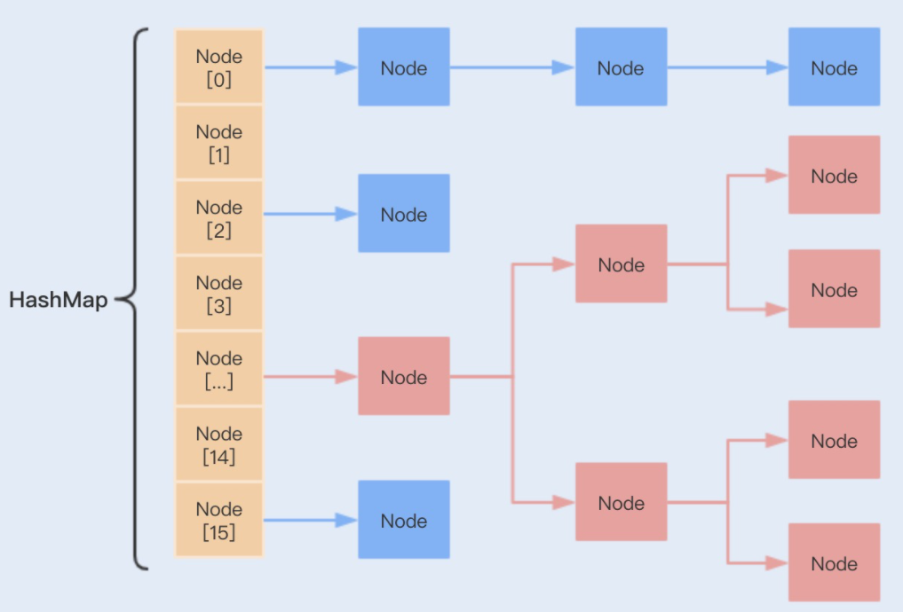

# 编程性能调优

## 高效使用字符串

### String 对象的不可变性

* 保证 String 对象的安全性。假设 String 对象是可变的，那么 String 对象将可能被恶意修改。
* 保证 hash 属性值不会频繁变更，确保了唯一性，使得类似 HashMap 容器才能实现相应的 key-value 缓存功能。
* 可以实现字符串常量池。在 Java 中，通常有两种创建字符串对象的方式，一种是通过字符串常量的方式创建，如 String str=“abc”；另一种是字符串变量通过 new 形式的创建，如 String str = new String(“abc”)。
  * 一种方式创建字符串对象时，JVM 首先会检查该对象是否在字符串常量池中，如果在，就返回该对象引用，否则新的字符串将在常量池中被创建。这种方式可以减少同一个值的字符串对象的重复创建，节约内存。
  * String str = new String(“abc”) 这种方式，首先在编译类文件时，"abc"常量字符串将会放入到常量结构中，在类加载时，“abc"将会在常量池中创建；其次，在调用 new 时，JVM 命令将会调用 String 的构造函数，同时引用常量池中的"abc” 字符串，在堆内存中创建一个 String 对象；最后，str 将引用 String 对象。

> 平常编程时，对一个 String 对象 str 赋值“hello”，然后又让 str 值为“world”，这个时候 str 的值变成了“world”。那么 str 值确实改变了，为什么我还说 String 对象不可变呢？
>
> 这是因为 str 只是 String 对象的引用，并不是对象本身。对象在内存中是一块内存地址，str 则是一个指向该内存地址的引用。所以在刚刚我们说的这个例子中，第一次赋值的时候，创建了一个“hello”对象，str 引用指向“hello”地址；第二次赋值的时候，又重新创建了一个对象“world”，str 引用指向了“world”，但“hello”对象依然存在于内存中。
>
> 也就是说 str 并不是对象，而只是一个对象引用。真正的对象依然还在内存中，没有被改变。

### String 对象的优化

> 如何构建超大字符串？

Java 在进行字符串的拼接时，偏向使用 StringBuilder，这样可以提高程序的效率。

```java
String str = "abcdef";

for(int i=0; i<1000; i++) {
            str = (new StringBuilder(String.valueOf(str))).append(i).toString();
}
```

即使使用 + 号作为字符串的拼接，也一样可以被编译器优化成 StringBuilder 的方式。但再细致些，你会发现在编译器优化的代码中，每次循环都会生成一个新的 StringBuilder 实例，同样也会降低系统的性能。

所以平时做字符串拼接的时候，我建议你还是要显示地使用 String Builder 来提升系统性能。

如果在多线程编程中，String 对象的拼接涉及到线程安全，你可以使用 StringBuffer。但是要注意，由于 StringBuffer 是线程安全的，涉及到锁竞争，所以从性能上来说，要比 StringBuilder 差一些。

### 如何使用 String.intern 节省内存？

```java
String a =new String("abc").intern();
String b = new String("abc").intern();
        
if(a==b) {
    System.out.print("a==b");
}
//a==b
```

在字符串常量中，默认会将对象放入常量池；在字符串变量中，对象是会创建在堆内存中，同时也会在常量池中创建一个字符串对象，String 对象中的 char 数组将会引用常量池中的 char 数组，并返回堆内存对象引用。

如果调用 intern 方法，会去查看字符串常量池中是否有等于该对象的字符串的引用，如果没有，在 JDK1.6 版本中会复制堆中的字符串到常量池中，并返回该字符串引用，堆内存中原有的字符串由于没有引用指向它，将会通过垃圾回收器回收。

在 JDK1.7 版本以后，由于常量池已经合并到了堆中，所以不会再复制具体字符串了，只是会把首次遇到的字符串的引用添加到常量池中；如果有，就返回常量池中的字符串引用。

```markdown
- 在一开始字符串"abc"会在加载类时，在常量池中创建一个字符串对象。
- 创建 a 变量时，调用 new Sting() 会在堆内存中创建一个 String 对象，String 对象中的 char 数组将会引用常量池中字符串。在调用 intern 方法之后，会去常量池中查找是否有等于该字符串对象的引用，有就返回引用。
- 创建 b 变量时，调用 new Sting() 会在堆内存中创建一个 String 对象，String 对象中的 char 数组将会引用常量池中字符串。在调用 intern 方法之后，会去常量池中查找是否有等于该字符串对象的引用，有就返回引用。
- 而在堆内存中的两个对象，由于没有引用指向它，将会被垃圾回收。所以 a 和 b 引用的是同一个对象。
```


> 使用 intern 方法需要注意的一点是，一定要结合实际场景。因为常量池的实现是类似于一个 HashTable 的实现方式，HashTable 存储的数据越大，遍历的时间复杂度就会增加。如果数据过大，会增加整个字符串常量池的负担。

### 如何使用字符串的分割方法？

Split() 方法使用了正则表达式实现了其强大的分割功能，而正则表达式的性能是非常不稳定的，使用不恰当会引起回溯问题，很可能导致 CPU 居高不下。

所以我们应该慎重使用 Split() 方法，我们可以用 String.indexOf() 方法代替 Split() 方法完成字符串的分割。如果实在无法满足需求，你就在使用 Split() 方法时，对回溯问题加以重视就可以了。

## 慎重使用正则表达式

正则表达式是计算机科学的一个概念，很多语言都实现了它。正则表达式使用一些特定的元字符来检索、匹配以及替换符合规则的字符串。

构造正则表达式语法的元字符，由普通字符、标准字符、限定字符（量词）、定位字符（边界字符）组成。


### 正则表达式引擎

正则表达式是一个用正则符号写出的公式，程序对这个公式进行语法分析，建立一个语法分析树，再根据这个分析树结合正则表达式的引擎生成执行程序（这个执行程序我们把它称作状态机，也叫状态自动机），用于字符匹配。

目前实现正则表达式引擎的方式有两种：DFA 自动机（Deterministic Final Automaton 确定有限状态自动机）和 NFA 自动机（Non deterministic Finite Automaton 非确定有限状态自动机）。

对比来看，构造 DFA 自动机的代价远大于 NFA 自动机，但 DFA 自动机的执行效率高于 NFA 自动机。

NFA 自动机的优势是支持更多功能。例如，捕获 group、环视、占有优先量词等高级功能。这些功能都是基于子表达式独立进行匹配，因此在编程语言里，使用的正则表达式库都是基于 NFA 实现的。

### NFA 自动机的回溯

用 NFA 自动机实现的比较复杂的正则表达式，在匹配过程中经常会引起回溯问题。大量的回溯会长时间地占用 CPU，从而带来系统性能开销。

```markdown
# 贪婪模式（Greedy）
- 顾名思义，就是在数量匹配中，如果单独使用 +、 ? 、* 或{min,max} 等量词，正则表达式会匹配尽可能多的内容。
# 懒惰模式（Reluctant）
- 在该模式下，正则表达式会尽可能少地重复匹配字符。如果匹配成功，它会继续匹配剩余的字符串。
# 独占模式（Possessive）
- 同贪婪模式一样，独占模式一样会最大限度地匹配更多内容；不同的是，在独占模式下，匹配失败就会结束匹配，不会发生回溯问题。
```

在很多情况下使用懒惰模式和独占模式可以减少回溯的发生

### 正则表达式的优化

* 少用贪婪模式，多用独占模式
* 减少分支选择
* 减少捕获嵌套

## ArrayList还是LinkedList？

ArrayList、Vector、LinkedList 集合类继承了 AbstractList 抽象类，而 AbstractList 实现了 List 接口，同时也继承了 AbstractCollection 抽象类。ArrayList、Vector、LinkedList 又根据自我定位，分别实现了各自的功能。

ArrayList 和 Vector 使用了数组实现，这两者的实现原理差不多，LinkedList 使用了双向链表实现。

### ArrayList 是如何实现的？

> ArrayList 实现类

ArrayList 实现了 List 接口，继承了 AbstractList 抽象类，底层是数组实现的，并且实现了自增扩容数组大小。

ArrayList 还实现了 Cloneable 接口和 Serializable 接口，所以他可以实现克隆和序列化。

ArrayList 还实现了 RandomAccess 接口。RandomAccess 接口是一个标志接口，他标志着“只要实现该接口的 List 类，都能实现快速随机访问”。

> ArrayList 属性

ArrayList 属性主要由数组长度 size、对象数组 elementData、初始化容量 default_capacity 等组成， 其中初始化容量默认大小为 10。

```java
//默认初始化容量
private static final int DEFAULT_CAPACITY = 10;
//对象数组
transient Object[] elementData; 
//数组长度
private int size;
```

transient 关键字修饰该字段则表示该属性不会被序列化，但 ArrayList 其实是实现了序列化接口，这到底是怎么回事呢？

这还得从“ArrayList 是基于数组实现“开始说起，由于 ArrayList 的数组是基于动态扩增的，所以并不是所有被分配的内存空间都存储了数据。

如果采用外部序列化法实现数组的序列化，会序列化整个数组。ArrayList 为了避免这些没有存储数据的内存空间被序列化，内部提供了两个私有方法 writeObject 以及 readObject 来自我完成序列化与反序列化，从而在序列化与反序列化数组时节省了空间和时间。

因此使用 transient 修饰数组，是防止对象数组被其他外部方法序列化。

> ArrayList 构造函数

```java
public ArrayList(int initialCapacity) {
    //初始化容量不为零时，将根据初始化值创建数组大小
    if (initialCapacity > 0) {
        this.elementData = new Object[initialCapacity];
    } else if (initialCapacity == 0) {//初始化容量为零时，使用默认的空数组
        this.elementData = EMPTY_ELEMENTDATA;
    } else {
        throw new IllegalArgumentException("Illegal Capacity: "+
                                           initialCapacity);
    }
}

public ArrayList() {
    //初始化默认为空数组
    this.elementData = DEFAULTCAPACITY_EMPTY_ELEMENTDATA;
}
```

我们在初始化 ArrayList 时，可以通过第一个构造函数合理指定数组初始大小，这样有助于减少数组的扩容次数，从而提高系统性能。

> ArrayList 新增元素

```java
// 直接将元素添加到数组的末尾
public boolean add(E e) {
    ensureCapacityInternal(size + 1);  // Increments modCount!!
    elementData[size++] = e;
    return true;
}
// 添加元素到任意位置
public void add(int index, E element) {
    rangeCheckForAdd(index);

    ensureCapacityInternal(size + 1);  // Increments modCount!!
    System.arraycopy(elementData, index, elementData, index + 1,
                     size - index);
    elementData[index] = element;
    size++;
}
```

两个方法的相同之处是在添加元素之前，都会先确认容量大小，如果容量够大，就不用进行扩容；如果容量不够大，就会按照原来数组的 1.5 倍大小进行扩容，在扩容之后需要将数组复制到新分配的内存地址。

两个方法也有不同之处，添加元素到任意位置，会导致在该位置后的所有元素都需要重新排列，而将元素添加到数组的末尾，在没有发生扩容的前提下，是不会有元素复制排序过程的。

> ArrayList 删除元素

ArrayList 的删除方法和添加任意位置元素的方法是有些相同的。ArrayList 在每一次有效的删除元素操作之后，都要进行数组的重组，并且删除的元素位置越靠前，数组重组的开销就越大。

```java
public E remove(int index) {
    rangeCheck(index);

    modCount++;
    E oldValue = elementData(index);

    int numMoved = size - index - 1;
    if (numMoved > 0)
        System.arraycopy(elementData, index+1, elementData, index,
                         numMoved);
    elementData[--size] = null; // clear to let GC do its work

    return oldValue;
}
```

> ArrayList 遍历元素

ArrayList 是基于数组实现的，所以在获取元素的时候是非常快捷的。

```java
public E get(int index) {
    rangeCheck(index);

    return elementData(index);
}

E elementData(int index) {
    return (E) elementData[index];
}
```

### LinkedList 是如何实现的？

LinkedList 是基于双向链表数据结构实现的，LinkedList 定义了一个 Node 结构，Node 结构中包含了 3 个部分：元素内容 item、前指针 prev 以及后指针 next

```java
private static class Node<E> {
    E item;
    Node<E> next;
    Node<E> prev;

    Node(Node<E> prev, E element, Node<E> next) {
        this.item = element;
        this.next = next;
        this.prev = prev;
    }
}
```

> LinkedList 实现类

LinkedList 类实现了 List 接口、Deque 接口，同时继承了 AbstractSequentialList 抽象类，LinkedList 既实现了 List 类型又有 Queue 类型的特点；LinkedList 也实现了 Cloneable 和 Serializable 接口，同 ArrayList 一样，可以实现克隆和序列化。

于 LinkedList 存储数据的内存地址是不连续的，而是通过指针来定位不连续地址，因此，LinkedList 不支持随机快速访问，LinkedList 也就不能实现 RandomAccess 接口。

> LinkedList 属性

```java
transient int size = 0;
transient Node<E> first;
transient Node<E> last;
```

这三个属性都被 transient 修饰了，原因很简单，我们在序列化的时候不会只对头尾进行序列化，所以 LinkedList 也是自行实现 readObject 和 writeObject 进行序列化与反序列化。

> LinkedList 新增元素

链表的增加元素，LinkedList 也有添加元素到任意位置的方法

相比 ArrayList 的添加操作来说，LinkedList 的性能优势明显。

> LinkedList 删除元素

在 LinkedList 删除元素的操作中，我们首先要通过循环找到要删除的元素，如果要删除的位置处于 List 的前半段，就从前往后找；若其位置处于后半段，就从后往前找。

这样做的话，无论要删除较为靠前或较为靠后的元素都是非常高效的，但如果 List 拥有大量元素，移除的元素又在 List 的中间段，那效率相对来说会很低。

> LinkedList 遍历元素

LinkedList 的获取元素操作实现跟 LinkedList 的删除元素操作基本类似，通过分前后半段来循环查找到对应的元素。但是通过这种方式来查询元素是非常低效的，特别是在 for 循环遍历的情况下，每一次循环都会去遍历半个 List。

所以在 LinkedList 循环遍历时，我们可以使用 iterator 方式迭代循环，直接拿到我们的元素，而不需要通过循环查找 List。

### 总结

> ArrayList 和 LinkedList 新增元素操作测试(花费时间)

从集合头部位置新增元素：ArrayList>LinkedList

从集合中间位置新增元素：ArrayList<LinkedList

从集合尾部位置新增元素：ArrayList<LinkedList

```markdown
- ArrayList 是数组实现的，而数组是一块连续的内存空间，在添加元素到数组头部的时候，需要对头部以后的数据进行复制重排，所以效率很低；
- ArrayList 在添加元素到数组中间时，同样有部分数据需要复制重排，效率也不是很高；LinkedList 将元素添加到中间位置，是添加元素最低效率的，因为靠近中间位置，在添加元素之前的循环查找是遍历元素最多的操作。
- 而在添加元素到尾部的操作中，我们发现，在没有扩容的情况下，ArrayList 的效率要高于 LinkedList。这是因为 ArrayList 在添加元素到尾部的时候，不需要复制重排数据，效率非常高。而 LinkedList 虽然也不用循环查找元素，但 LinkedList 中多了 new 对象以及变换指针指向对象的过程，所以效率要低于 ArrayList。
```

> ArrayList 和 LinkedList 删除元素操作测试

从集合头部位置删除元素：ArrayList>LinkedList

从集合中间位置删除元素：ArrayList<LinkedList

从集合尾部位置删除元素：ArrayList<LinkedList

> ArrayList 和 LinkedList 遍历元素操作测试

for(;;) 循环：ArrayList<LinkedList

迭代器迭代循环：ArrayList≈LinkedList

```markdown
- LinkedList 的 for 循环性能是最差的，而 ArrayList 的 for 循环性能是最好的。
- 这是因为 LinkedList 基于链表实现的，在使用 for 循环的时候，每一次 for 循环都会去遍历半个 List，所以严重影响了遍历的效率；ArrayList 则是基于数组实现的，并且实现了 RandomAccess 接口标志，意味着 ArrayList 可以实现快速随机访问，所以 for 循环效率非常高。
- LinkedList 的迭代循环遍历和 ArrayList 的迭代循环遍历性能相当，也不会太差，所以在遍历 LinkedList 时，我们要切忌使用 for 循环遍历。
```

> 遍历删除元素时，要使用迭代器

```java
public static void remove(ArrayList<String> list) {
    Iterator<String> it = list.iterator();

    while (it.hasNext()) {
        String str = it.next();

        if (str.equals("b")) {
            it.remove();
        }
    }
}
```

```markdown
- 使用迭代器遍历时，ArrayList 内部创建了一个内部迭代器 iterator，在使用 next() 方法来取下一个元素时，会使用 ArrayList 里保存的一个用来记录 List 修改次数的变量 modCount ，与 iterator 保存了一个 expectedModCount 来表示期望的修改次数进行比较，如果不相等则会抛出异常；
- 而在 foreach 循环中调用 list 中的 remove() 方法，会走到 fastRemove() 方法，该方法不是 iterator 中的方法，而是 ArrayList 中的方法，在该方法只做了modCount++，而没有同步到 expectedModCount。
- 当再次遍历时，会先调用内部类 iteator 中的 hasNext() ,再调用 next() ,在调用 next() 方法时，会对 modCount 和 expectedModCount 进行比较，此时两者不一致，就抛出了 ConcurrentModificationException 异常。
- 所以关键是用 ArrayList 的 remove 还是 iterator 中的 remove 。
```

## Stream如何提高遍历集合效率？

在 Java8 之前，我们通常是通过 for 循环或者 Iterator 迭代来重新排序合并数据，又或者通过重新定义 Collections.sorts 的 Comparator 方法来实现，这两种方式对于大数据量系统来说，效率并不是很理想。

Java8 中添加了一个新的接口类 Stream，他和我们之前接触的字节流概念不太一样，Java8 集合中的 Stream 相当于高级版的 Iterator，他可以通过 Lambda 表达式对集合进行各种非常便利、高效的聚合操作（Aggregate Operation），或者大批量数据操作 (Bulk Data Operation)。

Stream 的聚合操作与数据库 SQL 的聚合操作 sorted、filter、map 等类似。我们在应用层就可以高效地实现类似数据库 SQL 的聚合操作了，而在数据操作方面，Stream 不仅可以通过串行的方式实现数据操作，还可以通过并行的方式处理大批量数据，提高数据的处理效率。

### Demo

```java
// 过滤分组一所中学里身高在 160cm 以上的男女同学

// 传统方式
Map<String, List<Student>> stuMap = new HashMap<String, List<Student>>();
for (Student stu: studentsList) {
    if (stu.getHeight() > 160) { //如果身高大于160
        if (stuMap.get(stu.getSex()) == null) { //该性别还没分类
            List<Student> list = new ArrayList<Student>(); //新建该性别学生的列表
            list.add(stu);//将学生放进去列表
            stuMap.put(stu.getSex(), list);//将列表放到map中
        } else { //该性别分类已存在
            stuMap.get(stu.getSex()).add(stu);//该性别分类已存在，则直接放进去即可
        }
    }
}

// 串行实现
Map<String, List<Student>> stuMap = stuList.stream()
    .filter((Student s) -> s.getHeight() > 160) 
    .collect(Collectors.groupingBy(Student ::getSex)); 
// 并行实现
Map<String, List<Student>> stuMap = stuList.parallelStream()
    .filter((Student s) -> s.getHeight() > 160) 
    .collect(Collectors.groupingBy(Student ::getSex)); 
```

### Stream 如何优化遍历？

> Stream 操作分类

Stream 的操作分类是实现高效迭代大数据集合的重要原因之一

官方将 Stream 中的操作分为两大类：中间操作（Intermediate operations）和终结操作（Terminal operations）。中间操作只对操作进行了记录，即只会返回一个流，不会进行计算操作，而终结操作是实现了计算操作。

中间操作又可以分为无状态（Stateless）与有状态（Stateful）操作，前者是指元素的处理不受之前元素的影响，后者是指该操作只有拿到所有元素之后才能继续下去。

终结操作又可以分为短路（Short-circuiting）与非短路（Unshort-circuiting）操作，前者是指遇到某些符合条件的元素就可以得到最终结果，后者是指必须处理完所有元素才能得到最终结果。


我们通常还会将中间操作称为懒操作，也正是由这种懒操作结合终结操作、数据源构成的处理管道（Pipeline），实现了 Stream 的高效。

> Stream 源码实现


* BaseStream 和 Stream 为最顶端的接口类。BaseStream 主要定义了流的基本接口方法，例如，spliterator、isParallel 等；Stream 则定义了一些流的常用操作方法，例如，map、filter 等。

* ReferencePipeline 是一个结构类，他通过定义内部类组装了各种操作流。他定义了 Head、StatelessOp、StatefulOp 三个内部类，实现了 BaseStream 与 Stream 的接口方法。

* Sink 接口是定义每个 Stream 操作之间关系的协议，他包含 begin()、end()、cancellationRequested()、accpt() 四个方法。ReferencePipeline 最终会将整个 Stream 流操作组装成一个调用链，而这条调用链上的各个 Stream 操作的上下关系就是通过 Sink 接口协议来定义实现的。

> Stream 操作叠加

一个 Stream 的各个操作是由处理管道组装，并统一完成数据处理的。

管道结构通常是由 ReferencePipeline 类实现的

* Head 类主要用来定义数据源操作，在我们初次调用 names.stream() 方法时，会初次加载 Head 对象，此时为加载数据源操作
* 接着加载的是中间操作，分别为无状态中间操作 StatelessOp 对象和有状态操作 StatefulOp 对象，此时的 Stage 并没有执行，而是通过 AbstractPipeline 生成了一个中间操作 Stage 链表
* 当我们调用终结操作时，会生成一个最终的 Stage，通过这个 Stage 触发之前的中间操作，从最后一个 Stage 开始，递归产生一个 Sink 链

### 总结

* 在循环迭代次数较少的情况下，常规的迭代方式性能反而更好
* 在单核 CPU 服务器配置环境中，也是常规迭代方式更有优势
* 而在大数据循环迭代中，如果服务器是多核 CPU 的情况下，Stream 的并行迭代优势明显

所以我们在平时处理大数据的集合时，应该尽量考虑将应用部署在多核 CPU 环境下，并且使用 Stream 的并行迭代方式进行处理。

## 深入浅出HashMap的设计与优化

HashMap 是基于哈希表的数据结构实现的

哈希表：根据关键码值（Key value）直接进行访问的数据结构。通过把关键码值映射到表中一个位置来访问记录，以加快查找的速度。这个映射函数叫做哈希函数，存放记录的数组就叫做哈希表。

### HashMap 的实现结构

作为最常用的 Map 类，它是基于哈希表实现的，继承了 AbstractMap 并且实现了 Map 接口。

哈希表将键的 Hash 值映射到内存地址，即根据键获取对应的值，并将其存储到内存地址。也就是说 HashMap 是根据键的 Hash 值来决定对应值的存储位置。通过这种索引方式，HashMap 获取数据的速度会非常快。

例如，存储键值对（x，“aa”）时，哈希表会通过哈希函数 f(x) 得到"aa"的实现存储位置。

```markdown
# 解决哈希冲突
- 开放定址法很简单，当发生哈希冲突时，如果哈希表未被装满，说明在哈希表中必然还有空位置，那么可以把 key 存放到冲突位置后面的空位置上去。这种方法存在着很多缺点，例如，查找、扩容等，所以我不建议你作为解决哈希冲突的首选。
- 再哈希法顾名思义就是在同义词产生地址冲突时再计算另一个哈希函数地址，直到冲突不再发生，这种方法不易产生“聚集”，但却增加了计算时间。如果我们不考虑添加元素的时间成本，且对查询元素的要求极高，就可以考虑使用这种算法设计。
- HashMap 则是综合考虑了所有因素，采用链地址法解决哈希冲突问题。这种方法是采用了数组（哈希表）+ 链表的数据结构，当发生哈希冲突时，就用一个链表结构存储相同 Hash 值的数据。
```

### HashMap 的重要属性

HashMap 是由一个 Node 数组构成，每个 Node 包含了一个 key-value 键值对。

Node 类作为 HashMap 中的一个内部类，除了 key、value 两个属性外，还定义了一个 next 指针。当有哈希冲突时，HashMap 会用之前数组当中相同哈希值对应存储的 Node 对象，通过指针指向新增的相同哈希值的 Node 对象的引用。

HashMap 还有两个重要的属性：加载因子（loadFactor）和边界值（threshold）。在初始化 HashMap 时，就会涉及到这两个关键初始化参数。

```markdown
- LoadFactor 属性是用来间接设置 Entry 数组（哈希表）的内存空间大小

# 默认 LoadFactor 值为 0.75。为什么是 0.75 这个值呢？
- 这是因为对于使用链表法的哈希表来说，查找一个元素的平均时间是 O(1+n)，这里的 n 指的是遍历链表的长度，因此加载因子越大，对空间的利用就越充分，这就意味着链表的长度越长，查找效率也就越低。如果设置的加载因子太小，那么哈希表的数据将过于稀疏，对空间造成严重浪费。

- Entry 数组的 Threshold 是通过初始容量和 LoadFactor 计算所得，在初始 HashMap 不设置参数的情况下，默认边界值为 12。如果我们在初始化时，设置的初始化容量较小，HashMap 中 Node 的数量超过边界值，HashMap 就会调用 resize() 方法重新分配 table 数组。这将会导致 HashMap 的数组复制，迁移到另一块内存中去，从而影响 HashMap 的效率。
```

### HashMap 添加元素优化

HashMap 使用 put() 方法添加键值对，当程序将一个 key-value 对添加到 HashMap 中，程序首先会根据该 key 的 hashCode() 返回值，再通过 hash() 方法计算出 hash 值，再通过 putVal 方法中的 (n - 1) & hash 决定该 Node 的存储位置。(尽可能减少哈希冲突)

```java
public V put(K key, V value) {
    return putVal(hash(key), key, value, false, true);
}

static final int hash(Object key) {
    int h;
    return (key == null) ? 0 : (h = key.hashCode()) ^ (h >>> 16);
}

if ((tab = table) == null || (n = tab.length) == 0)
    n = (tab = resize()).length;
//通过putVal方法中的(n - 1) & hash决定该Node的存储位置
if ((p = tab[i = (n - 1) & hash]) == null)
    tab[i] = newNode(hash, key, value, null);
```

```java
// put 源码
final V putVal(int hash, K key, V value, boolean onlyIfAbsent,
               boolean evict) {
    Node<K,V>[] tab; Node<K,V> p; int n, i;
    if ((tab = table) == null || (n = tab.length) == 0)
        //1、判断当table为null或者tab的长度为0时，即table尚未初始化，此时通过resize()方法得到初始化的table
        n = (tab = resize()).length;
    if ((p = tab[i = (n - 1) & hash]) == null)
        //1.1、此处通过（n - 1） & hash 计算出的值作为tab的下标i，并另p表示tab[i]，也就是该链表第一个节点的位置。并判断p是否为null
        tab[i] = newNode(hash, key, value, null);
    //1.1.1、当p为null时，表明tab[i]上没有任何元素，那么接下来就new第一个Node节点，调用newNode方法返回新节点赋值给tab[i]
    else {
        //2.1下面进入p不为null的情况，有三种情况：p为链表节点；p为红黑树节点；p是链表节点但长度为临界长度TREEIFY_THRESHOLD，再插入任何元素就要变成红黑树了。
        Node<K,V> e; K k;
        if (p.hash == hash &&
            ((k = p.key) == key || (key != null && key.equals(k))))
            //2.1.1HashMap中判断key相同的条件是key的hash相同，并且符合equals方法。这里判断了p.key是否和插入的key相等，如果相等，则将p的引用赋给e

            e = p;
        else if (p instanceof TreeNode)
            //2.1.2现在开始了第一种情况，p是红黑树节点，那么肯定插入后仍然是红黑树节点，所以我们直接强制转型p后调用TreeNode.putTreeVal方法，返回的引用赋给e
            e = ((TreeNode<K,V>)p).putTreeVal(this, tab, hash, key, value);
        else {
            //2.1.3接下里就是p为链表节点的情形，也就是上述说的另外两类情况：插入后还是链表/插入后转红黑树。另外，上行转型代码也说明了TreeNode是Node的一个子类
            for (int binCount = 0; ; ++binCount) {
                //我们需要一个计数器来计算当前链表的元素个数，并遍历链表，binCount就是这个计数器

                if ((e = p.next) == null) {
                    p.next = newNode(hash, key, value, null);
                    if (binCount >= TREEIFY_THRESHOLD - 1) 
                        // 插入成功后，要判断是否需要转换为红黑树，因为插入后链表长度加1，而binCount并不包含新节点，所以判断时要将临界阈值减1
                        treeifyBin(tab, hash);
                    //当新长度满足转换条件时，调用treeifyBin方法，将该链表转换为红黑树
                    break;
                }
                if (e.hash == hash &&
                    ((k = e.key) == key || (key != null && key.equals(k))))
                    break;
                p = e;
            }
        }
        if (e != null) { // existing mapping for key
            V oldValue = e.value;
            if (!onlyIfAbsent || oldValue == null)
                e.value = value;
            afterNodeAccess(e);
            return oldValue;
        }
    }
    ++modCount;
    if (++size > threshold)
        resize();
    afterNodeInsertion(evict);
    return null;
}
```

在 JDK1.8 中，HashMap 引入了红黑树数据结构来提升链表的查询效率。

这是因为链表的长度超过 8 后，红黑树的查询效率要比链表高，所以当链表超过 8 时，HashMap 就会将链表转换为红黑树，这里值得注意的一点是，这时的新增由于存在左旋、右旋效率会降低。

### HashMap 获取元素优化

一旦发生大量的哈希冲突，就会产生 Node 链表，这个时候每次查询元素都可能遍历 Node 链表，从而降低查询数据的性能。

特别是在链表长度过长的情况下，性能将明显降低，红黑树的使用很好地解决了这个问题，使得查询的平均复杂度降低到了 O(log(n))，链表越长，使用黑红树替换后的查询效率提升就越明显。

我们在编码中也可以优化 HashMap 的性能，例如，重写 key 值的 hashCode() 方法，降低哈希冲突，从而减少链表的产生，高效利用哈希表，达到提高性能的效果。

### HashMap 扩容优化

在 JDK1.7 中，HashMap 整个扩容过程就是分别取出数组元素，一般该元素是最后一个放入链表中的元素，然后遍历以该元素为头的单向链表元素，依据每个被遍历元素的 hash 值计算其在新数组中的下标，然后进行交换。这样的扩容方式会将原来哈希冲突的单向链表尾部变成扩容后单向链表的头部。

而在 JDK 1.8 中，HashMap 对扩容操作做了优化。由于扩容数组的长度是 2 倍关系，所以对于假设初始 tableSize = 4 要扩容到 8 来说就是 0100 到 1000 的变化（左移一位就是 2 倍），在扩容中只用判断原来的 hash 值和左移动的一位（newtable 的值）按位与操作是 0 或 1 就行，0 的话索引不变，1 的话索引变成原索引加上扩容前数组。

之所以能通过这种“与运算“来重新分配索引，是因为 hash 值本来就是随机的，而 hash 按位与上 newTable 得到的 0（扩容前的索引位置）和 1（扩容前索引位置加上扩容前数组长度的数值索引处）就是随机的，所以扩容的过程就能把之前哈希冲突的元素再随机分布到不同的索引中去。

### 总结

HashMap 通过哈希表数据结构的形式来存储键值对，这种设计的好处就是查询键值对的效率高。

当查询操作较为频繁时，我们可以适当地减少加载因子

如果对内存利用率要求比较高，我可以适当的增加加载因子。

我们还可以在预知存储数据量的情况下，提前设置初始容量（初始容量 = 预知数据量 / 加载因子）。这样做的好处是可以减少 resize() 操作，提高 HashMap 的效率。

HashMap 还使用了数组 + 链表这两种数据结构相结合的方式实现了链地址法，当有哈希值冲突时，就可以将冲突的键值对链成一个链表。

HashMap 就在 Java8 中使用了红黑树来解决链表过长导致的查询性能下降问题



> 实际应用中，我们设置初始容量，一般得是 2 的整数次幂。你知道原因吗？
>
> 2的幂次方减1后每一位都是1，让数组每一个位置都能添加到元素。
> 例如十进制8，对应二进制1000，减1是0111，这样在&hash值使数组每个位置都是可以添加到元素的，如果有一个位置为0，那么无论hash值是多少那一位总是0，例如0101，&hash后第二位总是0，也就是说数组中下标为2的位置总是空的。
> 如果初始化大小设置的不是2的幂次方，hashmap也会调整到比初始化值大且最近的一个2的幂作为capacity。
>
> 减少哈希冲突，均匀分布元素。

## 如何解决高并发下I/O瓶颈？

### 什么是IO

I/O 是机器获取和交换信息的主要渠道，而流是完成 I/O 操作的主要方式。

在计算机中，流是一种信息的转换。流是有序的，因此相对于某一机器或者应用程序而言，我们通常把机器或者应用程序接收外界的信息称为输入流（InputStream），从机器或者应用程序向外输出的信息称为输出流（OutputStream），合称为输入 / 输出流（I/O Streams）。

机器间或程序间在进行信息交换或者数据交换时，总是先将对象或数据转换为某种形式的流，再通过流的传输，到达指定机器或程序后，再将流转换为对象数据。因此，流就可以被看作是一种数据的载体，通过它可以实现数据交换和传输。

### 传统 I/O 的性能问题

> 多次内存复制

输入操作在操作系统中的具体流程


* JVM 会发出 read() 系统调用，并通过 read 系统调用向内核发起读请求；
* 内核向硬件发送读指令，并等待读就绪；
* 内核把将要读取的数据复制到指向的内核缓存中；
* 操作系统内核将数据复制到用户空间缓冲区，然后 read 系统调用返回。

在这个过程中，数据先从外部设备复制到内核空间，再从内核空间复制到用户空间，这就发生了两次内存复制操作。这种操作会导致不必要的数据拷贝和上下文切换，从而降低 I/O 的性能。

> 阻塞

一旦发生线程阻塞，这些线程将会不断地抢夺 CPU 资源，从而导致大量的 CPU 上下文切换，增加系统的性能开销。

### 如何优化 I/O 操作

JDK1.4 发布了 java.nio 包（new I/O 的缩写），NIO 的发布优化了内存复制以及阻塞导致的严重性能问题。JDK1.7 又发布了 NIO2，提出了从操作系统层面实现的异步 I/O。

> 使用缓冲区优化读写流操作

传统 I/O 流的实现以字节为单位处理数据。

NIO 与传统 I/O 不同，它是基于块（Block）的，它以块为基本单位处理数据。在 NIO 中，最为重要的两个组件是缓冲区（Buffer）和通道（Channel）。Buffer 是一块连续的内存块，是 NIO 读写数据的中转地。Channel 表示缓冲数据的源头或者目的地，它用于读取缓冲或者写入数据，是访问缓冲的接口。

传统 I/O 和 NIO 的最大区别就是传统 I/O 是面向流，NIO 是面向 Buffer。Buffer 可以将文件一次性读入内存再做后续处理，而传统的方式是边读文件边处理数据。虽然传统 I/O 后面也使用了缓冲块，例如 BufferedInputStream，但仍然不能和 NIO 相媲美。使用 NIO 替代传统 I/O 操作，可以提升系统的整体性能，效果立竿见影。

> 使用 DirectBuffer 减少内存复制

我们知道数据要输出到外部设备，必须先从用户空间复制到内核空间，再复制到输出设备，而在 Java 中，在用户空间中又存在一个拷贝，那就是从 Java 堆内存中拷贝到临时的直接内存中，通过临时的直接内存拷贝到内存空间中去。此时的直接内存和堆内存都是属于用户空间。

NIO 的 Buffer 除了做了缓冲块优化之外，还提供了一个可以直接访问物理内存的类 DirectBuffer。普通的 Buffer 分配的是 JVM 堆内存，而 DirectBuffer 是直接分配物理内存 (非堆内存)。减少了一次数据拷贝。

由于 DirectBuffer 申请的是非 JVM 的物理内存，所以**创建和销毁的代价很高**。DirectBuffer 申请的内存并不是直接由 JVM 负责垃圾回收，但在 DirectBuffer 包装类被回收时，会通过 Java Reference 机制来释放该内存块。

另外一个 Buffer 类：MappedByteBuffer，跟 DirectBuffer 不同的是，MappedByteBuffer 是通过本地类调用 mmap 进行文件内存映射的，map() 系统调用方法会直接将文件从硬盘拷贝到用户空间，只进行一次数据拷贝，从而减少了传统的 read() 方法从硬盘拷贝到内核空间这一步。

> 避免阻塞，优化 I/O 操作

NIO 发布后，通道（Channel）和多路复用器（Selector）这两个基本组件实现了 NIO 的非阻塞

Channel 有自己的处理器，可以完成内核空间和磁盘之间的 I/O 操作。在 NIO 中，我们读取和写入数据都要通过 Channel，由于 Channel 是双向的，所以读、写可以同时进行。

Selector 是 Java NIO 编程的基础。用于检查一个或多个 NIO Channel 的状态是否处于可读、可写。

Selector 是基于事件驱动实现的，我们可以在 Selector 中注册 accpet、read 监听事件，Selector 会不断轮询注册在其上的 Channel，如果某个 Channel 上面发生监听事件，这个 Channel 就处于就绪状态，然后进行 I/O 操作。

一个线程使用一个 Selector，通过轮询的方式，可以监听多个 Channel 上的事件。我们可以在注册 Channel 时设置该通道为非阻塞，当 Channel 上没有 I/O 操作时，该线程就不会一直等待了，而是会不断轮询所有 Channel，从而避免发生阻塞。

目前操作系统的 I/O 多路复用机制都使用了 epoll

>在 JDK1.7 版本中，Java 发布了 NIO 的升级包 NIO2，也就是 AIO。AIO 实现了真正意义上的异步 I/O，它是直接将 I/O 操作交给操作系统进行异步处理。这也是对 I/O 操作的一种优化，那为什么现在很多容器的通信框架都还是使用 NIO 呢？
>
>在Linux中，AIO并未真正使用操作系统所提供的异步I/O，它仍然使用poll或epoll，并将API封装为异步I/O的样子，但是其本质仍然是同步非阻塞I/O
>
>异步I/O模型在Linux内核中没有实现

>一次普通IO需要要进过六次拷贝:
>网卡->内核->临时本地内存->堆内存->临时本地内存->内核->网卡。
>directbfuffer下:
>网卡->内核->本地内存->内核->网卡
>ARP下C直接调用:
>文件->内核->网卡

## 避免使用Java序列化

当前大部分后端服务都是基于微服务架构实现的。服务按照业务划分被拆分，实现了服务的解耦，但同时也带来了新的问题，不同业务之间通信需要通过接口实现调用。两个服务之间要共享一个数据对象，就需要从对象转换成二进制流，通过网络传输，传送到对方服务，再转换回对象，供服务方法调用。**这个编码和解码过程我们称之为序列化与反序列化**。

在大量并发请求的情况下，如果序列化的速度慢，会导致请求响应时间增加；而序列化后的传输数据体积大，会导致网络吞吐量下降。所以一个优秀的序列化框架可以提高系统的整体性能。

Java 提供了 RMI 框架可以实现服务与服务之间的接口暴露和调用，RMI 中对数据对象的序列化采用的是 Java 序列化。而目前主流的微服务框架却几乎没有用到 Java 序列化，SpringCloud 用的是 Json 序列化，Dubbo 虽然兼容了 Java 序列化，但默认使用的是 Hessian 序列化。这是为什么呢？

### Java 序列化

Java 默认的序列化是通过 Serializable 接口实现的，只要类实现了该接口，同时生成一个默认的版本号，我们无需手动设置，该类就会自动实现序列化与反序列化。

Java 默认的序列化虽然实现方便，但却存在安全漏洞、不跨语言以及性能差等缺陷，所以我强烈建议你避免使用 Java 序列化。

纵观主流序列化框架，FastJson、Protobuf、Kryo 是比较有特点的，而且性能以及安全方面都得到了业界的认可，我们可以结合自身业务来选择一种适合的序列化框架，来优化系统的序列化性能。

# 多线程性能调优

## 深入了解Synchronized同步锁的优化方法

在并发编程中，多个线程访问同一个共享资源时，我们必须考虑如何维护数据的原子性

Lock 同步锁是基于 Java 实现的，而 Synchronized 是基于底层操作系统的 Mutex Lock 实现的，每次获取和释放锁操作都会带来用户态和内核态的切换，从而增加系统性能开销。因此，在锁竞争激烈的情况下，Synchronized 同步锁在性能上就表现得非常糟糕，它也常被大家称为重量级锁。

特别是在单个线程重复申请锁的情况下，JDK1.5 版本的 Synchronized 锁性能要比 Lock 的性能差很多，JDK1.6 版本之后，Java 对 Synchronized 同步锁做了充分的优化，甚至在某些场景下，它的性能已经超越了 Lock 同步锁。

### Synchronized 同步锁实现原理

通常 Synchronized 实现同步锁的方式有两种，一种是修饰方法，一种是修饰方法块

```java
// 关键字在实例方法上，锁为当前实例
public synchronized void method1() {
    // code
}

// 关键字在代码块上，锁为括号里面的对象
public void method2() {
    Object o = new Object();
    synchronized (o) {
        // code
    }
}
// javac -encoding UTF-8 SyncTest.java  //先运行编译class文件命令
// javap -v SyncTest.class //再通过javap打印出字节文件
```

> Synchronized 在修饰同步代码块时，是由 monitorenter 和 monitorexit 指令来实现同步的。进入 monitorenter 指令后，线程将持有 Monitor 对象，退出 monitorenter 指令后，线程将释放该 Monitor 对象。
>
> Synchronized 修饰同步方法时，并没有发现 monitorenter 和 monitorexit 指令，而是出现了一个 ACC_SYNCHRONIZED 标志。
>
> 这是因为 JVM 使用了 ACC_SYNCHRONIZED 访问标志来区分一个方法是否是同步方法。当方法调用时，调用指令将会检查该方法是否被设置 ACC_SYNCHRONIZED 访问标志。如果设置了该标志，执行线程将先持有 Monitor 对象，然后再执行方法。在该方法运行期间，其它线程将无法获取到该 Mointor 对象，当方法执行完成后，再释放该 Monitor 对象。

### 锁升级优化

为了提升性能，JDK1.6 引入了偏向锁、轻量级锁、重量级锁概念，来减少锁竞争带来的上下文切换，而正是新增的 Java 对象头实现了锁升级功能。

当 Java 对象被 Synchronized 关键字修饰成为同步锁后，围绕这个锁的一系列升级操作都将和 Java 对象头有关。

### Java 对象头

在 JDK1.6 JVM 中，对象实例在堆内存中被分为了三个部分：对象头、实例数据和对齐填充。其中 Java 对象头由 Mark Word、指向类的指针以及数组长度三部分组成。

Mark Word 记录了对象和锁有关的信息。Mark Word 在 64 位 JVM 中的长度是 64bit


锁升级功能主要依赖于 Mark Word 中的锁标志位和释放偏向锁标志位，Synchronized 同步锁就是从偏向锁开始的，随着竞争越来越激烈，偏向锁升级到轻量级锁，最终升级到重量级锁。

### 偏向锁

偏向锁主要用来优化同一线程多次申请同一个锁的竞争。在某些情况下，大部分时间是同一个线程竞争锁资源，例如，在创建一个线程并在线程中执行循环监听的场景下，或单线程操作一个线程安全集合时，同一线程每次都需要获取和释放锁，每次操作都会发生用户态与内核态的切换。

偏向锁的作用就是，当一个线程再次访问这个同步代码或方法时，该线程只需去对象头的 Mark Word 中去判断一下是否有偏向锁指向它的 ID，无需再进入 Monitor 去竞争对象了。当对象被当做同步锁并有一个线程抢到了锁时，锁标志位还是 01，“是否偏向锁”标志位设置为 1，并且记录抢到锁的线程 ID，表示进入偏向锁状态。

一旦出现其它线程竞争锁资源时，偏向锁就会被撤销。偏向锁的撤销需要等待全局安全点，暂停持有该锁的线程，同时检查该线程是否还在执行该方法，如果是，则升级锁，反之则被其它线程抢占。

### 轻量级锁

当有另外一个线程竞争获取这个锁时，由于该锁已经是偏向锁，当发现对象头 Mark Word 中的线程 ID 不是自己的线程 ID，就会进行 CAS 操作获取锁，如果获取成功，直接替换 Mark Word 中的线程 ID 为自己的 ID，该锁会保持偏向锁状态；如果获取锁失败，代表当前锁有一定的竞争，偏向锁将升级为轻量级锁。

轻量级锁适用于线程交替执行同步块的场景，绝大部分的锁在整个同步周期内都不存在长时间的竞争。

### 自旋锁和重量级锁

轻量级锁 CAS 抢锁失败，线程将会被挂起进入阻塞状态。如果正在持有锁的线程在很短的时间内释放资源，那么进入阻塞状态的线程无疑又要申请锁资源。

JVM 提供了一种自旋锁，可以通过自旋方式不断尝试获取锁，从而避免线程被挂起阻塞。这是基于大多数情况下，线程持有锁的时间都不会太长，毕竟线程被挂起阻塞可能会得不偿失。

自旋锁重试之后如果抢锁依然失败，同步锁就会升级至重量级锁，锁标志位改为 10。在这个状态下，未抢到锁的线程都会进入 Monitor，之后会被阻塞在 _WaitSet 队列中。

**在锁竞争不激烈且锁占用时间非常短的场景下，自旋锁可以提高系统性能**。一旦锁竞争激烈或锁占用的时间过长，自旋锁将会导致大量的线程一直处于 CAS 重试状态，占用 CPU 资源，反而会增加系统性能开销。所以自旋锁和重量级锁的使用都要结合实际场景。

### 总结

JVM 在 JDK1.6 中引入了分级锁机制来优化 Synchronized，当一个线程获取锁时，首先对象锁将成为一个偏向锁，这样做是为了优化同一线程重复获取导致的用户态与内核态的切换问题；其次如果有多个线程竞争锁资源，锁将会升级为轻量级锁，它适用于在短时间内持有锁，且分锁有交替切换的场景；轻量级锁还使用了自旋锁来避免线程用户态与内核态的频繁切换，大大地提高了系统性能；但如果锁竞争太激烈了，那么同步锁将会升级为重量级锁。

减少锁竞争，是优化 Synchronized 同步锁的关键。我们应该尽量使 Synchronized 同步锁处于轻量级锁或偏向锁，这样才能提高 Synchronized 同步锁的性能；通过减小锁粒度来降低锁竞争也是一种最常用的优化方法；另外我们还可以通过减少锁的持有时间来提高 Synchronized 同步锁在自旋时获取锁资源的成功率，避免 Synchronized 同步锁升级为重量级锁。

## 深入了解Lock同步锁的优化方法

相对于需要 JVM 隐式获取和释放锁的 Synchronized 同步锁，Lock 同步锁（以下简称 Lock 锁）需要的是显示获取和释放锁，这就为获取和释放锁提供了更多的灵活性。Lock 锁的基本操作是通过乐观锁来实现的，但由于 Lock 锁也会在阻塞时被挂起，因此它依然属于悲观锁


从性能方面上来说，在并发量不高、竞争不激烈的情况下，Synchronized 同步锁由于具有分级锁的优势，性能上与 Lock 锁差不多；但在高负载、高并发的情况下，Synchronized 同步锁由于竞争激烈会升级到重量级锁，性能则没有 Lock 锁稳定。

### Lock 锁的实现原理

Lock 锁是基于 Java 实现的锁，Lock 是一个接口类，常用的实现类有 ReentrantLock、ReentrantReadWriteLock（RRW），它们都是依赖 AbstractQueuedSynchronizer（AQS）类实现的。

AQS 类结构中包含一个基于链表实现的等待队列（CLH 队列），用于存储所有阻塞的线程，AQS 中还有一个 state 变量，该变量对 ReentrantLock 来说表示加锁状态。

该队列的操作均通过 CAS 操作实现


### 锁分离优化 Lock 同步锁

虽然 Lock 锁的性能稳定，但也并不是所有的场景下都默认使用 ReentrantLock 独占锁来实现线程同步。

### 读写锁

ReentrantReadWriteLock

针对这种读多写少的场景，Java 提供了另外一个实现 Lock 接口的读写锁 RRW。我们已知 ReentrantLock 是一个独占锁，同一时间只允许一个线程访问，而 RRW 允许多个读线程同时访问，但不允许写线程和读线程、写线程和写线程同时访问。读写锁内部维护了两个锁，一个是用于读操作的 ReadLock，一个是用于写操作的 WriteLock。

RRW 也是基于 AQS 实现的，它的自定义同步器（继承 AQS）需要在同步状态 state 上维护多个读线程和一个写线程的状态，该状态的设计成为实现读写锁的关键。RRW 很好地使用了高低位，来实现一个整型控制两种状态的功能，读写锁将变量切分成了两个部分，高 16 位表示读，低 16 位表示写。

```java
public class TestRTTLock {

    private double x, y;

    private ReentrantReadWriteLock lock = new ReentrantReadWriteLock();
    // 读锁
    private Lock readLock = lock.readLock();
    // 写锁
    private Lock writeLock = lock.writeLock();

    public double read() {
        //获取读锁
        readLock.lock();
        try {
            return Math.sqrt(x * x + y * y);
        } finally {
            //释放读锁
            readLock.unlock();
        }
    }

    public void move(double deltaX, double deltaY) {
        //获取写锁
        writeLock.lock();
        try {
            x += deltaX;
            y += deltaY;
        } finally {
            //释放写锁
            writeLock.unlock();
        }
    }
}
```

### StampedLock

RRW 被很好地应用在了读大于写的并发场景中，然而 RRW 在性能上还有可提升的空间。在读取很多、写入很少的情况下，RRW 会使写入线程遭遇饥饿（Starvation）问题，也就是说写入线程会因迟迟无法竞争到锁而一直处于等待状态。

在 JDK1.8 中，Java 提供了 StampedLock 类解决了这个问题。StampedLock 不是基于 AQS 实现的，但实现的原理和 AQS 是一样的，都是基于队列和锁状态实现的。与 RRW 不一样的是，StampedLock 控制锁有三种模式: 写、悲观读以及乐观读，并且 StampedLock 在获取锁时会返回一个票据 stamp，获取的 stamp 除了在释放锁时需要校验，在乐观读模式下，stamp 还会作为读取共享资源后的二次校验，如果存在写操作，会将乐观锁变为悲观锁

```java
public class Point {
    private double x, y;
    private final StampedLock s1 = new StampedLock();

    void move(double deltaX, double deltaY) {
        //获取写锁
        long stamp = s1.writeLock();
        try {
            x += deltaX;
            y += deltaY;
        } finally {
            //释放写锁
            s1.unlockWrite(stamp);
        }
    }

    double distanceFormOrigin() {
        //乐观读操作
        long stamp = s1.tryOptimisticRead();  
        //拷贝变量
        double currentX = x, currentY = y;
        //判断读期间是否有写操作
        if (!s1.validate(stamp)) {
            //升级为悲观读
            stamp = s1.readLock();
            try {
                currentX = x;
                currentY = y;
            } finally {
                s1.unlockRead(stamp);
            }
        }
        return Math.sqrt(currentX * currentX + currentY * currentY);
    }
}
```

相比于 RRW，StampedLock 获取读锁只是使用与或操作进行检验，不涉及 CAS 操作，即使第一次乐观锁获取失败，也会马上升级至悲观锁，这样就可以避免一直进行 CAS 操作带来的 CPU 占用性能的问题，因此 StampedLock 的效率更高。

### 总结

不管使用 Synchronized 同步锁还是 Lock 同步锁，只要存在锁竞争就会产生线程阻塞，从而导致线程之间的频繁切换，最终增加性能消耗。因此，如何降低锁竞争，就成为了优化锁的关键。

可以利用 Lock 锁的灵活性，通过锁分离的方式来降低锁竞争。

Lock 锁实现了读写锁分离来优化读大于写的场景，从普通的 RRW 实现到读锁和写锁，到 StampedLock 实现了乐观读锁、悲观读锁和写锁，都是为了降低锁的竞争，促使系统的并发性能达到最佳。

> StampedLock 没有被广泛应用的原因？
>
> StampLock不支持重入，不支持条件变量，线程被中断时可能导致CPU暴涨

## 使用乐观锁优化并行操作

Synchronized 和 Lock 实现的同步锁机制，这两种同步锁都属于悲观锁，是保护线程安全最直观的方式。我们知道悲观锁在高并发的场景下，激烈的锁竞争会造成线程阻塞，大量阻塞线程会导致系统的上下文切换，增加系统的性能开销。

### 什么是乐观锁

乐观锁，顾名思义，就是说在操作共享资源时，它总是抱着乐观的态度进行，它认为自己可以成功地完成操作。但实际上，当多个线程同时操作一个共享资源时，只有一个线程会成功，那么失败的线程呢？它们不会像悲观锁一样在操作系统中挂起，而仅仅是返回，并且系统允许失败的线程重试，也允许自动放弃退出操作。

所以，乐观锁相比悲观锁来说，不会带来死锁、饥饿等活性故障问题，线程间的相互影响也远远比悲观锁要小。更为重要的是，乐观锁没有因竞争造成的系统开销，所以在性能上也是更胜一筹。

### 乐观锁的实现原理

CAS 是实现乐观锁的核心算法，它包含了 3 个参数：V（需要更新的变量）、E（预期值）和 N（最新值）。

只有当需要更新的变量等于预期值时，需要更新的变量才会被设置为最新值，如果更新值和预期值不同，则说明已经有其它线程更新了需要更新的变量，此时当前线程不做操作，返回 V 的真实值。

### CAS 如何实现原子操作

在 JDK 中的 concurrent 包中，atomic 路径下的类都是基于 CAS 实现的。AtomicInteger 就是基于 CAS 实现的一个线程安全的整型类。

AtomicInteger 的自增方法 getAndIncrement 是用了 Unsafe 的 getAndAddInt 方法，显然 AtomicInteger 依赖于本地方法 Unsafe 类，Unsafe 类中的操作方法会调用 CPU 底层指令实现原子操作。

```java

//基于CAS操作更新值
public final boolean compareAndSet(int expect, int update) {
    return unsafe.compareAndSwapInt(this, valueOffset, expect, update);
}
//基于CAS操作增1
public final int getAndIncrement() {
    return unsafe.getAndAddInt(this, valueOffset, 1);
}

//基于CAS操作减1
public final int getAndDecrement() {
    return unsafe.getAndAddInt(this, valueOffset, -1);

```

### 处理器如何实现原子操作

处理器和物理内存之间的通信速度要远慢于处理器间的处理速度，所以处理器有自己的内部缓存


一般情况下，一个单核处理器能自我保证基本的内存操作是原子性的，当一个线程读取一个字节时，所有进程和线程看到的字节都是同一个缓存里的字节，其它线程不能访问这个字节的内存地址。

但现在的服务器通常是多处理器，并且每个处理器都是多核的。每个处理器维护了一块字节的内存，每个内核维护了一块字节的缓存，这时候多线程并发就会存在缓存不一致的问题，从而导致数据不一致。

处理器提供了**总线锁定**和**缓存锁定**两个机制来保证复杂内存操作的原子性。

> 当处理器要操作一个共享变量的时候，其在总线上会发出一个 Lock 信号，这时其它处理器就不能操作共享变量了，该处理器会独享此共享内存中的变量。但总线锁定在阻塞其它处理器获取该共享变量的操作请求时，也可能会导致大量阻塞，从而增加系统的性能开销。
>
> 于是，后来的处理器都提供了缓存锁定机制，也就说当某个处理器对缓存中的共享变量进行了操作，就会通知其它处理器放弃存储该共享资源或者重新读取该共享资源。目前最新的处理器都支持缓存锁定机制。

### 优化 CAS 乐观锁

虽然乐观锁在并发性能上要比悲观锁优越，但是在写大于读的操作场景下，CAS 失败的可能性会增大，如果不放弃此次 CAS 操作，就需要循环做 CAS 重试，这无疑会长时间地占用 CPU。

在 JDK1.8 中，Java 提供了一个新的原子类 LongAdder。LongAdder 在高并发场景下会比 AtomicInteger 和 AtomicLong 的性能更好，代价就是会消耗更多的内存空间。

LongAdder 的原理就是降低操作共享变量的并发数，也就是将对单一共享变量的操作压力分散到多个变量值上，将竞争的每个写线程的 value 值分散到一个数组中，不同线程会命中到数组的不同槽中，各个线程只对自己槽中的 value 值进行 CAS 操作，最后在读取值的时候会将原子操作的共享变量与各个分散在数组的 value 值相加，返回一个近似准确的数值。

### 总结

四种模式下的五个锁 Synchronized、ReentrantLock、ReentrantReadWriteLock、StampedLock 以及乐观锁 LongAdder 进行压测


* 在读大于写的场景下，读写锁 ReentrantReadWriteLock、StampedLock 以及乐观锁的读写性能是最好的；

* 在写大于读的场景下，乐观锁的性能是最好的，其它 4 种锁的性能则相差不多；

* 在读和写差不多的场景下，两种读写锁以及乐观锁的性能要优于 Synchronized 和 ReentrantLock。

## 哪些操作导致了上下文切换？

从实践中总结经验，我知道了在并发程序中，并不是启动更多的线程就能让程序最大限度地并发执行。线程数量设置太小，会导致程序不能充分地利用系统资源；线程数量设置太大，又可能带来资源的过度竞争，导致上下文切换带来额外的系统开销。

### 初识上下文切换

操作系统处理多线程并发任务时，处理器给每个线程分配 CPU 时间片（Time Slice），线程在分配获得的时间片内执行任务。

CPU 时间片是 CPU 分配给每个线程执行的时间段，一般为几十毫秒。

时间片决定了一个线程可以连续占用处理器运行的时长。当一个线程的时间片用完了，或者因自身原因被迫暂停运行了，这个时候，另外一个线程（可以是同一个线程或者其它进程的线程）就会被操作系统选中，来占用处理器。**这种一个线程被暂停剥夺使用权，另外一个线程被选中开始或者继续运行的过程就叫做上下文切换（Context Switch）。**

具体来说，一个线程被剥夺处理器的使用权而被暂停运行，就是“切出”；一个线程被选中占用处理器开始或者继续运行，就是“切入”。在这种切出切入的过程中，操作系统需要保存和恢复相应的进度信息，这个进度信息就是“上下文”了。

上下文包括了寄存器的存储内容以及程序计数器存储的指令内容。CPU 寄存器负责存储已经、正在和将要执行的任务，程序计数器负责存储 CPU 正在执行的指令位置以及即将执行的下一条指令的位置。

在当前 CPU 数量远远不止一个的情况下，操作系统将 CPU 轮流分配给线程任务，此时的上下文切换就变得更加频繁了，并且存在跨 CPU 上下文切换，比起单核上下文切换，跨核切换更加昂贵。

### 多线程上下文切换诱因


结合图示可知，线程主要有“新建”（NEW）、“就绪”（RUNNABLE）、“运行”（RUNNING）、“阻塞”（BLOCKED）、“死亡”（DEAD）五种状态。到了 Java 层面它们都被映射为了 NEW、RUNABLE、BLOCKED、WAITING、TIMED_WAITING、TERMINADTED 等 6 种状态。

在这个运行过程中，线程由 RUNNABLE 转为非 RUNNABLE 的过程就是线程上下文切换。

一个线程的状态由 RUNNING 转为 BLOCKED ，再由 BLOCKED 转为 RUNNABLE ，然后再被调度器选中执行，这就是一个上下文切换的过程。

```markdown
# 程序本身触发的切换,称为自发性上下文切换
- 自发性上下文切换指线程由 Java 程序调用导致切出，在多线程编程中，执行调用以下方法或关键字，常常就会引发自发性上下文切换。
- sleep()、wait()、yield()、join()、park()、synchronized、lock
# 由系统或者虚拟机诱发的非自发性上下文切换
- 非自发性上下文切换指线程由于调度器的原因被迫切出。常见的有：线程被分配的时间片用完，虚拟机垃圾回收导致或者执行优先级的问题导致。
## 虚拟机垃圾回收为什么会导致上下文切换
- Java 虚拟机提供了一种回收机制，对创建后不再使用的对象进行回收，从而保证堆内存的可持续性分配。而这种垃圾回收机制的使用有可能会导致 stop-the-world 事件的发生，这其实就是一种线程暂停行为。
```

### 发现上下文切换

```java

public class DemoApplication {
    public static void main(String[] args) {
        //运行多线程
        MultiThreadTester test1 = new MultiThreadTester();
        test1.Start();
        //运行单线程
        SerialTester test2 = new SerialTester();
        test2.Start();
    }


    static class MultiThreadTester extends ThreadContextSwitchTester {
        @Override
        public void Start() {
            long start = System.currentTimeMillis();
            MyRunnable myRunnable1 = new MyRunnable();
            Thread[] threads = new Thread[4];
            //创建多个线程
            for (int i = 0; i < 4; i++) {
                threads[i] = new Thread(myRunnable1);
                threads[i].start();
            }
            for (int i = 0; i < 4; i++) {
                try {
                    //等待一起运行完
                    threads[i].join();
                } catch (InterruptedException e) {
                    // TODO Auto-generated catch block
                    e.printStackTrace();
                }
            }
            long end = System.currentTimeMillis();
            System.out.println("multi thread exce time: " + (end - start) + "s");
            System.out.println("counter: " + counter);
        }
        // 创建一个实现Runnable的类
        class MyRunnable implements Runnable {
            public void run() {
                while (counter < 100000000) {
                    synchronized (this) {
                        if(counter < 100000000) {
                            increaseCounter();
                        }

                    }
                }
            }
        }
    }

    //创建一个单线程
    static class SerialTester extends ThreadContextSwitchTester{
        @Override
        public void Start() {
            long start = System.currentTimeMillis();
            for (long i = 0; i < count; i++) {
                increaseCounter();
            }
            long end = System.currentTimeMillis();
            System.out.println("serial exec time: " + (end - start) + "s");
            System.out.println("counter: " + counter);
        }
    }

    //父类
    static abstract class ThreadContextSwitchTester {
        public static final int count = 100000000;
        public volatile int counter = 0;
        public int getCount() {
            return this.counter;
        }
        public void increaseCounter() {

            this.counter += 1;
        }
        public abstract void Start();
    }
}
```


> 单线程串联的执行速度要比并发的执行速度快，这就是因为线程的上下文切换导致了额外的开销，使用 Synchronized 锁关键字，导致了资源竞争，从而引起了上下文切换，但即使不使用 Synchronized 锁关键字，并发的执行速度也无法超越串联的执行速度，这是因为多线程同样存在着上下文切换。Redis、NodeJS 的设计就很好地体现了单线程串行的优势。

在 Linux 系统下，可以使用 Linux 内核提供的 vmstat 命令，来监视 Java 程序运行过程中系统的上下文切换频率。

如果是监视某个应用的上下文切换，就可以使用 pidstat 命令监控指定进程的 Context Switch 上下文切换。

### 总结

上下文切换就是一个工作的线程被另外一个线程暂停，另外一个线程占用了处理器开始执行任务的过程。系统和 Java 程序自发性以及非自发性的调用操作，就会导致上下文切换，从而带来系统开销。

## 如何优化多线程上下文切换？

如果是单个线程，在 CPU 调用之后，那么它基本上是不会被调度出去的。如果可运行的线程数远大于 CPU 数量，那么操作系统最终会将某个正在运行的线程调度出来，从而使其它线程能够使用 CPU ，这就会导致上下文切换。

还有，在多线程中如果使用了竞争锁，当线程由于等待竞争锁而被阻塞时，JVM 通常会将这个线程挂起，并允许它被交换出去。如果频繁地发生阻塞，CPU 密集型的程序就会发生更多的上下文切换。

### 竞争锁优化

多线程对锁资源的竞争会引起上下文切换，还有锁竞争导致的线程阻塞越多，上下文切换就越频繁，系统的性能开销也就越大。由此可见，在多线程编程中，锁其实不是性能开销的根源，竞争锁才是。

> 减少锁的持有时间

锁的持有时间越长，就意味着有越多的线程在等待该竞争资源释放。如果是 Synchronized 同步锁资源，就不仅是带来线程间的上下文切换，还有可能会增加进程间的上下文切换。

可以将一些与锁无关的代码移出同步代码块，尤其是那些开销较大的操作以及可能被阻塞的操作。

> 降低锁的粒度

同步锁可以保证对象的原子性，我们可以考虑将锁粒度拆分得更小一些，以此避免所有线程对一个锁资源的竞争过于激烈

* 锁分离：读写分离，读写锁实现了锁分离，也就是说读写锁是由“读锁”和“写锁”两个锁实现的，其规则是可以共享读，但只有一个写。
* 锁分段：使用锁来保证集合或者大对象原子性时，可以考虑将锁对象进一步分解，例如 ConcurrentHashMap 中的 Segment

> 非阻塞乐观锁替代竞争锁

volatile 关键字的作用是保障可见性及有序性，volatile 的读写操作不会导致上下文切换，因此开销比较小。 但是，volatile 不能保证操作变量的原子性，因为没有锁的排他性。

而 CAS 是一个原子的 if-then-act 操作，CAS 是一个无锁算法实现，保障了对一个共享变量读写操作的一致性。CAS 操作中有 3 个操作数，内存值 V、旧的预期值 A 和要修改的新值 B，当且仅当 A 和 V 相同时，将 V 修改为 B，否则什么都不做，CAS 算法将不会导致上下文切换。Java 的 Atomic 包就使用了 CAS 算法来更新数据，就不需要额外加锁。

### wait/notify 优化

在 Java 中，我们可以通过配合调用 Object 对象的 wait() 方法和 notify() 方法或 notifyAll() 方法来实现线程间的通信。

在线程中调用 wait() 方法，将阻塞等待其它线程的通知（其它线程调用 notify() 方法或 notifyAll() 方法），在线程中调用 notify() 方法或 notifyAll() 方法，将通知其它线程从 wait() 方法处返回。

wait/notify 的使用导致了较多的上下文切换

建议使用 Lock 锁结合 Condition 接口替代 Synchronized 内部锁中的 wait / notify，实现等待／通知。这样做不仅可以解决上述的 Object.wait(long) 无法区分的问题，还可以解决线程被过早唤醒的问题。

### 合理地设置线程池大小，避免创建过多线程

线程池的线程数量设置不宜过大，因为一旦线程池的工作线程总数超过系统所拥有的处理器数量，就会导致过多的上下文切换。

### 使用协程实现非阻塞等待

协程是一种比线程更加轻量级的东西，相比于由操作系统内核来管理的进程和线程，协程则完全由程序本身所控制，也就是在用户态执行。协程避免了像线程切换那样产生的上下文切换，在性能方面得到了很大的提升。

### 减少 Java 虚拟机的垃圾回收

很多 JVM 垃圾回收器（serial 收集器、ParNew 收集器）在回收旧对象时，会产生内存碎片，从而需要进行内存整理，在这个过程中就需要移动存活的对象。而移动内存对象就意味着这些对象所在的内存地址会发生变化，因此在移动对象前需要暂停线程，在移动完成后需要再次唤醒该线程。因此减少 JVM 垃圾回收的频率可以有效地减少上下文切换。

