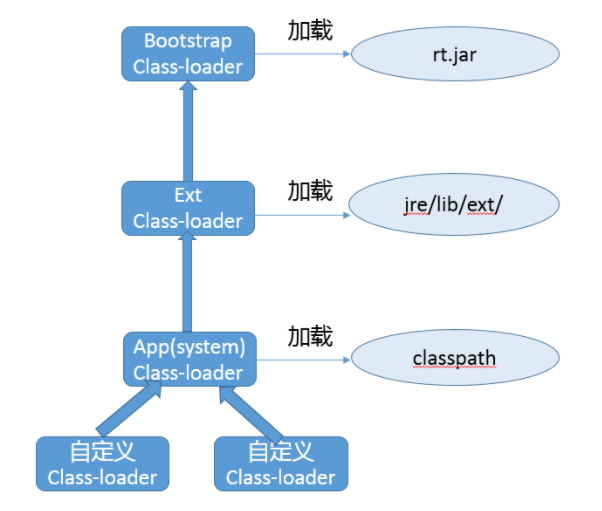
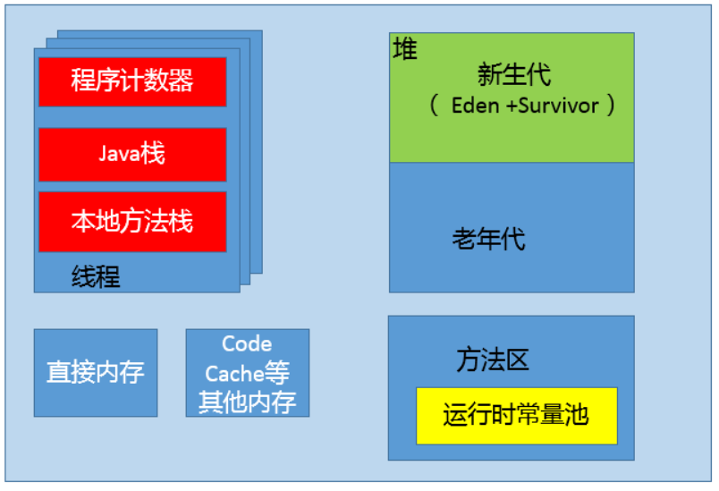
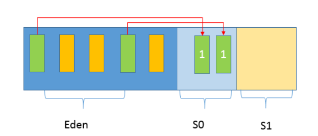
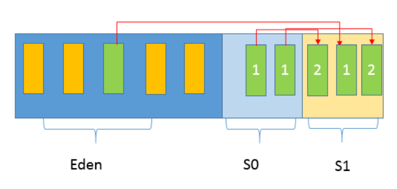
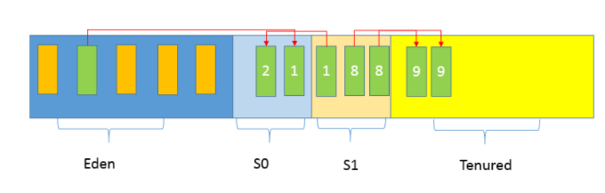
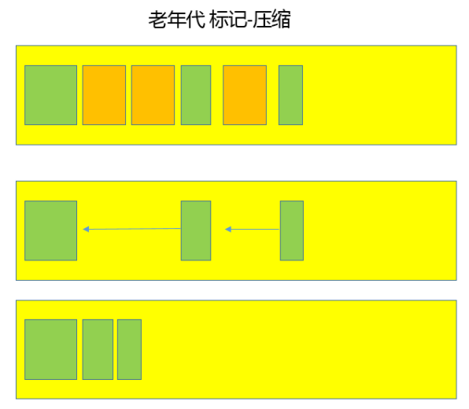

# 基础

## 谈谈对Java平台的理解

Java 是一种面向对象的语言，最显著的特性：书写一次，到处运行，有跨平台能力，Java 通过垃圾收集器回收分配内存

JRE是Java运行环境，包含了JVM和Java类库，JDK是JRE的超集，提供了更多工具，如编译器和各种诊断工具

Java是解释执行这个说法不太准确，Java源代码通过Javac编译成了字节码，然后在运行时通过JVM内嵌的解释器将字节码转换成机器码。常见的JVM提供了JIT（Just-In-Time）编译器，也称为动态编译器，能够在运行时将热点代码编译成机器码，这种情况下部分热点代码就属于编译执行


## Exception和Error有什么区别？

Exception和Error都继承了Throwable类，在Java中只有Throwable类型的实例才可以被抛出（throw）或被捕获（catch），他是异常处理机制的基本组成类型

Exception是程序正常运行中，可以预料的意外情况，可能并且应该被捕获，进行相应的处理

Error会导致程序处于非正常、不可恢复状态，既然是非正常情况，不便于也不需要捕获，常见的OOM（OutOfMemoryError）

Exception又分为可检查异常和不检查异常，可检查异常在源代码里必须显式地进行捕获处理，这是编译期检查的一部分，不检查异常就是所谓的运行时异常，如NullPointerException、ArrayIndexOutOfBoundsException，要避免逻辑错误来避免异常发生，具体根据需要来判断是否需要捕获，在编译期不强制要求


> NoClassDefFoundError 和 ClassNotFoundException 有什么区别


ClassNotFoundException的产生原因主要是：
Java支持使用反射方式在运行时动态加载类，例如使用Class.forName方法来动态地加载类时，可以将类名作为参数传递给上述方法从而将指定类加载到JVM内存中，如果这个类在类路径中没有被找到，那么此时就会在运行时抛出ClassNotFoundException异常。

NoClassDefFoundError产生的原因在于：
如果JVM或者ClassLoader实例尝试加载（可以通过正常的方法调用，也可能是使用new来创建新的对象）类的时候却找不到类的定义。要查找的类在编译的时候是存在的，运行的时候却找不到了。这个时候就会导致NoClassDefFoundError.

> throw、throws 关键字

throws通常用在声明方法时，用来制指定可能抛出的异常。多个异常可以使用逗号分隔。

throw关键字通常用于方法体中，并且抛出一个异常对象。程序在执行到throw语句时立即终止，它后面的语句都不执行。通过throw抛出异常后，如果想在上一级代码中来捕获并处理异常，则需要在抛出异常的方法中使用throws关键字在方法的声明中指明要抛出的异常；如果要捕获throw抛出的异常，则必须使用try-catch语句块；

> Try-with-resources和Multiple catch

```java
try (BufferedReader br = new BufferedReader(…);
     BufferedWriter writer = new BufferedWriter(…)) {
    // Try-with-resources
    // do something
    catch ( IOException | XEception e) {// Multiple catch
        // Handle it
    } 
```

```java
FileInputStream fis = new FileInputStream(file);
try {
  // do something
} finally {
  fis.close();
}
// 等价
try (FileInputStream fis = new FileInputStream(file)) {
  // do something
}
```

> 性能开销

try-catch 代码段会产生额外的性能开销，或者换个角度说，它往往会影响 JVM 对代码进行优化，所以建议仅捕获有必要的代码段，尽量不要一个大的 try 包住整段的代码；与此同时，利用异常控制代码流程，也不是一个好主意，远比我们通常意义上的条件语句（if/else、switch）要低效。

Java 每实例化一个 Exception，都会对当时的栈进行快照，这是一个相对比较重的操作。如果发生的非常频繁，这个开销可就不能被忽略了。

## final、finally、 finalize 有什么不同？

final 可以用来修饰类、方法、变量，分别有不同的意义，final 修饰的 class 代表不可以继承扩展，final 的变量是不可以修改的，而 final 的方法也是不可以重写的（override）。

finally 则是 Java 保证重点代码一定要被执行的一种机制。我们可以使用 try-finally 或者 try-catch-finally 来进行类似关闭 JDBC 连接、保证 unlock 锁等动作。

finalize 是基础类 java.lang.Object 的一个方法，它的设计目的是保证对象在被垃圾收集前完成特定资源的回收。finalize 机制现在已经不推荐使用，并且在 JDK 9 开始被标记为 deprecated。

## 强引用、软引用、弱引用、幻象引用有什么区别？具体使用场景是什么？

不同的引用类型，主要体现的是对象不同的可达性（reachable）状态和对垃圾收集的影响。

所谓强引用（“Strong” Reference），就是我们最常见的普通对象引用，只要还有强引用指向一个对象，就能表明**对象还“活着”，垃圾收集器不会碰这种对象**。对于一个普通的对象，如果没有其他的引用关系，**只要超过了引用的作用域或者显式地将相应（强）引用赋值为 null，就是可以被垃圾收集**的了，当然具体回收时机还是要看垃圾收集策略。

软引用（SoftReference），是一种相对强引用弱化一些的引用，可以让**对象豁免一些垃圾收集，只有当 JVM 认为内存不足时，才会去试图回收软引用指向的对象**。JVM 会确保在抛出 OutOfMemoryError 之前，清理软引用指向的对象。软引用通常用来实现内存敏感的缓存，如果还有空闲内存，就可以暂时保留缓存，当内存不足时清理掉，这样就保证了使用缓存的同时，不会耗尽内存。

弱引用（WeakReference）**并不能使对象豁免垃圾收集，仅仅是提供一种访问在弱引用状态下对象的途径**。这就可以用来构建一种没有特定约束的关系，比如，维护一种非强制性的映射关系，如果试图获取时对象还在，就使用它，否则重现实例化。它同样是很多缓存实现的选择。

对于幻象引用，有时候也翻译成虚引用，你**不能通过它访问对象**。幻象引用仅仅是提供了一种确保对象被 finalize 以后，做某些事情的机制，比如，通常用来做所谓的 Post-Mortem 清理机制，我在专栏上一讲中介绍的 Java 平台自身 Cleaner 机制等，也有人利用幻象引用监控对象的创建和销毁。


在Java语言中，除了基本数据类型外，其他的都是指向各类对象的对象引用；Java中根据其生命周期的长短，将引用分为4类。

1 强引用

特点：我们平常典型编码Object obj = new Object()中的obj就是强引用。通过关键字new创建的对象所关联的引用就是强引用。 当JVM内存空间不足，JVM宁愿抛出OutOfMemoryError运行时错误（OOM），使程序异常终止，也不会靠随意回收具有强引用的“存活”对象来解决内存不足的问题。对于一个普通的对象，如果没有其他的引用关系，只要超过了引用的作用域或者显式地将相应（强）引用赋值为 null，就是可以被垃圾收集的了，具体回收时机还是要看垃圾收集策略。

2 软引用

特点：软引用通过SoftReference类实现。 软引用的生命周期比强引用短一些。只有当 JVM 认为内存不足时，才会去试图回收软引用指向的对象：即JVM 会确保在抛出 OutOfMemoryError 之前，清理软引用指向的对象。软引用可以和一个引用队列（ReferenceQueue）联合使用，如果软引用所引用的对象被垃圾回收器回收，Java虚拟机就会把这个软引用加入到与之关联的引用队列中。后续，我们可以调用ReferenceQueue的poll()方法来检查是否有它所关心的对象被回收。如果队列为空，将返回一个null,否则该方法返回队列中前面的一个Reference对象。

应用场景：软引用通常用来实现内存敏感的缓存。如果还有空闲内存，就可以暂时保留缓存，当内存不足时清理掉，这样就保证了使用缓存的同时，不会耗尽内存。

3 弱引用

弱引用通过WeakReference类实现。 弱引用的生命周期比软引用短。在垃圾回收器线程扫描它所管辖的内存区域的过程中，一旦发现了具有弱引用的对象，不管当前内存空间足够与否，都会回收它的内存。由于垃圾回收器是一个优先级很低的线程，因此不一定会很快回收弱引用的对象。弱引用可以和一个引用队列（ReferenceQueue）联合使用，如果弱引用所引用的对象被垃圾回收，Java虚拟机就会把这个弱引用加入到与之关联的引用队列中。

应用场景：弱应用同样可用于内存敏感的缓存。

4 虚引用

特点：虚引用也叫幻象引用，通过PhantomReference类来实现。无法通过虚引用访问对象的任何属性或函数。幻象引用仅仅是提供了一种确保对象被 finalize 以后，做某些事情的机制。如果一个对象仅持有虚引用，那么它就和没有任何引用一样，在任何时候都可能被垃圾回收器回收。虚引用必须和引用队列 （ReferenceQueue）联合使用。当垃圾回收器准备回收一个对象时，如果发现它还有虚引用，就会在回收对象的内存之前，把这个虚引用加入到与之关联的引用队列中。
ReferenceQueue queue = new ReferenceQueue ();
PhantomReference pr = new PhantomReference (object, queue);
程序可以通过判断引用队列中是否已经加入了虚引用，来了解被引用的对象是否将要被垃圾回收。如果程序发现某个虚引用已经被加入到引用队列，那么就可以在所引用的对象的内存被回收之前采取一些程序行动。

应用场景：可用来跟踪对象被垃圾回收器回收的活动，当一个虚引用关联的对象被垃圾收集器回收之前会收到一条系统通知。

## String、StringBuffer、StringBuilder 有什么区别？

String 是 Java 语言非常基础和重要的类，提供了构造和管理字符串的各种基本逻辑。它是典型的 Immutable 类，被声明成为 **final class**，所有属性也都是 final 的。也由于它的不可变性，类似拼接、裁剪字符串等动作，都会产生新的 String 对象。由于字符串操作的普遍性，所以相关操作的效率往往对应用性能有明显影响。

StringBuffer 是为解决上面提到拼接产生太多中间对象的问题而提供的一个类，我们可以**用 append 或者 add 方法**，把字符串添加到已有序列的末尾或者指定位置。**StringBuffer 本质是一个线程安全的可修改字符序列，**它保证了线程安全，也随之带来了额外的性能开销，所以除非有线程安全的需要，不然还是推荐使用它的后继者，也就是 StringBuilder。

StringBuilder 是 Java 1.5 中新增的，在能力上和 StringBuffer 没有本质区别，但是**它去掉了线程安全的部分**，有效减小了开销，是绝大部分情况下进行字符串拼接的首选。

1 String

(1) String的创建机理
由于String在Java世界中使用过于频繁，Java为了避免在一个系统中产生大量的String对象，引入了**字符串常量池**。其运行机制是：创建一个字符串时，首先检查池中是否有值相同的字符串对象，如果有则不需要创建直接从池中刚查找到的对象引用；如果没有则新建字符串对象，返回对象引用，并且将新创建的对象放入池中。但是，通过new方法创建的String对象是不检查字符串池的，而是直接在堆区或栈区创建一个新的对象，也不会把对象放入池中。上述原则只适用于通过直接量给String对象引用赋值的情况。

举例：String str1 = "123"; //通过直接量赋值方式，放入字符串常量池
String str2 = new String(“123”);//通过new方式赋值方式，不放入字符串常量池

注意：String提供了inter()方法。调用该方法时，如果常量池中包括了一个等于此String对象的字符串（由equals方法确定），则返回池中的字符串。否则，将此String对象添加到池中，并且返回此池中对象的引用。


(2) String的特性
[A] 不可变。是指String对象一旦生成，则不能再对它进行改变。不可变的主要作用在于当一个对象需要被多线程共享，并且访问频繁时，可以省略同步和锁等待的时间，从而大幅度提高系统性能。不可变模式是一个可以提高多线程程序的性能，降低多线程程序复杂度的设计模式。

[B] 针对常量池的优化。当2个String对象拥有相同的值时，他们只引用常量池中的同一个拷贝。当同一个字符串反复出现时，这个技术可以大幅度节省内存空间。

2 StringBuffer/StringBuilder

StringBuffer和StringBuilder都实现了AbstractStringBuilder抽象类，拥有几乎一致对外提供的调用接口；其底层在内存中的存储方式与String相同，都是以一个有序的字符序列（char类型的数组）进行存储，不同点是StringBuffer/StringBuilder对象的值是可以改变的，并且值改变以后，对象引用不会发生改变;两者对象在构造过程中，首先按照默认大小申请一个字符数组，由于会不断加入新数据，当超过默认大小后，会创建一个更大的数组，并将原先的数组内容复制过来，再丢弃旧的数组。因此，对于较大对象的扩容会涉及大量的内存复制操作，如果能够预先评估大小，可提升性能。

唯一需要注意的是：StringBuffer是线程安全的，但是StringBuilder是线程不安全的。可参看Java标准类库的源代码，StringBuffer类中方法定义前面都会有synchronize关键字。为此，StringBuffer的性能要远低于StringBuilder。


3 应用场景

[A]在字符串内容不经常发生变化的业务场景优先使用String类。例如：常量声明、少量的字符串拼接操作等。如果有大量的字符串内容拼接，避免使用String与String之间的“+”操作，因为这样会产生大量无用的中间对象，耗费空间且执行效率低下（新建对象、回收对象花费大量时间）。

[B]在频繁进行字符串的运算（如拼接、替换、删除等），并且运行在多线程环境下，建议使用StringBuffer，例如XML解析、HTTP参数解析与封装。

[C]在频繁进行字符串的运算（如拼接、替换、删除等），并且运行在单线程环境下，建议使用StringBuilder，例如SQL语句拼装、JSON封装等。

## Java 反射机制，动态代理是基于什么原理？

反射机制是 Java 语言提供的一种基础功能，赋予程序在运行时自省（introspect，官方用语）的能力。通过反射我们可以直接操作类或者对象，比如获取某个对象的类定义，获取类声明的属性和方法，调用方法或者构造对象，甚至可以运行时修改类定义。

动态代理是一种方便运行时动态构建代理、动态处理代理方法调用的机制，很多场景都是利用类似机制做到的，比如用来包装 RPC 调用、面向切面的编程（AOP）。动态代理是一个代理机制，通过代理可以让调用者和实现者之间解耦。

实现动态代理的方式很多，比如 JDK 自身提供的动态代理，就是主要利用了上面提到的反射机制。还有其他的实现方式，比如利用传说中更高性能的字节码操作机制，类似 ASM、cglib（基于 ASM）、Javassist 等。

## int 和 Integer 有什么区别？

int是java 的 8 个原始数据类型（Primitive Types，boolean、byte 、short、char、int、float、double、long）之一

Integer 是 int 对应的包装类，它有一个 int 类型的字段存储数据，并且提供了基本操作，比如数学运算、int 和字符串之间转换等。

Integer的值默认缓存是 -128 到 127 之间。

Java得自动装箱拆箱机制其实是**编译时**自动完成替换的，装箱阶段自动替换成为了valueOf方法，拆箱阶段自动替换为了xxxValue方法。

```java
/**
 * 自动装箱
 * 将一个基本类型的变量直接赋值给对应的包装类变量
 * 或者赋值给Object 变量
 */
//直接把一个基本类型变量给Integer对象
Integer inObj = 5;  //Integer i = Integer.valueOf(5);
/**
 * 自动拆箱
 * 允许直接把包装类对象直接赋给一个对应的基本类型变量
 */
int it = inObj;
```

Integer同样是不可变类型

如果有线程安全的计算需要，建议考虑使用类似 AtomicInteger、AtomicLong 这样的线程安全类

原始数据类型和 Java 泛型并不能配合使用

```markdown
# 对象结构
- 对象在内存中存储的布局可以分为3块区域：对象头（Header）、实例数据（Instance Data）和对齐填充（Padding）。
## 对象头
- markword：用于存储对象自身的运行时数据，如哈希码、GC分代年龄、锁状态标志、线程持有的锁等。这部分数据长度在32位机器和64位机器虚拟机中分别为4字节和8字节；
- lass指针：即对象指向它的类元数据的指针，虚拟机通过这个指针来确定这个对象属于哪个类的实例；
- length：如果是java数组，对象头必须有一块用于记录数组长度的数据，用4个字节来int来记录数组长度
## 实例数据
- 实例数据是对象真正存储的有效信息，也是程序代码中定义的各种类型的字段内容。无论是从父类继承下来还是在子类中定义的数据，都需要记录下来
## 对齐填充
- 对齐填充并不是必然存在的，也没有特别的含义，它仅仅起着占位符的作用。由于HotSpot VM的自动内存管理系统要求对象起始地址必须是8字节的整数倍，换句话说，就是对象的大小必须是8字节的整数倍。而对象头部分正好是8字节的倍数（1倍或者2倍），因此，当对象实例数据部分没有对齐时，就需要通过对齐填充来补全。原因是访问未对齐的内存，处理器需要做两次内存访问，而对齐的内存访问仅需一次访问.
# 对象大小计算
1. 在32位系统下，存放Class指针的空间大小是4字节，MarkWord是4字节，对象头为8字节。
2. 在64位系统下，存放Class指针的空间大小是8字节，MarkWord是8字节，对象头为16字节。
3. 64位开启指针压缩的情况下，存放Class指针的空间大小是4字节，MarkWord是8字节，对象头为12字节。 数组长度4字节+数组对象头8字节(对象引用4字节（未开启指针压缩的64位为8字节）+数组markword为4字节（64位未开启指针压缩的为8字节）)+对齐4=16字节。
4. 静态属性不算在对象大小内。
```

## Vector、ArrayList、LinkedList 有何区别？

这三者都是实现集合框架中的 List，也就是所谓的有序集合，因此具体功能也比较近似，比如都提供按照位置进行定位、添加或者删除的操作，都提供迭代器以遍历其内容等。但因为具体的设计区别，在行为、性能、线程安全等方面，表现又有很大不同。

Vector 是 Java 早期提供的线程安全的动态数组，如果不需要线程安全，并不建议选择，毕竟同步是有额外开销的。Vector 内部是使用对象数组来保存数据，可以根据需要自动的增加容量，当数组已满时，会创建新的数组，并拷贝原有数组数据。

ArrayList 是应用更加广泛的动态数组实现，它本身不是线程安全的，所以性能要好很多。与 Vector 近似，ArrayList 也是可以根据需要调整容量，不过两者的调整逻辑有所区别，Vector 在扩容时会提高 1 倍，而 ArrayList 则是增加 50%。

LinkedList 顾名思义是 Java 提供的双向链表，所以它不需要像上面两种那样调整容量，它也不是线程安全的。

```markdown
# 集合
- List，也就是我们前面介绍最多的有序集合，它提供了方便的访问、插入、删除等操作。
- Set，Set 是不允许重复元素的，这是和 List 最明显的区别，也就是不存在两个对象 equals 返回 true。我们在日常开发中有很多需要保证元素唯一性的场合。
- Queue/Deque，则是 Java 提供的标准队列结构的实现，除了集合的基本功能，它还支持类似先入先出（FIFO， First-in-First-Out）或者后入先出（LIFO，Last-In-First-Out）等特定行为。这里不包括 BlockingQueue，因为通常是并发编程场合，所以被放置在并发包里。
```

## 对比 Hashtable、HashMap、TreeMap 有什么不同？

Hashtable、HashMap、TreeMap 都是最常见的一些 Map 实现，是以键值对的形式存储和操作数据的容器类型。

Hashtable 是早期 Java 类库提供的一个哈希表实现，本身是同步的，不支持 null 键和值，由于同步导致的性能开销，所以已经很少被推荐使用。

HashMap 是应用更加广泛的哈希表实现，行为上大致上与 HashTable 一致，主要区别在于 HashMap 不是同步的，支持 null 键和值等。通常情况下，HashMap 进行 put 或者 get 操作，可以达到常数时间的性能，所以它是绝大部分利用键值对存取场景的首选，比如，实现一个用户 ID 和用户信息对应的运行时存储结构。

TreeMap 则是基于红黑树的一种提供顺序访问的 Map，和 HashMap 不同，它的 get、put、remove 之类操作都是 O（log(n)）的时间复杂度，具体顺序可以由指定的 Comparator 来决定，或者根据键的自然顺序来判断。

```markdown
# hashCode 和 equals 的一些基本约定
- equals 相等，hashCode 一定要相等。
- 重写了 hashCode 也要重写 equals。hashCode 需要保持一致性，状态改变返回的哈希值仍然要一致。
- equals 的对称、反射、传递等特性。
```

HashMap 内部的结构，它可以看作是数组（Node[] table）和链表结合组成的复合结构，数组被分为一个个桶（bucket），通过哈希值决定了键值对在这个数组的寻址；哈希值相同的键值对，则以链表形式存储，你可以参考下面的示意图。这里需要注意的是，如果链表大小超过阈值（TREEIFY_THRESHOLD, 8），图中的链表就会被改造为树形结构。


容量和负载系数决定了可用的桶的数量，空桶太多会浪费空间，如果使用的太满则会严重影响操作的性能。极端情况下，假设只有一个桶，那么它就退化成了链表，完全不能提供所谓常数时间存的性能。

` 负载因子 * 容量 > 元素数量`

为什么 HashMap 要树化呢？

本质上这是个安全问题。因为在元素放置过程中，如果一个对象哈希冲突，都被放置到同一个桶里，则会形成一个链表，我们知道链表查询是线性的，会严重影响存取的性能。

```markdown
# 解决哈希冲突的常用方法有：

## 开放定址法
- 基本思想是：当关键字key的哈希地址p=H（key）出现冲突时，以p为基础，产生另一个哈希地址p1，如果p1仍然冲突，再以p为基础，产生另一个哈希地址p2，…，直到找出一个不冲突的哈希地址pi ，将相应元素存入其中。

## 再哈希法
- 这种方法是同时构造多个不同的哈希函数：
- Hi=RH1（key）  i=1，2，…，k
- 当哈希地址Hi=RH1（key）发生冲突时，再计算Hi=RH2（key）……，直到冲突不再产生。这种方法不易产生聚集，但增加了计算时间。

## 链地址法
- 这种方法的基本思想是将所有哈希地址为i的元素构成一个称为同义词链的单链表，并将单链表的头指针存在哈希表的第i个单元中，因而查找、插入和删除主要在同义词链中进行。链地址法适用于经常进行插入和删除的情况。

## 建立公共溢出区
- 这种方法的基本思想是：将哈希表分为基本表和溢出表两部分，凡是和基本表发生冲突的元素，一律填入溢出表。
```

## 如何保证容器是线程安全的?

具体保证线程安全的方式，包括有从简单的 synchronize 方式，到基于更加精细化的，比如基于分离锁实现的 ConcurrentHashMap 等并发实现等。具体选择要看开发的场景需求，总体来说，并发包内提供的容器通用场景，远优于早期的简单同步实现。

```markdown
# ConcurrentHashMap 分析
- 早期 ConcurrentHashMap，其实现是基于：
- 分离锁，也就是将内部进行分段（Segment），里面则是 HashEntry 的数组，和 HashMap 类似，哈希相同的条目也是以链表形式存放。
- HashEntry 内部使用 volatile 的 value 字段来保证可见性，也利用了不可变对象的机制以改进利用 Unsafe 提供的底层能力，比如 volatile access，去直接完成部分操作，以最优化性能，毕竟 Unsafe 中的很多操作都是 JVM intrinsic 优化过的。
```


> 其核心是利用分段设计，在进行并发操作的时候，只需要锁定相应段，这样就有效避免了类似 Hashtable 整体同步的问题，大大提高了性能。
>
> 在构造的时候，Segment 的数量由所谓的 concurrentcyLevel 决定，默认是 16，也可以在相应构造函数直接指定。注意，Java 需要它是 2 的幂数值，如果输入是类似 15 这种非幂值，会被自动调整到 16 之类 2 的幂数值

```markdown
- 在进行并发写操作时：
- ConcurrentHashMap 会获取再入锁，以保证数据一致性，Segment 本身就是基于 ReentrantLock 的扩展实现，所以，在并发修改期间，相应 Segment 是被锁定的。
- 在最初阶段，进行重复性的扫描，以确定相应 key 值是否已经在数组里面，进而决定是更新还是放置操作，你可以在代码里看到相应的注释。重复扫描、检测冲突是 ConcurrentHashMap 的常见技巧。
```

在 Java 8 和之后的版本中，ConcurrentHashMap 发生了哪些变化呢？

```markdown
- 总体结构上，它的内部存储变得和 HashMap 结构非常相似，同样是大的桶（bucket）数组，然后内部也是一个个所谓的链表结构（bin），同步的粒度要更细致一些。
- 其内部仍然有 Segment 定义，但仅仅是为了保证序列化时的兼容性而已，不再有任何结构上的用处。
- 因为不再使用 Segment，初始化操作大大简化，修改为 lazy-load 形式，这样可以有效避免初始开销，解决了老版本很多人抱怨的这一点。
- 数据存储利用 volatile 来保证可见性。使用 CAS 等操作，在特定场景进行无锁并发操作。
- 使用 Unsafe、LongAdder 之类底层手段，进行极端情况的优化。
```

## Java 提供了哪些 IO 方式？ NIO 如何实现多路复用？

第一，传统的 java.io 包，它基于流模型实现，提供了我们最熟知的一些 IO 功能，比如 File 抽象、输入输出流等。交互方式是同步、阻塞的方式，也就是说，在读取输入流或者写入输出流时，在读、写动作完成之前，线程会一直阻塞在那里，它们之间的调用是可靠的线性顺序。java.io 包的好处是代码比较简单、直观，缺点则是 IO 效率和扩展性存在局限性，容易成为应用性能的瓶颈。

第二，在 Java 1.4 中引入了 NIO 框架（java.nio 包），提供了 Channel、Selector、Buffer 等新的抽象，可以构建多路复用的、同步非阻塞 IO 程序，同时提供了更接近操作系统底层的高性能数据操作方式。

第三，在 Java 7 中，NIO 有了进一步的改进，也就是 NIO 2，引入了异步非阻塞 IO 方式，也有很多人叫它 AIO（Asynchronous IO）。异步 IO 操作基于事件和回调机制，可以简单理解为，应用操作直接返回，而不会阻塞在那里，当后台处理完成，操作系统会通知相应线程进行后续工作。

```markdown
# 区分同步和异步
- 同步是一种可靠的有序运行机制，当我们进行同步操作时，后续的任务是等待当前调用返回，才会进行下一步
- 而异步则相反，其他任务不需要等待当前调用返回，通常依靠事件、回调等机制来实现任务间次序关系。
# 区分阻塞和非阻塞
- 在进行阻塞操作时，当前线程会处于阻塞状态，无法从事其他任务，只有当条件就绪才能继续，比如 ServerSocket 新连接建立完毕，或数据读取、写入操作完成
- 而非阻塞则是不管 IO 操作是否结束，直接返回，相应操作在后台继续处理。
```


```markdown
# NIO
- Buffer，高效的数据容器，除了布尔类型，所有原始数据类型都有相应的 Buffer 实现
- Channel，类似在 Linux 之类操作系统上看到的文件描述符，是 NIO 中被用来支持批量式 IO 操作的一种抽象。
- Selector，是 NIO 实现多路复用的基础，它提供了一种高效的机制，可以检测到注册在 Selector 上的多个 Channel 中，是否有 Channel 处于就绪状态，进而实现了单线程对多 Channel 的高效管理
- Charset，提供 Unicode 字符串定义，NIO 也提供了相应的编解码器等
```


## Java 有几种文件拷贝方式？哪一种最高效？

```java
// 常规实现
public static void copyFileByStream(File source, File dest) {
    try (InputStream is = new FileInputStream(source);
         OutputStream os = new FileOutputStream(dest);){
        byte[] buffer = new byte[1024];
        int length;
        while ((length = is.read(buffer)) > 0) {
            os.write(buffer, 0, length);
        }
    }
}
// NIO
public static void copyFileByChannel(File source, File dest){
    try (FileChannel sourceChannel = new FileInputStream(source).getChannel();
         FileChannel targetChannel = new FileOutputStream(dest).getChannel();){
        for (long count = sourceChannel.size() ;count>0 ;) {
            long transferred =sourceChannel.transferTo(sourceChannel.position(),count,targetChannel);
            sourceChannel.position(sourceChannel.position() + transferred);
            count -= transferred;
        }
    }
}
```

常规实现


NIO transferTo  零拷贝


```markdown
# 如何提高类似拷贝等 IO 操作的性能
- 在程序中，使用缓存等机制，合理减少 IO 次数（在网络通信中，如 TCP 传输，window 大小也可以看作是类似思路）。
- 使用 transferTo 等机制，减少上下文切换和额外 IO 操作。
- 尽量减少不必要的转换过程，比如编解码；对象序列化和反序列化，比如操作文本文件或者网络通信，如果不是过程中需要使用文本信息，可以考虑不要将二进制信息转换成字符串，直接传输二进制信息。
```

```markdown
# 掌握 NIO Buffer
## Buffer 的基本属性
- capacity，它反映这个 Buffer 到底有多大，也就是数组的长度。
- position，要操作的数据起始位置。
- limit，相当于操作的限额。在读取或者写入时，limit 的意义很明显是不一样的。比如，读取操作时，很可能将 limit 设置到所容纳数据的上限；而在写入时，则会设置容量或容量以下的可写限度。
- mark，记录上一次 postion 的位置，默认是 0，算是一个便利性的考虑，往往不是必须的。
## Buffer 的基本操作
- 我们创建了一个 ByteBuffer，准备放入数据，capacity 当然就是缓冲区大小，而 position 就是 0，limit 默认就是 capacity 的大小。
- 当我们写入几个字节的数据时，position 就会跟着水涨船高，但是它不可能超过 limit 的大小。
- 如果我们想把前面写入的数据读出来，需要调用 flip 方法，将 position 设置为 0，limit 设置为以前的 position 那里。
- 如果还想从头再读一遍，可以调用 rewind，让 limit 不变，position 再次设置为 0。
```

## 谈谈接口和抽象类有什么区别？

接口是对行为的抽象，它是抽象方法的集合，利用接口可以达到 API 定义和实现分离的目的。接口，不能实例化；不能包含任何非常量成员，任何 field 都是隐含着 public static final 的意义；同时，没有非静态方法实现，也就是说要么是抽象方法，要么是静态方法。Java 标准类库中，定义了非常多的接口，比如 java.util.List。

抽象类是不能实例化的类，用 abstract 关键字修饰 class，其目的主要是代码重用。除了不能实例化，形式上和一般的 Java 类并没有太大区别，可以有一个或者多个抽象方法，也可以没有抽象方法。抽象类大多用于抽取相关 Java 类的共用方法实现或者是共同成员变量，然后通过继承的方式达到代码复用的目的。Java 标准库中，比如 collection 框架，很多通用部分就被抽取成为抽象类，例如 java.util.AbstractList。

Java 8 增加了函数式编程的支持，所以又增加了一类定义，即所谓 functional interface，简单说就是只有一个抽象方法的接口，通常建议使用 @FunctionalInterface Annotation 来标记。Lambda 表达式本身可以看作是一类 functional interface

```markdown
# 面向对象设计
## 封装,继承,多态
- 封装的目的是隐藏事务内部的实现细节，以便提高安全性和简化编程。封装提供了合理的边界，避免外部调用者接触到内部的细节。
- 继承是代码复用的基础机制,继承可以看作是非常紧耦合的一种关系，父类代码修改，子类行为也会变动。在实践中，过度滥用继承，可能会起到反效果。
- 多态，你可能立即会想到重写（override）和重载（overload）、向上转型。简单说，重写是父子类中相同名字和参数的方法，不同的实现；重载则是相同名字的方法，但是不同的参数，本质上这些方法签名是不一样的.
# S.O.L.I.D 原则
- 单一职责（Single Responsibility），类或者对象最好是只有单一职责，在程序设计中如果发现某个类承担着多种义务，可以考虑进行拆分。
- 开关原则（Open-Close, Open for extension, close for modification），设计要对扩展开放，对修改关闭。换句话说，程序设计应保证平滑的扩展性，尽量避免因为新增同类功能而修改已有实现，这样可以少产出些回归（regression）问题。
- 里氏替换（Liskov Substitution），这是面向对象的基本要素之一，进行继承关系抽象时，凡是可以用父类或者基类的地方，都可以用子类替换。
- 接口分离（Interface Segregation），我们在进行类和接口设计时，如果在一个接口里定义了太多方法，其子类很可能面临两难，就是只有部分方法对它是有意义的，这就破坏了程序的内聚性。对于这种情况，可以通过拆分成功能单一的多个接口，将行为进行解耦。在未来维护中，如果某个接口设计有变，不会对使用其他接口的子类构成影响。
- 依赖反转（Dependency Inversion），实体应该依赖于抽象而不是实现。也就是说高层次模块，不应该依赖于低层次模块，而是应该基于抽象。实践这一原则是保证产品代码之间适当耦合度的法宝。
```

## 谈谈你知道的设计模式？

设计模式可以分为创建型模式、结构型模式和行为型模式

创建型模式，是对对象创建过程的各种问题和解决方案的总结：

* 各种工厂模式（Factory、Abstract Factory）
* 单例模式（Singleton）
* 构建器模式（Builder）
* 原型模式（Proto Type）

结构型模式，是对软件设计结构的总结，关注于类、对象继承、组合方式的实践经验

* 桥接模式（Bridge）
* 适配器模式（Adapter）
* 装饰者模式（Decorator）
* 代理模式（Proxy）
* 组合模式（Composite）
* 外观模式（Facade）
* 享元模式（Flyweight）

行为型模式，是从类或对象之间交互、职责划分等角度总结的模式

* 策略模式（Strategy）
* 解释器模式（Interpreter）
* 命令模式（Command）
* 观察者模式（Observer）
* 迭代器模式（Iterator）
* 模板方法模式（Template Method）
* 访问者模式（Vistor）

```markdown
# Spring 中使用到的设计模式
- BeanFactory和ApplicationContext应用了工厂模式。
- 在 Bean 的创建中，Spring 也为不同 scope 定义的对象，提供了单例和原型等模式实现。
- AOP 领域则是使用了代理模式、装饰器模式、适配器模式等。
- 各种事件监听器，是观察者模式的典型应用
- 类似 JdbcTemplate 等则是应用了模板模式
```

# 进阶

## synchronized 和 ReentrantLock 有什么区别？

synchronized 是 Java 内建的同步机制，所以也有人称其为 Intrinsic Locking，它提供了互斥的语义和可见性，当一个线程已经获取当前锁时，其他试图获取的线程只能等待或者阻塞在那里。

ReentrantLock，通常翻译为再入锁，是 Java 5 提供的锁实现，它的语义和 synchronized 基本相同。再入锁通过代码直接调用 lock() 方法获取，代码书写也更加灵活。与此同时，ReentrantLock 提供了很多实用的方法，能够实现很多 synchronized 无法做到的细节控制，比如可以控制 fairness，也就是公平性，或者利用定义条件等。但是，编码中也需要注意，必须要明确调用 unlock() 方法释放，不然就会一直持有该锁。

synchronized 和 ReentrantLock 的性能不能一概而论，早期版本 synchronized 在很多场景下性能相差较大，在后续版本进行了较多改进，在低竞争场景中表现可能优于 ReentrantLock。

```markdown
# 线程安全需要保证几个基本特性
- 原子性，简单说就是相关操作不会中途被其他线程干扰，一般通过同步机制实现。
- 可见性，是一个线程修改了某个共享变量，其状态能够立即被其他线程知晓，通常被解释为将线程本地状态反映到主内存上，volatile 就是负责保证可见性的。
- 有序性，是保证线程内串行语义，避免指令重排等。
```

## synchronized 底层如何实现？

synchronized 代码块是由一对儿 monitorenter/monitorexit 指令实现的，Monitor 对象是同步的基本实现单元。

在 Java 6 之前，Monitor 的实现完全是依靠操作系统内部的互斥锁，因为需要进行用户态到内核态的切换，所以同步操作是一个无差别的重量级操作。

现代的（Oracle）JDK 中，JVM 对此进行了大刀阔斧地改进，提供了三种不同的 Monitor 实现，也就是常说的三种不同的锁：偏斜锁（Biased Locking）、轻量级锁和重量级锁，大大改进了其性能。

所谓锁的升级、降级，就是 JVM 优化 synchronized 运行的机制，当 JVM 检测到不同的竞争状况时，会自动切换到适合的锁实现，这种切换就是锁的升级、降级。

当没有竞争出现时，默认会使用偏斜锁。JVM 会利用 CAS 操作（compare and swap），在对象头上的 Mark Word 部分设置线程 ID，以表示这个对象偏向于当前线程，所以并不涉及真正的互斥锁。这样做的假设是基于在很多应用场景中，大部分对象生命周期中最多会被一个线程锁定，使用偏斜锁可以降低无竞争开销。

如果有另外的线程试图锁定某个已经被偏斜过的对象，JVM 就需要撤销（revoke）偏斜锁，并切换到轻量级锁实现。轻量级锁依赖 CAS 操作 Mark Word 来试图获取锁，如果重试成功，就使用普通的轻量级锁；否则，进一步升级为重量级锁。

锁降级确实是会发生的，当 JVM 进入安全点（SafePoint）的时候，会检查是否有闲置的 Monitor，然后试图进行降级。

## 一个线程两次调用 start() 方法会出现什么情况？

Java 的线程是不允许启动两次的，第二次调用必然会抛出 IllegalThreadStateException，这是一种运行时异常，多次调用 start 被认为是编程错误。

```markdown
# 线程生命周期
- 新建（NEW），表示线程被创建出来还没真正启动的状态，可以认为它是个 Java 内部状态。
- 就绪（RUNNABLE），表示该线程已经在 JVM 中执行，当然由于执行需要计算资源，它可能是正在运行，也可能还在等待系统分配给它 CPU 片段，在就绪队列里面排队。
- 在其他一些分析中，会额外区分一种状态 RUNNING，但是从 Java API 的角度，并不能表示出来。
- 阻塞（BLOCKED），这个状态和我们前面两讲介绍的同步非常相关，阻塞表示线程在等待 Monitor lock。比如，线程试图通过 synchronized 去获取某个锁，但是其他线程已经独占了，那么当前线程就会处于阻塞状态。
- 等待（WAITING），表示正在等待其他线程采取某些操作。一个常见的场景是类似生产者消费者模式，发现任务条件尚未满足，就让当前消费者线程等待（wait），另外的生产者线程去准备任务数据，然后通过类似 notify 等动作，通知消费线程可以继续工作了。Thread.join() 也会令线程进入等待状态。
- 计时等待（TIMED_WAIT），其进入条件和等待状态类似，但是调用的是存在超时条件的方法，比如 wait 或 join 等方法的指定超时版本
- 终止（TERMINATED），不管是意外退出还是正常执行结束，线程已经完成使命，终止运行，也有人把这个状态叫作死亡。
```

```markdown
# 线程是什么？
- 从操作系统的角度，可以简单认为，线程是系统调度的最小单元，一个进程可以包含多个线程，作为任务的真正运作者，有自己的栈（Stack）、寄存器（Register）、本地存储（Thread Local）等，但是会和进程内其他线程共享文件描述符、虚拟地址空间等。
```

## 什么情况下 Java 程序会产生死锁？如何定位、修复？

死锁是一种特定的程序状态，在实体之间，由于循环依赖导致彼此一直处于等待之中，没有任何个体可以继续前进。死锁不仅仅是在线程之间会发生，存在资源独占的进程之间同样也可能出现死锁。通常来说，我们大多是聚焦在多线程场景中的死锁，指两个或多个线程之间，由于互相持有对方需要的锁，而永久处于阻塞的状态。

定位死锁最常见的方式就是利用 jstack 等工具获取线程栈，然后定位互相之间的依赖关系，进而找到死锁。如果是比较明显的死锁，往往 jstack 等就能直接定位，类似 JConsole 甚至可以在图形界面进行有限的死锁检测。

```markdown
# 如何避免死锁
- 尽量避免使用多个锁，并且只有需要时才持有锁。
- 如果必须使用多个锁，尽量设计好锁的获取顺序
- 使用带超时的方法，为程序带来更多可控性。
```

当是死循环引起的其他线程阻塞，会导致cpu飙升，可以先看下cpu的使用率。

## Java 并发包提供了哪些并发工具类？

提供了比 synchronized 更加高级的各种同步结构，包括 CountDownLatch、CyclicBarrier、Semaphore 等，可以实现更加丰富的多线程操作，比如利用 Semaphore 作为资源控制器，限制同时进行工作的线程数量。

各种线程安全的容器，比如最常见的 ConcurrentHashMap、有序的 ConcurrentSkipListMap，或者通过类似快照机制，实现线程安全的动态数组 CopyOnWriteArrayList 等。

各种并发队列实现，如各种 BlockingQueue 实现，比较典型的 ArrayBlockingQueue、 SynchronousQueue 或针对特定场景的 PriorityBlockingQueue 等。

强大的 Executor 框架，可以创建各种不同类型的线程池，调度任务运行等，绝大部分情况下，不再需要自己从头实现线程池和任务调度器。

```markdown
- CountDownLatch，允许一个或多个线程等待某些操作完成。
- CyclicBarrier，一种辅助性的同步结构，允许多个线程等待到达某个屏障。
- Semaphore，Java 版本的信号量实现。就是个计数器，其基本逻辑基于 acquire/release，并没有太复杂的同步逻辑。
```

```markdown
# CountDownLatch 和 CyclicBarrier 的区别
- CountDownLatch 是不可以重置的，所以无法重用；而 CyclicBarrier 则没有这种限制，可以重用。
- CountDownLatch 的基本操作组合是 countDown/await。调用 await 的线程阻塞等待 countDown 足够的次数，不管你是在一个线程还是多个线程里 countDown，只要次数足够即可。所以就像 Brain Goetz 说过的，CountDownLatch 操作的是事件。
- CyclicBarrier 的基本操作组合，则就是 await，当所有的伙伴（parties）都调用了 await，才会继续进行任务，并自动进行重置。注意，正常情况下，CyclicBarrier 的重置都是自动发生的，如果我们调用 reset 方法，但还有线程在等待，就会导致等待线程被打扰，抛出 BrokenBarrierException 异常。CyclicBarrier 侧重点是线程，而不是调用事件，它的典型应用场景是用来等待并发线程结束。
```

##  ConcurrentLinkedQueue 和 LinkedBlockingQueue 有什么区别？

有时候我们把并发包下面的所有容器都习惯叫作并发容器，但是严格来讲，类似 ConcurrentLinkedQueue 这种“Concurrent*”容器，才是真正代表并发。

* Concurrent 类型基于 lock-free，在常见的多线程访问场景，一般可以提供较高吞吐量。
* 而 LinkedBlockingQueue 内部则是基于锁，并提供了 BlockingQueue 的等待性方法。

不知道你有没有注意到，java.util.concurrent 包提供的容器（Queue、List、Set）、Map，从命名上可以大概区分为 Concurrent*、CopyOnWrite和 Blocking等三类，同样是线程安全容器，可以简单认为：

```markdown
- Concurrent 类型没有类似 CopyOnWrite 之类容器相对较重的修改开销。
- 但是，凡事都是有代价的，Concurrent 往往提供了较低的遍历一致性。你可以这样理解所谓的弱一致性，例如，当利用迭代器遍历时，如果容器发生修改，迭代器仍然可以继续进行遍历。
- 与弱一致性对应的，就是我介绍过的同步容器常见的行为“fail-fast”，也就是检测到容器在遍历过程中发生了修改，则抛出 ConcurrentModificationException，不再继续遍历。
- 弱一致性的另外一个体现是，size 等操作准确性是有限的，未必是 100% 准确。
- 与此同时，读取的性能具有一定的不确定性。
```


```markdown
# 哪些队列是有界的，哪些是无界的？
- ArrayBlockingQueue 是最典型的的有界队列，其内部以 final 的数组保存数据，数组的大小就决定了队列的边界，所以我们在创建 ArrayBlockingQueue 时，都要指定容量，如public ArrayBlockingQueue(int capacity, boolean fair)
- LinkedBlockingQueue，容易被误解为无边界，但其实其行为和内部代码都是基于有界的逻辑实现的，只不过如果我们没有在创建队列时就指定容量，那么其容量限制就自动被设置为 Integer.MAX_VALUE，成为了无界队列。
- SynchronousQueue，这是一个非常奇葩的队列实现，每个删除操作都要等待插入操作，反之每个插入操作也都要等待删除动作。那么这个队列的容量是多少呢？是 1 吗？其实不是的，其内部容量是 0。
- PriorityBlockingQueue 是无边界的优先队列，虽然严格意义上来讲，其大小总归是要受系统资源影响。
- DelayedQueue 和 LinkedTransferQueue 同样是无边界的队列。对于无边界的队列，有一个自然的结果，就是 put 操作永远也不会发生其他 BlockingQueue 的那种等待情况。
```

## Java 并发类库提供的线程池有哪几种？ 分别有什么特点？

通常开发者都是利用 Executors 提供的通用线程池创建方法，去创建不同配置的线程池，主要区别在于不同的 ExecutorService 类型或者不同的初始参数。

```markdown
- newCachedThreadPool()，它是一种用来处理大量短时间工作任务的线程池，具有几个鲜明特点：它会试图缓存线程并重用，当无缓存线程可用时，就会创建新的工作线程；如果线程闲置的时间超过 60 秒，则被终止并移出缓存；长时间闲置时，这种线程池，不会消耗什么资源。其内部使用 SynchronousQueue 作为工作队列。
- newFixedThreadPool(int nThreads)，重用指定数目（nThreads）的线程，其背后使用的是无界的工作队列，任何时候最多有 nThreads 个工作线程是活动的。这意味着，如果任务数量超过了活动队列数目，将在工作队列中等待空闲线程出现；如果有工作线程退出，将会有新的工作线程被创建，以补足指定的数目 nThreads。
- newSingleThreadExecutor()，它的特点在于工作线程数目被限制为 1，操作一个无界的工作队列，所以它保证了所有任务的都是被顺序执行，最多会有一个任务处于活动状态，并且不允许使用者改动线程池实例，因此可以避免其改变线程数目。
- newSingleThreadScheduledExecutor() 和 newScheduledThreadPool(int corePoolSize)，创建的是个 ScheduledExecutorService，可以进行定时或周期性的工作调度，区别在于单一工作线程还是多个工作线程。
- newWorkStealingPool(int parallelism)，这是一个经常被人忽略的线程池，Java 8 才加入这个创建方法，其内部会构建ForkJoinPool，利用Work-Stealing算法，并行地处理任务，不保证处理顺序。
```


## AtomicInteger 底层实现原理是什么？

AtomicIntger 是对 int 类型的一个封装，提供原子性的访问和更新操作，其原子性操作的实现是基于 CAS（compare-and-swap）技术。

所谓 CAS，表征的是一些列操作的集合，获取当前数值，进行一些运算，利用 CAS 指令试图进行更新。如果当前数值未变，代表没有其他线程进行并发修改，则成功更新。否则，可能出现不同的选择，要么进行重试，要么就返回一个成功或者失败的结果。

从 AtomicInteger 的内部属性可以看出，它依赖于 Unsafe 提供的一些底层能力，进行底层操作；以 volatile 的 value 字段，记录数值，以保证可见性。

Unsafe 会利用 value 字段的内存地址偏移，直接完成操作。

```java
public final int getAndAddInt(Object o, long offset, int delta) {
    int v;
    do {
        v = getIntVolatile(o, offset);
    } while (!weakCompareAndSetInt(o, offset, v, v + delta));
    return v;
}
public final boolean compareAndSet(int expectedValue, int newValue)
```

CAS 是 Java 并发中所谓 lock-free 机制的基础。

```java
// 两种方式使用CAS

/**
* java.util.concurrent.atomic.AtomicLongFieldUpdater，它是基于反
* 射机制创建，我们需要保证类型和字段名称正确。
*/
private static final AtomicLongFieldUpdater<AtomicBTreePartition> lockFieldUpdater =AtomicLongFieldUpdater.newUpdater(AtomicBTreePartition.class, "lock");

private void acquireLock(){
    long t = Thread.currentThread().getId();
    while (!lockFieldUpdater.compareAndSet(this, 0L, t)){
        // 等待一会儿，数据库操作可能比较慢
        …
    }
}

/**
* Variable Handle API
*/

private static final VarHandle HANDLE =  MethodHandles.lookup().findStaticVarHandle
        (AtomicBTreePartition.class, "lock");

private void acquireLock(){
    long t = Thread.currentThread().getId();
    while (!HANDLE.compareAndSet(this, 0L, t)){
        // 等待一会儿，数据库操作可能比较慢
        …
    }
}
```

```markdown
# ABA 问题
- Java 提供了 AtomicStampedReference 工具类，通过为引用建立类似版本号（stamp）的方式，来保证 CAS 的正确性
# AbstractQueuedSynchronizer（AQS）
- AQS 是 Java 并发包中，实现各种同步结构和部分其他组成单元（如线程池中的 Worker）的基础。
- AQS 内部数据和方法，可以简单拆分为：
- - 一个 volatile 的整数成员表征状态，同时提供了 setState 和 		getState 方法
- - 一个先入先出（FIFO）的等待线程队列，以实现多线程间竞争和等待，这是 AQS 机制的核心之一。
- - 各种基于 CAS 的基础操作方法，以及各种期望具体同步结构去实现的 acquire/release 方法。
- 利用 AQS 实现一个同步结构，至少要实现两个基本类型的方法，分别是 acquire 操作，获取资源的独占权；还有就是 release 操作，释放对某个资源的独占。
```

## 请介绍类加载过程，什么是双亲委派模型？

我们把 Java 的类加载过程分为三个主要步骤：加载、链接、初始化，具体行为在[Java 虚拟机规范](https://docs.oracle.com/javase/specs/jvms/se8/html/jvms-5.html)里有非常详细的定义。

* 首先是加载阶段（Loading），它是 Java 将字节码数据从不同的数据源读取到 JVM 中，并映射为 JVM 认可的数据结构（Class 对象），这里的数据源可能是各种各样的形态，如 jar 文件、class 文件，甚至是网络数据源等；如果输入数据不是 ClassFile 的结构，则会抛出 ClassFormatError。加载阶段是用户参与的阶段，我们可以自定义类加载器，去实现自己的类加载过程。
* 第二阶段是链接（Linking），这是核心的步骤，简单说是把原始的类定义信息平滑地转化入 JVM 运行的过程中。这里可进一步细分为三个步骤：
  * 验证（Verification），这是虚拟机安全的重要保障，JVM 需要核验字节信息是符合 Java 虚拟机规范的，否则就被认为是 VerifyError，这样就防止了恶意信息或者不合规的信息危害 JVM 的运行，验证阶段有可能触发更多 class 的加载。
  * 准备（Preparation），创建类或接口中的静态变量，并初始化静态变量的初始值。但这里的“初始化”和下面的显式初始化阶段是有区别的，侧重点在于分配所需要的内存空间，不会去执行更进一步的 JVM 指令。
  * 解析（Resolution），在这一步会将常量池中的符号引用（symbolic reference）替换为直接引用。在Java 虚拟机规范中，详细介绍了类、接口、方法和字段等各个方面的解析。
* 最后是初始化阶段（initialization），这一步真正去执行类初始化的代码逻辑，包括静态字段赋值的动作，以及执行类定义中的静态初始化块内的逻辑，编译器在编译阶段就会把这部分逻辑整理好，父类型的初始化逻辑优先于当前类型的逻辑。

双亲委派模型：简单说就是当类加载器（Class-Loader）试图加载某个类型的时候，除非父加载器找不到相应类型，否则尽量将这个任务代理给当前加载器的父加载器去做。使用委派模型的目的是避免重复加载 Java 类型。

```markdown
# 三种 Oracle JDK 内建的类加载器
- 启动类加载器（Bootstrap Class-Loader），加载 jre/lib 下面的 jar 文件，如 rt.jar。它是个超级公民，即使是在开启了 Security Manager 的时候，JDK 仍赋予了它加载的程序 AllPermission。
- 扩展类加载器（Extension or Ext Class-Loader），负责加载我们放到 jre/lib/ext/ 目录下面的 jar 包，这就是所谓的 extension 机制。该目录也可以通过设置 “java.ext.dirs”来覆盖。
- 应用类加载器（Application or App Class-Loader），就是加载我们最熟悉的 classpath 的内容。这里有一个容易混淆的概念，系统（System）类加载器，通常来说，其默认就是 JDK 内建的应用类加载器，但是它同样是可能修改的
```



```markdown
# 类加载机制有三个基本特征
- 双亲委派模型。
- 可见性，子类加载器可以访问父加载器加载的类型，但是反过来是不允许的，不然，因为缺少必要的隔离，我们就没有办法利用类加载器去实现容器的逻辑。
- 单一性，由于父加载器的类型对于子加载器是可见的，所以父加载器中加载过的类型，就不会在子加载器中重复加载。但是注意，类加载器“邻居”间，同一类型仍然可以被加载多次，因为互相并不可见。
```

## 有哪些方法可以在运行时动态生成一个 Java 类？

Java 源码需要编译成 JVM 可以理解的字节码，只要是符合 JVM 规范的字节码，不管他是如何生成的，都可以被 JVM 加载，字节码通常可以利用 Java 字节码操纵工具和类库实现，比如 ASM，Javassit，cglib 等

## 谈谈 JVM 内存区域的划分，哪些区域可能发生 OutOfMemoryError？



* 程序计数器（PC，Program Counter Register）。在 JVM 规范中，每个线程都有它自己的程序计数器，并且任何时间一个线程都只有一个方法在执行，也就是所谓的当前方法。程序计数器会存储当前线程正在执行的 Java 方法的 JVM 指令地址；或者，如果是在执行本地方法，则是未指定值（undefined）。
* Java 虚拟机栈（Java Virtual Machine Stack），早期也叫 Java 栈。每个线程在创建时都会创建一个虚拟机栈，其内部保存一个个的栈帧（Stack Frame），对应着一次次的 Java 方法调用。
  * 前面谈程序计数器时，提到了当前方法；同理，在一个时间点，对应的只会有一个活动的栈帧，通常叫作当前帧，方法所在的类叫作当前类。如果在该方法中调用了其他方法，对应的新的栈帧会被创建出来，成为新的当前帧，一直到它返回结果或者执行结束。JVM 直接对 Java 栈的操作只有两个，就是对栈帧的压栈和出栈。
  * 栈帧中存储着局部变量表、操作数（operand）栈、动态链接、方法正常退出或者异常退出的定义等。
* 第三，堆（Heap），它是 Java 内存管理的核心区域，用来放置 Java 对象实例，几乎所有创建的 Java 对象实例都是被直接分配在堆上。堆被所有的线程共享，在虚拟机启动时，我们指定的“Xmx”之类参数就是用来指定最大堆空间等指标。
  * 理所当然，堆也是垃圾收集器重点照顾的区域，所以堆内空间还会被不同的垃圾收集器进行进一步的细分，最有名的就是新生代、老年代的划分。
* 第四，方法区（Method Area）。这也是所有线程共享的一块内存区域，用于存储所谓的元（Meta）数据，例如类结构信息，以及对应的运行时常量池、字段、方法代码等。
* 第五，运行时常量池（Run-Time Constant Pool），这是方法区的一部分。如果仔细分析过反编译的类文件结构，你能看到版本号、字段、方法、超类、接口等各种信息，还有一项信息就是常量池。Java 的常量池可以存放各种常量信息，不管是编译期生成的各种字面量，还是需要在运行时决定的符号引用，所以它比一般语言的符号表存储的信息更加宽泛。
* 第六，本地方法栈（Native Method Stack）。它和 Java 虚拟机栈是非常相似的，支持对本地方法的调用，也是每个线程都会创建一个。在 Oracle Hotspot JVM 中，本地方法栈和 Java 虚拟机栈是在同一块儿区域，这完全取决于技术实现的决定，并未在规范中强制。
* 直接内存（Direct Memory）区域，它就是Direct Buffer 所直接分配的内存，也是个容易出现问题的地方。尽管，在 JVM 工程师的眼中，并不认为它是 JVM 内部内存的一部分，也并未体现 JVM 内存模型中。
* JVM 本身是个本地程序，还需要其他的内存去完成各种基本任务，比如，JIT Compiler 在运行时对热点方法进行编译，就会将编译后的方法储存在 Code Cache 里面；GC 等功能需要运行在本地线程之中，类似部分都需要占用内存空间。这些是实现 JVM JIT 等功能的需要，但规范中并不涉及。

```markdown
# OOM 问题
- 首先，OOM 如果通俗点儿说，就是 JVM 内存不够用了，javadoc 中对OutOfMemoryError的解释是，没有空闲内存，并且垃圾收集器也无法提供更多内存。在抛出 OutOfMemoryError 之前，通常垃圾收集器会被触发，尽其所能去清理出空间
# OOM 发生的区域
- 程序计数器
- 堆内存不足是最常见的 OOM 原因之一，抛出的错误信息是“java.lang.OutOfMemoryError:Java heap space”，原因可能千奇百怪，例如，可能存在内存泄漏问题；也很有可能就是堆的大小不合理，比如我们要处理比较可观的数据量，但是没有显式指定 JVM 堆大小或者指定数值偏小；或者出现 JVM 处理引用不及时，导致堆积起来，内存无法释放等。
- 而对于 Java 虚拟机栈和本地方法栈，这里要稍微复杂一点。如果我们写一段程序不断的进行递归调用，而且没有退出条件，就会导致不断地进行压栈。类似这种情况，JVM 实际会抛出 StackOverFlowError；当然，如果 JVM 试图去扩展栈空间的的时候失败，则会抛出 OutOfMemoryError
- 对于老版本的 Oracle JDK，因为永久代的大小是有限的，并且 JVM 对永久代垃圾回收（如，常量池回收、卸载不再需要的类型）非常不积极，所以当我们不断添加新类型的时候，永久代出现 OutOfMemoryError 也非常多见，尤其是在运行时存在大量动态类型生成的场合；类似 Intern 字符串缓存占用太多空间，也会导致 OOM 问题。对应的异常信息，会标记出来和永久代相关：“java.lang.OutOfMemoryError: PermGen space”。
- 随着元数据区的引入，方法区内存已经不再那么窘迫，所以相应的 OOM 有所改观，出现 OOM，异常信息则变成了：“java.lang.OutOfMemoryError: Metaspace”。
- 直接内存不足，也会导致 OOM
```

## 如何监控和诊断 JVM 堆内和堆外内存使用？

```markdown
# 堆内部是什么结构？
## 新生代
- 新生代是大部分对象创建和销毁的区域，在通常的 Java 应用中，绝大部分对象生命周期都是很短暂的。其内部又分为 Eden 区域，作为对象初始分配的区域；两个 Survivor，有时候也叫 from、to 区域，被用来放置从 Minor GC 中保留下来的对象。
## 老年代
- 放置长生命周期的对象，通常都是从 Survivor 区域拷贝过来的对象。当然，也有特殊情况，我们知道普通的对象会被分配在 TLAB 上；如果对象较大，JVM 会试图直接分配在 Eden 其他位置上；如果对象太大，完全无法在新生代找到足够长的连续空闲空间，JVM 就会直接分配到老年代。
## 永久代
- 这部分就是早期 Hotspot JVM 的方法区实现方式了，储存 Java 类元数据、常量池、Intern 字符串缓存，在 JDK 8 之后就不存在永久代这块儿了。
```


## Java 常见的垃圾收集器有哪些？

实际上，垃圾收集器（GC，Garbage Collector）是和具体 JVM 实现紧密相关的，不同厂商（IBM、Oracle），不同版本的 JVM，提供的选择也不同。

```markdown
# Serial GC
- Serial GC，最古老的垃圾收集器，其收集工作是单线程的，并且在进行垃圾收集过程中，会进入臭名昭著的“Stop-The-World”状态。其单线程设计也意味着精简的 GC 实现，无需维护复杂的数据结构，初始化也简单，所以一直是 Client 模式下 JVM 的默认选项。
- 从年代的角度，通常将其老年代实现单独称作 Serial Old，它采用了标记 - 整理（Mark-Compact）算法，区别于新生代的复制算法。
# CMS（Concurrent Mark Sweep） GC
- CMS（Concurrent Mark Sweep） GC，基于标记 - 清除（Mark-Sweep）算法，设计目标是尽量减少停顿时间，这一点对于 Web 等反应时间敏感的应用非常重要，一直到今天，仍然有很多系统使用 CMS GC。但是，CMS 采用的标记 - 清除算法，存在着内存碎片化问题，所以难以避免在长时间运行等情况下发生 full GC，导致恶劣的停顿。另外，既然强调了并发（Concurrent），CMS 会占用更多 CPU 资源，并和用户线程争抢。
# Parallel GC
- Parallel GC，在早期 JDK 8 等版本中，它是 server 模式 JVM 的默认 GC 选择，也被称作是吞吐量优先的 GC。它的算法和 Serial GC 比较相似，尽管实现要复杂的多，其特点是新生代和老年代 GC 都是并行进行的，在常见的服务器环境中更加高效。
# G1 GC
- G1 GC 这是一种兼顾吞吐量和停顿时间的 GC 实现，是 Oracle JDK 9 以后的默认 GC 选项。G1 可以直观的设定停顿时间的目标，相比于 CMS GC，G1 未必能做到 CMS 在最好情况下的延时停顿，但是最差情况要好很多。
- G1 GC 仍然存在着年代的概念，但是其内存结构并不是简单的条带式划分，而是类似棋盘的一个个 region。Region 之间是复制算法，但整体上实际可看作是标记 - 整理（Mark-Compact）算法，可以有效地避免内存碎片，尤其是当 Java 堆非常大的时候，G1 的优势更加明显。
# 总结
- Serial收集器：串行运行；作用于新生代；复制算法；响应速度优先；适用于单CPU环境下的client模式。
- ParNew收集器：并行运行；作用于新生代；复制算法；响应速度优先；多CPU环境Server模式下与CMS配合使用。
- Parallel Scavenge收集器：并行运行；作用于新生代；复制算法；吞吐量优先；适用于后台运算而不需要太多交互的场景。

- Serial Old收集器：串行运行；作用于老年代；标记-整理算法；响应速度优先；单CPU环境下的Client模式。
- Parallel Old收集器：并行运行；作用于老年代；标记-整理算法；吞吐量优先；适用于后台运算而不需要太多交互的场景。
- CMS收集器：并发运行；作用于老年代；标记-清除算法；响应速度优先；适用于互联网或B/S业务。

- G1收集器：并发运行；可作用于新生代或老年代；标记-整理算法+复制算法；响应速度优先；面向服务端应用。
```

```markdown
# 对象实例收集的两种基本算法
- 引用计数算法，顾名思义，就是为对象添加一个引用计数，用于记录对象被引用的情况，如果计数为 0，即表示对象可回收。这是很多语言的资源回收选择，例如因人工智能而更加火热的 Python，它更是同时支持引用计数和垃圾收集机制。具体哪种最优是要看场景的，业界有大规模实践中仅保留引用计数机制，以提高吞吐量的尝试。Java 并没有选择引用计数，是因为其存在一个基本的难题，也就是很难处理循环引用关系。
- 另外就是 Java 选择的可达性分析，Java 的各种引用关系，在某种程度上，将可达性问题还进一步复杂化，这种类型的垃圾收集通常叫作追踪性垃圾收集（Tracing Garbage Collection）。其原理简单来说，就是将对象及其引用关系看作一个图，选定活动的对象作为 GC Roots，然后跟踪引用链条，如果一个对象和 GC Roots 之间不可达，也就是不存在引用链条，那么即可认为是可回收对象。JVM 会把虚拟机栈和本地方法栈中正在引用的对象、静态属性引用的对象和常量，作为 GC Roots。
```

```markdown
# 常见的垃圾收集算法
- 复制（Copying）算法，的新生代 GC，基本都是基于复制算法，将活着的对象复制到 to 区域，拷贝过程中将对象顺序放置，就可以避免内存碎片化。这么做的代价是，既然要进行复制，既要提前预留内存空间，有一定的浪费；另外，对于 G1 这种分拆成为大量 region 的 GC，复制而不是移动，意味着 GC 需要维护 region 之间对象引用关系，这个开销也不小，不管是内存占用或者时间开销。
- 标记 - 清除（Mark-Sweep）算法，首先进行标记工作，标识出所有要回收的对象，然后进行清除。这么做除了标记、清除过程效率有限，另外就是不可避免的出现碎片化问题，这就导致其不适合特别大的堆；否则，一旦出现 Full GC，暂停时间可能根本无法接受。
- 标记 - 整理（Mark-Compact），类似于标记 - 清除，但为避免内存碎片化，它会在清理过程中将对象移动，以确保移动后的对象占用连续的内存空间。
```

**垃圾收集过程的理解**

> 第一，Java 应用不断创建对象，通常都是分配在 Eden 区域，当其空间占用达到一定阈值时，触发 minor GC。仍然被引用的对象（绿色方块）存活下来，被复制到 JVM 选择的 Survivor 区域，而没有被引用的对象（黄色方块）则被回收。注意，我给存活对象标记了“数字 1”，这是为了表明对象的存活时间。



> 第二， 经过一次 Minor GC，Eden 就会空闲下来，直到再次达到 Minor GC 触发条件，这时候，另外一个 Survivor 区域则会成为 to 区域，Eden 区域的存活对象和 From 区域对象，都会被复制到 to 区域，并且存活的年龄计数会被加 1。



> 第三， 类似第二步的过程会发生很多次，直到有对象年龄计数达到阈值，这时候就会发生所谓的晋升（Promotion）过程，如下图所示，超过阈值的对象会被晋升到老年代。这个阈值是可以通过参数指定：



> 后面就是老年代 GC，具体取决于选择的 GC 选项，对应不同的算法。下面是一个简单标记 - 整理算法过程示意图，老年代中的无用对象被清除后， GC 会将对象进行整理，以防止内存碎片化。



> 通常我们把老年代 GC 叫作 Major GC，将对整个堆进行的清理叫作 Full GC，但是这个也没有那么绝对，因为不同的老年代 GC 算法其实表现差异很大，例如 CMS，“concurrent”就体现在清理工作是与工作线程一起并发运行的。

## 谈谈你的 GC 调优思路？

## Java 内存模型中的 happen-before 是什么？

Happen-before 关系，是 Java 内存模型中保证多线程操作**可见性**的机制，也是对早期语言规范中含糊的可见性概念的一个精确定义。

它的具体表现形式，包括但远不止是我们直觉中的 synchronized、volatile、lock 操作顺序等方面