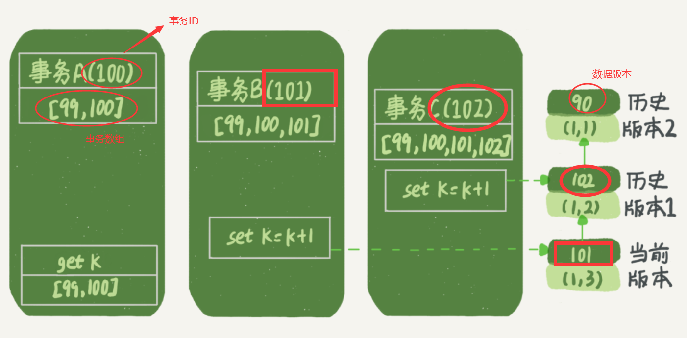

# 基础

## 基础架构

MySQL 可以分为 **Server 层**和**存储引擎层**两部分。


Server 层包括连接器、查询缓存、分析器、优化器、执行器等，涵盖 MySQL 的大多数核心服务功能，以及所有的内置函数（如日期、时间、数学和加密函数等），所有跨存储引擎的功能都在这一层实现，比如存储过程、触发器、视图等。

而存储引擎层负责数据的存储和提取。其架构模式是插件式的，支持 InnoDB、MyISAM、Memory 等多个存储引擎。现在最常用的存储引擎是 InnoDB，它从 MySQL 5.5.5 版本开始成为了默认存储引擎。

### 连接器

连接器负责跟客户端建立连接、获取权限、维持和管理连接。

```bash
mysql -h$ip -P$port -u$user -p
```

连接命令中的 mysql 是客户端工具，用来跟服务端建立连接。在完成经典的 TCP 握手后，连接器就要开始认证你的身份，这个时候用的就是你输入的用户名和密码。

如果用户名密码认证通过，连接器会到权限表里面查出你拥有的权限。之后，这个连接里面的权限判断逻辑，都将依赖于此时读到的权限。

这就意味着，一个用户成功建立连接后，即使你用管理员账号对这个用户的权限做了修改，也不会影响已经存在连接的权限。修改完成后，只有再新建的连接才会使用新的权限设置。

连接完成后，如果你没有后续的动作，这个连接就处于空闲状态，你可以在 show processlist 命令中看到它。

客户端如果太长时间没动静，连接器就会自动将它断开。这个时间是由参数 wait_timeout 控制的，默认值是 8 小时。

数据库里面，长连接是指连接成功后，如果客户端持续有请求，则一直使用同一个连接。短连接则是指每次执行完很少的几次查询就断开连接，下次查询再重新建立一个。(尽量使用长连接)

但是全部使用长连接后，你可能会发现，有些时候 MySQL 占用内存涨得特别快，这是因为 MySQL 在执行过程中临时使用的内存是管理在连接对象里面的。这些资源会在连接断开的时候才释放。所以如果长连接累积下来，可能导致内存占用太大，被系统强行杀掉（OOM），从现象看就是 MySQL 异常重启了。

解决方案:

* 定期断开长连接。使用一段时间，或者程序里面判断执行过一个占用内存的大查询后，断开连接，之后要查询再重连。
* MySQL 5.7 或更新版本，可以在每次执行一个比较大的操作后，通过执行 mysql_reset_connection 来重新初始化连接资源。这个过程不需要重连和重新做权限验证，但是会将连接恢复到刚刚创建完时的状态。

### 查询缓存

MySQL 拿到一个查询请求后，会先到查询缓存看看，之前是不是执行过这条语句。之前执行过的语句及其结果可能会以 key-value 对的形式，被直接缓存在内存中。key 是查询的语句，value 是查询的结果。如果你的查询能够直接在这个缓存中找到 key，那么这个 value 就会被直接返回给客户端。

如果查询命中缓存，MySQL 不需要执行后面的复杂操作，就可以直接返回结果，这个效率会很高。

查询缓存往往弊大于利。

查询缓存的失效非常频繁，只要有对一个表的更新，这个表上所有的查询缓存都会被清空。

MySQL 8.0 版本直接将查询缓存的整块功能删掉了

### 分析器

如果没有命中查询缓存，就要开始真正执行语句了.

分析器先会做“词法分析”。你输入的是由多个字符串和空格组成的一条 SQL 语句，MySQL 需要识别出里面的字符串分别是什么，代表什么。

### 优化器

经过了分析器，MySQL 就知道你要做什么了。在开始执行之前，还要先经过优化器的处理。

优化器是在表里面有多个索引的时候，决定使用哪个索引；或者在一个语句有多表关联（join）的时候，决定各个表的连接顺序。

### 执行器

MySQL 通过分析器知道了你要做什么，通过优化器知道了该怎么做，于是就进入了执行器阶段，开始执行语句。

首先判断是否有执行该表的权限，如果有权限，就打开表继续执行。打开表的时候，执行器就会根据表的引擎定义，去使用这个引擎提供的接口。

## 日志系统

与查询流程不一样的是，更新流程还涉及两个重要的日志模块，redo log（重做日志）和 binlog（归档日志）

### 重要的日志模块：redo log

有一条记录需要更新的时候，InnoDB 引擎就会先把记录写到 redo log（粉板）里面，并更新内存，这个时候更新就算完成了。同时，InnoDB 引擎会在适当的时候，将这个操作记录更新到磁盘里面，而这个更新往往是在系统比较空闲的时候做。


write pos 是当前记录的位置，一边写一边后移。checkpoint 是当前要擦除的位置，也是往后推移并且循环的，擦除记录前要把记录更新到数据文件。

write pos 和 checkpoint 之间的是空着的部分，可以用来记录新的操作。如果 write pos 追上 checkpoint，表示日志记录满了，这时候不能再执行新的更新，得停下来先擦掉一些记录，把 checkpoint 推进一下。

有了 redo log，InnoDB 就可以保证即使数据库发生异常重启，之前提交的记录都不会丢失，这个能力称为 crash-safe。

### 重要的日志模块：binlog

MySQL 整体来看，其实就有两块：一块是 Server 层，它主要做的是 MySQL 功能层面的事情；还有一块是引擎层，负责存储相关的具体事宜。

redo log 是 InnoDB 引擎特有的日志，而 Server 层也有自己的日志，称为 binlog（归档日志）。binlog 是没有 crash-safe 能力的。

```markdown
# 两个日志的区别
- redo log 是 InnoDB 引擎特有的；binlog 是 MySQL 的 Server 层实现的，所有引擎都可以使用。
- redo log 是物理日志，记录的是“在某个数据页上做了什么修改”；binlog 是逻辑日志，记录的是这个语句的原始逻辑，比如“给 ID=2 这一行的 c 字段加 1 ”。
- redo log 是循环写的，空间固定会用完；binlog 是可以追加写入的。“追加写”是指 binlog 文件写到一定大小后会切换到下一个，并不会覆盖以前的日志。
# 执行器和 InnoDB 引擎在执行这个简单的 update 语句时的内部流程
- 执行器先找引擎取 ID=2 这一行。ID 是主键，引擎直接用树搜索找到这一行。如果 ID=2 这一行所在的数据页本来就在内存中，就直接返回给执行器；否则，需要先从磁盘读入内存，然后再返回。
- 执行器拿到引擎给的行数据，把这个值加上 1，比如原来是 N，现在就是 N+1，得到新的一行数据，再调用引擎接口写入这行新数据。
- 引擎将这行新数据更新到内存中，同时将这个更新操作记录到 redo log 里面，此时 redo log 处于 prepare 状态。然后告知执行器执行完成了，随时可以提交事务。
- 执行器生成这个操作的 binlog，并把 binlog 写入磁盘。
- 执行器调用引擎的提交事务接口，引擎把刚刚写入的 redo log 改成提交（commit）状态，更新完成。
```

### 两阶段提交

将 redo log 的写入拆成了两个步骤：prepare 和 commit，这就是"两阶段提交"。

这是为了让两份日志之间的逻辑一致。

```markdown
- redo log 用于保证 crash-safe 能力。innodb_flush_log_at_trx_commit 这个参数设置成 1 的时候，表示每次事务的 redo log 都直接持久化到磁盘。这个参数我建议你设置成 1，这样可以保证 MySQL 异常重启之后数据不丢失。
- redo log 用于保证 crash-safe 能力。innodb_flush_log_at_trx_commit 这个参数设置成 1 的时候，表示每次事务的 redo log 都直接持久化到磁盘。这个参数我建议你设置成 1，这样可以保证 MySQL 异常重启之后数据不丢失。
```

## 事务隔离

事务就是要保证一组数据库操作，要么全部成功，要么全部失败。

事务特性 ACID（Atomicity、Consistency、Isolation、Durability，即原子性、一致性、隔离性、持久性）

### 隔离性与隔离级别

当数据库上有多个事务同时执行的时候，就可能出现脏读（dirty read）、不可重复读（non-repeatable read）、幻读（phantom read）的问题，为了解决这些问题，就有了“隔离级别”的概念。

你隔离得越严实，效率就会越低。

SQL 标准的事务隔离级别包括：读未提交（read uncommitted）、读提交（read committed）、可重复读（repeatable read）和串行化（serializable ）

```markdown
- 读未提交是指，一个事务还没提交时，它做的变更就能被别的事务看到。

- 读提交是指，一个事务提交之后，它做的变更才会被其他事务看到。

- 可重复读是指，一个事务执行过程中看到的数据，总是跟这个事务在启动时看到的数据是一致的。当然在可重复读隔离级别下，未提交变更对其他事务也是不可见的。

- 串行化，顾名思义是对于同一行记录，“写”会加“写锁”，“读”会加“读锁”。当出现读写锁冲突的时候，后访问的事务必须等前一个事务执行完成，才能继续执行。
```

```bash
# 查看事务隔离
mysql> show variables like 'transaction_isolation';
```

### 事务隔离的实现

在 MySQL 中，实际上每条记录在更新的时候都会同时记录一条回滚操作。记录上的最新值，通过回滚操作，都可以得到前一个状态的值。

尽量不要使用长事务。长事务意味着系统里面会存在很老的事务视图。

### 事务的启动方式

```markdown
- 显式启动事务语句， begin 或 start transaction。配套的提交语句是 commit，回滚语句是 rollback。
- set autocommit=0，这个命令会将这个线程的自动提交关掉。意味着如果你只执行一个 select 语句，这个事务就启动了，而且并不会自动提交。这个事务持续存在直到你主动执行 commit 或 rollback 语句，或者断开连接。
```

```sql
-- 在 information_schema 库的 innodb_trx 这个表中查询长事务
-- 比如下面这个语句，用于查找持续时间超过 60s 的事务。
select * from information_schema.innodb_trx where TIME_TO_SEC(timediff(now(),trx_started))>60
```

## 深入浅出索引

索引的出现其实就是为了提高数据查询的效率，就像书的目录一样。

### 索引的常见模型

三种常见的索引模型：哈希表、有序数组、搜索树

哈希表这种结构适用于只有等值查询的场景

有序数组在等值查询和范围查询场景中的性能就都非常优秀，有序数组索引只适用于静态存储引擎

N 叉树由于在读写上的性能优点，以及适配磁盘的访问模式，已经被广泛应用在数据库引擎中了。

### InnoDB 的索引模型

在 InnoDB 中，表都是根据主键顺序以索引的形式存放的，这种存储方式的表称为索引组织表。又因为前面我们提到的，InnoDB 使用了 **B+ 树**索引模型，所以数据都是存储在 B+ 树中的。

每一个索引在 InnoDB 里面对应一棵 B+ 树。

索引类型分为主键索引和非主键索引。

```sql
mysql> create table T(
id int primary key, 
k int not null, 
name varchar(16),
index (k))engine=InnoDB;
-- id 为主键索引
-- k 为非主键索引
```

主键索引的叶子节点存的是整行数据。在 InnoDB 里，主键索引也被称为聚簇索引（clustered index）。

非主键索引的叶子节点内容是主键的值。在 InnoDB 里，非主键索引也被称为二级索引（secondary index）。

```markdown
# 基于主键索引和普通索引的查询有什么区别？
- 如果语句是 select * from T where ID=500，即主键查询方式，则只需要搜索 ID 这棵 B+ 树；
- 如果语句是 select * from T where k=5，即普通索引查询方式，则需要先搜索 k 索引树，得到 ID 的值为 500，再到 ID 索引树搜索一次。这个过程称为回表。
- **也就是说，基于非主键索引的查询需要多扫描一棵索引树**。因此，我们在应用中应该尽量使用主键查询。
```

### 索引维护

B+ 树为了维护索引有序性，在插入新值的时候需要做必要的维护。


以上面这个图为例，如果插入新的行 ID 值为 700，则只需要在 R5 的记录后面插入一个新记录。如果新插入的 ID 值为 400，就相对麻烦了，需要逻辑上挪动后面的数据，空出位置。

而更糟的情况是，如果 R5 所在的数据页已经满了，根据 B+ 树的算法，这时候需要申请一个新的数据页，然后挪动部分数据过去。这个过程称为**页分裂**。在这种情况下，性能自然会受影响。

除了性能外，页分裂操作还影响数据页的利用率。原本放在一个页的数据，现在分到两个页中，整体空间利用率降低大约 50%。

当然有分裂就有合并。当相邻两个页由于删除了数据，利用率很低之后，会将数据页做合并。合并的过程，可以认为是分裂过程的逆过程。

自增主键是指自增列上定义的主键，在建表语句中一般是这么定义的： `NOT NULL PRIMARY KEY AUTO_INCREMENT`。

自增主键的插入数据模式，正符合了我们前面提到的递增插入的场景。每次插入一条新记录，都是追加操作，都不涉及到挪动其他记录，也不会触发叶子节点的分裂。

而有业务逻辑的字段做主键，则往往不容易保证有序插入，这样写数据成本相对较高。

由于每个非主键索引的叶子节点上都是主键的值。如果用身份证号做主键，那么每个二级索引的叶子节点占用约 20 个字节，而如果用整型做主键，则只要 4 个字节，如果是长整型（bigint）则是 8 个字节。

显然，**主键长度越小，普通索引的叶子节点就越小，普通索引占用的空间也就越小**。

**从性能和存储空间方面考量，自增主键往往是更合理的选择。**

直接将这个索引设置为主键，可以避免每次查询需要搜索两棵树。

B+ 树能够很好地配合磁盘的读写特性，减少单次查询的磁盘访问次数。

```sql
-- 重建索引k
alter table T drop index k;
alter table T add index(k);
-- 重建主键索引（不合理）,不论是删除主键还是创建主键，都会将整个表重建
alter table T drop primary key;
alter table T add primary key(id);
-- 重建表语句
alter table T engine=InnoDB;
```

### 覆盖索引

通过非主键索引查询所有数据会先查询非主键的B+树得到主键ID，通过查询结果再查询主键的索引的B+树，称为回表。

如果执行的语句是` select ID from T where k between 3 and 5`，这时只需要查 ID 的值，而 ID 的值已经在 k 索引树上了，因此可以直接提供查询结果，不需要回表。也就是说，在这个查询里面，索引 k 已经“覆盖了”我们的查询需求，我们称为覆盖索引。

由于覆盖索引可以减少树的搜索次数，显著提升查询性能，所以使用覆盖索引是一个常用的性能优化手段。

### 最左前缀原则

B+ 树这种索引结构，可以利用索引的“最左前缀”，来定位记录。

```sql
CREATE TABLE `tuser` (
  `id` int(11) NOT NULL,
  `id_card` varchar(32) DEFAULT NULL,
  `name` varchar(32) DEFAULT NULL,
  `age` int(11) DEFAULT NULL,
  `ismale` tinyint(1) DEFAULT NULL,
  PRIMARY KEY (`id`),
  KEY `id_card` (`id_card`),
  KEY `name_age` (`name`,`age`)
) ENGINE=InnoDB
-- id_card 索引
-- name_age 联合索引，通过联合索引和最左前缀原则，可以快速查询关于姓名的查询
-- 也就是说，可以不用再维护一个姓名索引
```

```markdown
# 在建立联合索引的时候，如何安排索引内的字段顺序。
- 这里我们的评估标准是，索引的复用能力。因为可以支持最左前缀，所以当已经有了 (a,b) 这个联合索引后，一般就不需要单独在 a 上建立索引了。因此，第一原则是，如果通过调整顺序，可以少维护一个索引，那么这个顺序往往就是需要优先考虑采用的。
- 那么，如果既有联合查询，又有基于 a、b 各自的查询呢？查询条件里面只有 b 的语句，是无法使用 (a,b) 这个联合索引的，这时候你不得不维护另外一个索引，也就是说你需要同时维护 (a,b)、(b) 这两个索引。
- 这时候，我们要考虑的原则就是空间了。比如上面这个市民表的情况，name 字段是比 age 字段大的 ，那我就建议你创建一个（name,age) 的联合索引和一个 (age) 的单字段索引。
```

### 索引下推

```bash
# 检索出表中“名字第一个字是张，而且年龄是 10 岁的所有男孩”
mysql> select * from tuser where name like '张%' and age=10 and ismale=1;
# MySQL5.6之前，只能先查询 name_age 索引表，找到第一个符合“张%”的ID后进行回表查询，到主键索引上找出数据行，在对比字段值
# MySQL5.6之后引入了索引下推，索引遍历过程中，对索引中包含的字段先做判断，直接过滤掉不满足条件的记录，减少回表次数。
```

## 全局锁和表锁

根据加锁的范围，MySQL 里面的锁大致可以分成全局锁、表级锁和行锁三类。

### 全局锁

全局锁就是对整个数据库实例加锁。MySQL 提供了一个加全局读锁的方法，命令是 `Flush tables with read lock `(FTWRL)。当你需要让整个库处于只读状态的时候，可以使用这个命令，之后其他线程的以下语句会被阻塞：数据更新语句（数据的增删改）、数据定义语句（包括建表、修改表结构等）和更新类事务的提交语句。

全局锁的典型使用场景是，做全库逻辑备份。也就是把整库每个表都 select 出来存成文本。

```markdown
# 问题
- 如果你在主库上备份，那么在备份期间都不能执行更新，业务基本上就得停摆；
- 如果你在从库上备份，那么备份期间从库不能执行主库同步过来的 binlog，会导致主从延迟。
```

官方自带的逻辑备份工具是 mysqldump。当 mysqldump 使用参数–single-transaction 的时候，导数据之前就会启动一个事务，来确保拿到一致性视图。而由于 MVCC 的支持，这个过程中数据是可以正常更新的。一致性读是好，但前提是引擎要支持这个隔离级别。**single-transaction 方法只适用于所有的表使用事务引擎的库。**

```markdown
# 既然要全库只读，为什么不使用 set global readonly=true 的方式呢？
- 一是，在有些系统中，readonly 的值会被用来做其他逻辑，比如用来判断一个库是主库还是备库。因此，修改 global 变量的方式影响面更大，我不建议你使用。
- 二是，在异常处理机制上有差异。如果执行 FTWRL 命令之后由于客户端发生异常断开，那么 MySQL 会自动释放这个全局锁，整个库回到可以正常更新的状态。而将整个库设置为 readonly 之后，如果客户端发生异常，则数据库就会一直保持 readonly 状态，这样会导致整个库长时间处于不可写状态，风险较高。
```

### 表级锁

MySQL 里面表级别的锁有两种：一种是表锁，一种是元数据锁（meta data lock，MDL)。

表锁的语法是 `lock tables … read/write`。与 FTWRL 类似，可以用 `unlock tables` 主动释放锁，也可以在客户端断开的时候自动释放。需要注意，lock tables 语法除了会限制别的线程的读写外，也限定了本线程接下来的操作对象。

举个例子, 如果在某个线程 A 中执行 `lock tables t1 read, t2 write;` 这个语句，则其他线程写 t1、读写 t2 的语句都会被阻塞。同时，线程 A 在执行 `unlock tables` 之前，也只能执行读 t1、读写 t2 的操作。连写 t1 都不允许，自然也不能访问其他表。

在还没有出现更细粒度的锁的时候，表锁是最常用的处理并发的方式。而对于 InnoDB 这种支持行锁的引擎，一般不使用 lock tables 命令来控制并发，毕竟锁住整个表的影响面还是太大。

另一类表级的锁是 **MDL**（metadata lock)。MDL 不需要显式使用，在访问一个表的时候会被自动加上。MDL 的作用是，保证读写的正确性。

```markdown
- 在 MySQL 5.5 版本中引入了 MDL，当对一个表做增删改查操作的时候，加 MDL 读锁；当要对表做结构变更操作的时候，加 MDL 写锁。
- 读锁之间不互斥，因此你可以有多个线程同时对一张表增删改查。
- 读写锁之间、写锁之间是互斥的，用来保证变更表结构操作的安全性。因此，如果有两个线程要同时给一个表加字段，其中一个要等另一个执行完才能开始执行。
- 事务中的 MDL 锁，在语句执行开始时申请，但是语句结束后并不会马上释放，而会等到整个事务提交后再释放。
```

```markdown
# 如何安全地给小表加字段？
- 首先我们要解决长事务，事务不提交，就会一直占着 MDL 锁。在 MySQL 的 information_schema 库的 innodb_trx 表中，你可以查到当前执行中的事务。如果你要做 DDL 变更的表刚好有长事务在执行，要考虑先暂停 DDL，或者 kill 掉这个长事务。
## 如果你要变更的表是一个热点表，虽然数据量不大，但是上面的请求很频繁，而你不得不加个字段，你该怎么做呢？
- 这时候 kill 可能未必管用，因为新的请求马上就来了。比较理想的机制是，在 alter table 语句里面设定等待时间，如果在这个指定的等待时间里面能够拿到 MDL 写锁最好，拿不到也不要阻塞后面的业务语句，先放弃。之后开发人员或者 DBA 再通过重试命令重复这个过程。
- ALTER TABLE tbl_name NOWAIT add column ...
- ALTER TABLE tbl_name WAIT N add column ... 
```

## 行锁功过

MySQL 的行锁是在引擎层由各个引擎自己实现的。不支持行锁意味着并发控制只能使用表锁，对于这种引擎的表，同一张表上任何时刻只能有一个更新在执行，这就会影响到业务并发度。InnoDB 是支持行锁的，这也是 MyISAM 被 InnoDB 替代的重要原因之一。

顾名思义，行锁就是针对数据表中行记录的锁。这很好理解，比如事务 A 更新了一行，而这时候事务 B 也要更新同一行，则必须等事务 A 的操作完成后才能进行更新。

### 两阶段锁

在 InnoDB 事务中，行锁是在需要的时候才加上的，但并不是不需要了就立刻释放，而是要等到事务结束时才释放。这个就是两阶段锁协议。

如果你的事务中需要锁多个行，要把最可能造成锁冲突、最可能影响并发度的锁尽量往后放。这就最大程度地减少了事务之间的锁等待，提升了并发度。

```markdown
- 顾客 A 要在影院 B 购买电影票需要执行 update 两条记录，并 insert 一条记录
- 1.从顾客 A 账户余额中扣除电影票价；
- 2.给影院 B 的账户余额增加这张电影票价；
- 3.记录一条交易日志。

- 试想如果同时有另外一个顾客 C 要在影院 B 买票，那么这两个事务冲突的部分就是语句 2 了。
- 根据两阶段锁协议，不论你怎样安排语句顺序，所有的操作需要的行锁都是在事务提交的时候才释放的。所以，如果你把语句 2 安排在最后，比如按照 3、1、2 这样的顺序，那么影院账户余额这一行的锁时间就最少。这就最大程度地减少了事务之间的锁等待，提升了并发度。
```

### 死锁和死锁检测

当并发系统中不同线程出现循环资源依赖，涉及的线程都在等待别的线程释放资源时，就会导致这几个线程都进入无限等待的状态，称为死锁。

事务A拥有id=1的行锁，事务B拥有id=2的行锁，而此时事务 A 在等待事务 B 释放 id=2 的行锁，而事务 B 在等待事务 A 释放 id=1 的行锁。 事务 A 和事务 B 在互相等待对方的资源释放，就是进入了死锁状态。

```markdown
# 解决死锁的策略
- 一种策略是，直接进入等待，直到超时。这个超时时间可以通过参数 innodb_lock_wait_timeout 来设置。在 InnoDB 中，innodb_lock_wait_timeout 的默认值是 50s.
- 另一种策略是，发起死锁检测，发现死锁后，主动回滚死锁链条中的某一个事务，让其他事务得以继续执行。将参数 innodb_deadlock_detect 设置为 on，表示开启这个逻辑。
```

建议使用主动死锁检测，因为设置超时参数没有一个很好的标准。

正常情况下我们还是要采用第二种策略，即：主动死锁检测，而且 innodb_deadlock_detect 的默认值本身就是 on。主动死锁检测在发生死锁的时候，是能够快速发现并进行处理的，但是它也是有额外负担的。

每个新来的被堵住的线程，都要判断会不会由于自己的加入导致了死锁，这是一个时间复杂度是 O(n) 的操作。

```markdown
# 怎么解决由这种热点行更新导致的性能问题呢？问题的症结在于，死锁检测要耗费大量的 CPU 资源。
- 一种头痛医头的方法，就是如果你能确保这个业务一定不会出现死锁，可以临时把死锁检测关掉。但是这种操作本身带有一定的风险，因为业务设计的时候一般不会把死锁当做一个严重错误，毕竟出现死锁了，就回滚，然后通过业务重试一般就没问题了，这是业务无损的。而关掉死锁检测意味着可能会出现大量的超时，这是业务有损的。
- 另一个思路是控制并发度。
```

## 锁与隔离

```sql
CREATE TABLE `t` (
    `id` int(11) NOT NULL,
    `k` int(11) DEFAULT NULL,
    PRIMARY KEY (`id`)
) ENGINE=InnoDB;
insert into t(id, k) values(1,1),(2,2);
```


begin/start transaction 命令并不是一个事务的起点，在执行到它们之后的第一个操作 InnoDB 表的语句，事务才真正启动。如果你想要马上启动一个事务，可以使用 `start transaction with consistent snapshot` 这个命令。

```markdown
# 两个“视图”的概念：
- 一个是 view。它是一个用查询语句定义的虚拟表，在调用的时候执行查询语句并生成结果。创建视图的语法是 create view … ，而它的查询方法与表一样。
- 另一个是 InnoDB 在实现 MVCC 时用到的一致性读视图，即 consistent read view，用于支持 RC（Read Committed，读提交）和 RR（Repeatable Read，可重复读）隔离级别的实现。
```

### “快照”在 MVCC 里是怎么工作的？

在可重复读隔离级别下，事务在启动的时候就“拍了个快照”。注意，这个快照是基于整库的。

InnoDB 里面每个事务有一个唯一的事务 ID，叫作 transaction id。它是在事务开始的时候向 InnoDB 的事务系统申请的，是按申请顺序严格递增的。

而每行数据也都是有多个版本的。每次事务更新数据的时候，都会生成一个新的数据版本，并且把 transaction id 赋值给这个数据版本的事务 ID，记为 row trx_id。同时，旧的数据版本要保留，并且在新的数据版本中，能够有信息可以直接拿到它。

也就是说，数据表中的一行记录，其实可能有多个版本 (row)，每个版本有自己的 row trx_id。

按照可重复读的定义，开启事务时，能够看到所有已经提交的事务结果。但是之后，这个事务执行期间，其他事务的更新对它不可见。

在实现上， InnoDB 为每个事务构造了一个数组，用来保存这个事务启动瞬间，当前正在“活跃”的所有事务 ID。“活跃”指的就是，启动了但还没提交。

数组里面事务 ID 的最小值记为低水位，当前系统里面已经创建过的事务 ID 的最大值加 1 记为高水位。

这个**视图数组**和高水位，就组成了当前事务的一致性视图（read-view）。

而数据版本的可见性规则，就是基于数据的 row trx_id 和这个一致性视图的对比结果得到的。(数据版本ID和事务ID的比较)


```markdown
# 对于当前事务的启动瞬间来说，一个数据版本的 row trx_id，有以下几种可能：
- 1.如果落在绿色部分，表示这个版本是已提交的事务或者是当前事务自己生成的，这个数据是可见的；
- 2.如果落在红色部分，表示这个版本是由将来启动的事务生成的，是肯定不可见的；
- 3.如果落在黄色部分，那就包括两种情况
- - a.若 row trx_id 在数组中，表示这个版本是由还没提交的事务生成的，不可见；
- - b. 若 row trx_id 不在数组中，表示这个版本是已经提交了的事务生成的，可见。
```

InnoDB 利用了“所有数据都有多个版本”的这个特性，实现了“秒级创建快照”的能力。



```markdown
# 事务 A 查询语句的读数据流程是这样的：
- 找到 (1,3) 的时候，判断出 row trx_id=101，比高水位大，处于红色区域，不可见；
- 接着，找到上一个历史版本，一看 row trx_id=102，比高水位大，处于红色区域，不可见；
- 再往前找，终于找到了（1,1)，它的 row trx_id=90，比低水位小，处于绿色区域，可见。
```

虽然期间这一行数据被修改过，但是事务 A 不论在什么时候查询，看到这行数据的结果都是一致的，所以我们称之为一致性读。

```markdown
# 一个数据版本，对于一个事务视图来说，除了自己的更新总是可见以外，有三种情况：
- 版本未提交，不可见；
- 版本已提交，但是是在视图创建后提交的，不可见；
- 版本已提交，而且是在视图创建前提交的，可见。
```

### 更新逻辑

**更新数据都是先读后写的，而这个读，只能读当前的值，称为“当前读”（current read）。**因此，事务 B 此时的 set k=k+1 是在（1,2）的基础上进行的操作。所以，在执行事务 B 查询语句的时候，一看自己的版本号是 101，最新数据的版本号也是 101，是自己的更新，可以直接使用，所以查询得到的 k 的值是 3。

除了 update 语句外，select 语句如果加锁，也是当前读。

所以，如果把事务 A 的查询语句 select * from t where id=1 修改一下，加上 lock in share mode 或 for update，也都可以读到版本号是 101 的数据，返回的 k 的值是 3。下面这两个 select 语句，就是分别加了读锁（S 锁，共享锁）和写锁（X 锁，排他锁）。

```bash
mysql> select k from t where id=1 lock in share mode;
mysql> select k from t where id=1 for update;
```

```markdown
# 如果事务C没有马上提交
- 事务 C 没提交，也就是说 (1,2) 这个版本上的写锁还没释放。而事务 B 是当前读，必须要读最新版本，而且必须加锁，因此就被锁住了，必须等到事务 C 释放这个锁，才能继续它的当前读。
```

```markdown
# 事务的可重复读的能力是怎么实现的？
- 可重复读的核心就是一致性读（consistent read）；而事务更新数据的时候，只能用当前读。如果当前的记录的行锁被其他事务占用的话，就需要进入锁等待。

# 而读提交的逻辑和可重复读的逻辑类似，它们最主要的区别是：
- 在可重复读隔离级别下，只需要在事务开始的时候创建一致性视图，之后事务里的其他查询都共用这个一致性视图；查询只承认在事务启动前就已经提交完成的数据；
- 在读提交隔离级别下，每一个语句执行前都会重新算出一个新的视图。查询只承认在语句启动前就已经提交完成的数据；
```

# 实践

## 普通索引和唯一索引，应该怎么选择？


从这两种索引对查询语句和更新语句的性能影响来进行分析。

### 查询过程

假设，执行查询的语句是 select id from T where k=5。这个查询语句在索引树上查找的过程，先是通过 B+ 树从树根开始，按层搜索到叶子节点，也就是图中右下角的这个数据页，然后可以认为数据页内部通过二分法来定位记录。

* 对于普通索引来说，查找到满足条件的第一个记录 (5,500) 后，需要查找下一个记录，直到碰到第一个不满足 k=5 条件的记录。
* 对于唯一索引来说，由于索引定义了唯一性，查找到第一个满足条件的记录后，就会停止继续检索。

这个不同带来的性能差距会有多少呢？答案是，**微乎其微**。

InnoDB 的数据是按数据页为单位来读写的。也就是说，当需要读一条记录的时候，并不是将这个记录本身从磁盘读出来，而是以页为单位，将其整体读入内存。在 InnoDB 中，每个数据页的大小默认是 16KB。

### 更新过程

当需要更新一个数据页时，**如果数据页在内存中就直接更新，而如果这个数据页还没有在内存中的话，在不影响数据一致性的前提下，InnoDB 会将这些更新操作缓存在 change buffer 中**，这样就不需要从磁盘中读入这个数据页了。在下次查询需要访问这个数据页的时候，将数据页读入内存，然后执行 change buffer 中与这个页有关的操作。通过这种方式就能保证这个数据逻辑的正确性。

将 change buffer 中的操作应用到原数据页，得到最新数据页的过程称为 merge。除了访问这个数据页会触发 merge 外，系统有后台线程会定期 merge。在数据库正常关闭（shutdown）的过程中，也会执行 merge 操作。

```markdown
# 什么条件下可以使用 change buffer 呢？
- 对于唯一索引来说，所有的更新操作都要先判断这个操作是否违反唯一性约束。比如，要插入 (4,400) 这个记录，就要先判断现在表中是否已经存在 k=4 的记录，而这必须要将数据页读入内存才能判断。如果都已经读入到内存了，那直接更新内存会更快，就没必要使用 change buffer 了。
- 因此，唯一索引的更新就不能使用 change buffer，实际上也只有普通索引可以使用。
- change buffer 用的是 buffer pool 里的内存，因此不能无限增大。change buffer 的大小，可以通过参数 innodb_change_buffer_max_size 来动态设置。这个参数设置为 50 的时候，表示 change buffer 的大小最多只能占用 buffer pool 的 50%。
# 如果要在这张表中插入一个新记录 (4,400) 的话，InnoDB 的处理流程是怎样的。
## 第一种情况是，这个记录要更新的目标页在内存中。
- 对于唯一索引来说，找到 3 和 5 之间的位置，判断到没有冲突，插入这个值，语句执行结束；
- 对于普通索引来说，找到 3 和 5 之间的位置，插入这个值，语句执行结束。
- 普通索引和唯一索引对更新语句性能影响的差别，只是一个判断，只会耗费微小的 CPU 时间。
## 第二种情况是，这个记录要更新的目标页不在内存中。
- 对于唯一索引来说，需要将数据页读入内存，判断到没有冲突，插入这个值，语句执行结束；
- 对于普通索引来说，则是将更新记录在 change buffer，语句执行就结束了。
- 将数据从磁盘读入内存涉及随机 IO 的访问，是数据库里面成本最高的操作之一。change buffer 因为减少了随机磁盘访问，所以对更新性能的提升是会很明显的。
```

### change buffer 的使用场景

change buffer 只限于用在普通索引的场景下，而不适用于唯一索引。

因为 merge 的时候是真正进行数据更新的时刻，而 change buffer 的主要目的就是将记录的变更动作缓存下来，所以**在一个数据页做 merge 之前，change buffer 记录的变更越多（也就是这个页面上要更新的次数越多），收益就越大**。

因此，对于**写多读少**的业务来说，页面在写完以后马上被访问到的概率比较小，此时 change buffer 的使用效果最好。这种业务模型常见的就是账单类、日志类的系统。

### 索引选择和实践

其实，这两类索引在查询能力上是没差别的，主要考虑的是对更新性能的影响。所以，我建议你尽量选择普通索引。

如果所有的更新后面，都马上伴随着对这个记录的查询，那么你应该关闭 change buffer。而在其他情况下，change buffer 都能提升更新性能。

### change buffer 和 redo log

redo log 主要节省的是随机写磁盘的 IO 消耗（转成顺序写），而 change buffer 主要节省的则是随机读磁盘的 IO 消耗。

## MySQL为什么有时候会选错索引？

```sql
-- 表里有 a、b 两个字段，并分别建上索引
CREATE TABLE `t` (
    `id` int(11) NOT NULL,
    `a` int(11) DEFAULT NULL,
    `b` int(11) DEFAULT NULL,
    PRIMARY KEY (`id`),
    KEY `a` (`a`),
    KEY `b` (`b`)
) ENGINE=InnoDB；
-- 存储过程来插入数据(1,1,1)->(100000,100000,100000)
delimiter ;;
create procedure idata()
begin
  declare i int;
  set i=1;
  while(i<=100000)do
    insert into t values(i, i, i);
    set i=i+1;
  end while;
end;;
delimiter ;
call idata();
```

```bash
mysql> select * from t where a between 10000 and 20000;
# 使用 explain 命令看到的这条语句的执行情况。这条查询语句的执行也确实符合预期，key 这个字段值是’a’，表示优化器选择了索引 a。
```


再进行如下操作


```sql
-- session A 的操作就是开启了一个事务。随后，session B 把数据都删除后，又调用了 idata 这个存储过程，插入了 10 万行数据。
-- session B 的查询语句 select * from t where a between 10000 and 20000 就不会再选择索引 a 了。我们可以通过慢查询日志（slow log）来查看一下具体的执行情况。

-- 如下测试
set long_query_time=0;
select * from t where a between 10000 and 20000; /*Q1*/
select * from t force index(a) where a between 10000 and 20000;/*Q2*/

-- 第一句，是将慢查询日志的阈值设置为 0，表示这个线程接下来的语句都会被记录入慢查询日志中；
-- 第二句，Q1 是 session B 原来的查询；
-- Q2 是加了 force index(a) 来和 session B 原来的查询语句执行情况对比。
-- Q1 扫描了 10 万行，显然是走了全表扫描，执行时间是 40 毫秒。
-- Q2 扫描了 10001 行，执行了 21 毫秒。
-- 也就是说，我们在没有使用 force index 的时候，MySQL 用错了索引，导致了更长的执行时间。
```


### 优化器的逻辑

选择索引是优化器的工作。在数据库里面，扫描行数是影响执行代价的因素之一。扫描的行数越少，意味着访问磁盘数据的次数越少，消耗的 CPU 资源越少。当然，扫描行数并不是唯一的判断标准，优化器还会结合是否使用临时表、是否排序等因素进行综合判断。

```markdown
# 扫描行数是怎么判断的？
- MySQL 在真正开始执行语句之前，并不能精确地知道满足这个条件的记录有多少条，而只能根据统计信息来估算记录数。
- 这个统计信息就是索引的“区分度”。显然，一个索引上不同的值越多，这个索引的区分度就越好。而一个索引上不同的值的个数，我们称之为“基数”（cardinality）。也就是说，这个基数越大，索引的区分度越好。
- show index from t 可以查看表t的基数值
# MySQL 是怎样得到索引的基数的呢？
- 因为把整张表取出来一行行统计，虽然可以得到精确的结果，但是代价太高了，所以只能选择“采样统计”。
- 采样统计的时候，InnoDB 默认会选择 N 个数据页，统计这些页面上的不同值，得到一个平均值，然后乘以这个索引的页面数，就得到了这个索引的基数。
- 而数据表是会持续更新的，索引统计信息也不会固定不变。所以，当变更的数据行数超过 1/M 的时候，会自动触发重新做一次索引统计。

- 有两种存储索引统计的方式，可以通过设置参数 innodb_stats_persistent 的值来选择：
- - 设置为 on 的时候，表示统计信息会持久化存储。这时，默认的 N 是 20，M 是 10。
- - 设置为 off 的时候，表示统计信息只存储在内存中。这时，默认的 N 是 8，M 是 16。
```

```mysql
explain select * from t where a between 10000 and 20000;/*Q1*/
explain select * from t force index(a) where a between 10000 and 20000;/*Q2*/
-- Q1 的结果还是符合预期的，rows 的值是 104620；但是 Q2 的 rows 值是 37116，
```


```markdown
# 而是优化器为什么放着扫描 37000 行的执行计划不用，却选择了扫描行数是 100000 的执行计划呢？
- 这是因为，如果使用索引 a，每次从索引 a 上拿到一个值，都要回到主键索引上查出整行数据，这个代价优化器也要算进去的。
- 而如果选择扫描 10 万行，是直接在主键索引上扫描的，没有额外的代价。
- 优化器会估算这两个选择的代价，从结果看来，优化器认为直接扫描主键索引更快。当然，从执行时间看来，这个选择并不是最优的。
# MySQL 选错索引，这件事儿还得归咎到没能准确地判断出扫描行数,判断出扫描行数的原因
- 因为另一个事务仍未提交，因此删除的数据只是标记删除，数据仍然在数据页中，后插入的数据需要找新的空位插入，这样查询时会扫描删除的数据+后插入的数据，同时算上回表扫描主键索引，因此扫描行数达到3万7千行
- 具体：session A 开启的事务是 RR（Repeatable Read，可重复读）级别，会创建一个一致性读视图； session B 的删除会产生记录的新版本（空记录），同时会产生新的 Undo Log； 一致性读视图需要的 Undo Log 是不会删除的，意味着 session B 产生的删除记录的 Undo Log 是不能删除的，意味着记录的当前版本（空记录）不能真的从磁盘上被删掉，因为如果记录都从磁盘上删掉了，那么空有 Undo Log 也无法回到 session A 应该看到的那个版本；就好比链表总得有个头结点把，如果失去了对头结点的引用，就失去了访问整个链表的起点； 不删除的情况下，记录还在数据页上占着空间呢，session B 又把数据加回来，导致索引的数据页出现大量的分裂； 大量的页分裂，导致了 cardinality 的不准；
- analyze table t 命令，可以用来重新统计索引信息。
```


另一个测试

```mysql
mysql> select * from t where (a between 1 and 1000)  and (b between 50000 and 100000) order by b limit 1;
```

a，b 两个索引的结构图：


```markdown
- 如果使用索引 a 进行查询，那么就是扫描索引 a 的前 1000 个值，然后取到对应的 id，再到主键索引上去查出每一行，然后根据字段 b 来过滤。显然这样需要扫描 1000 行。
- 如果使用索引 b 进行查询，那么就是扫描索引 b 的最后 50001 个值，与上面的执行过程相同，也是需要回到主键索引上取值再判断，所以需要扫描 50001 行。
- 使用 a 索引更快
```

```mysql
-- 执行 explain 的结果，使用了b索引，扫描了50198行
mysql> explain select * from t where (a between 1 and 1000) and (b between 50000 and 100000) order by b limit 1;
-- mysql 还是选错了索引
```


### 索引选择异常和处理

**一种方法是，像我们第一个例子一样，采用 force index 强行选择一个索引。**MySQL 会根据词法解析的结果分析出可能可以使用的索引作为候选项，然后在候选列表中依次判断每个索引需要扫描多少行。如果 force index 指定的索引在候选索引列表中，就直接选择这个索引，不再评估其他索引的执行代价。

第二次测试使用 force index(a)


```markdown
- 可以看到，原本语句需要执行 2.23 秒，而当你使用 force index(a) 的时候，只用了 0.05 秒，比优化器的选择快了 40 多倍。
- 也就是说，优化器没有选择正确的索引，force index 起到了“矫正”的作用。
- 不过很多程序员不喜欢使用 force index，一来这么写不优美，二来如果索引改了名字，这个语句也得改，显得很麻烦。而且如果以后迁移到别的数据库的话，这个语法还可能会不兼容。
```

**第二种方法就是，我们可以考虑修改语句，引导 MySQL 使用我们期望的索引。**比如，在这个例子里，显然把“order by b limit 1” 改成 “order by b,a limit 1” ，语义的逻辑是相同的。


```markdown
- 之前优化器选择使用索引 b，是因为它认为使用索引 b 可以避免排序（b 本身是索引，已经是有序的了，如果选择索引 b 的话，不需要再做排序，只需要遍历），所以即使扫描行数多，也判定为代价更小。
- 现在 order by b,a 这种写法，要求按照 b,a 排序，就意味着使用这两个索引都需要排序。因此，扫描行数成了影响决策的主要条件，于是此时优化器选了只需要扫描 1000 行的索引 a。
- 另一种改法
- mysql> select * from  (select * from t where (a between 1 and 1000)  and (b between 50000 and 100000) order by b limit 100)alias limit 1;
- 在这个例子里，我们用 limit 100 让优化器意识到，使用 b 索引代价是很高的。其实是我们根据数据特征诱导了一下优化器，也不具备通用性。
```

**第三种方法是，在有些场景下，我们可以新建一个更合适的索引，来提供给优化器做选择，或删掉误用的索引。**

## 怎么给字符串字段加索引？

```mysql
-- 用户表，字段邮箱
mysql> create table SUser(
ID bigint unsigned primary key,
email varchar(64), 
... 
)engine=innodb; 
-- 通过邮箱查询
mysql> select f1, f2 from SUser where email='xxx';
-- MySQL 是支持前缀索引的，也就是说，你可以定义字符串的一部分作为索引。
mysql> alter table SUser add index index1(email);
-- 或
mysql> alter table SUser add index index2(email(6));
-- 第一个语句创建的 index1 索引里面，包含了每个记录的整个字符串；
-- 而第二个语句创建的 index2 索引里面，对于每个记录都是只取前 6 个字节。
-- 由于 email(6) 这个索引结构中每个邮箱字段都只取前 6 个字节（即：zhangs），所以占用的空间会更小，这就是使用前缀索引的优势。
-- 但，这同时带来的损失是，可能会增加额外的记录扫描次数。
```

**使用前缀索引，定义好长度，就可以做到既节省空间，又不用额外增加太多的查询成本。**

实际上，我们在建立索引时关注的是区分度，区分度越高越好。因为区分度越高，意味着重复的键值越少。因此，我们可以通过统计索引上有多少个不同的值来判断要使用多长的前缀。

```mysql
-- 使用下面这个语句，算出这个列上有多少个不同的值：
mysql> select count(distinct email) as L from SUser;
-- 然后，依次选取不同长度的前缀来看这个值，比如我们要看一下 4~7 个字节的前缀索引，可以用这个语句：
mysql> select 
  count(distinct left(email,4)）as L4,
  count(distinct left(email,5)）as L5,
  count(distinct left(email,6)）as L6,
  count(distinct left(email,7)）as L7,
from SUser;
-- 当然，使用前缀索引很可能会损失区分度，所以你需要预先设定一个可以接受的损失比例，比如 5%。然后，在返回的 L4~L7 中，找出不小于 L * 95% 的值，假设这里 L6、L7 都满足，你就可以选择前缀长度为 6。
```

### 前缀索引对覆盖索引的影响

```mysql
-- 这个语句只要求返回 id 和 email 字段。
select id,email from SUser where email='zhangssxyz@xxx.com';
-- 如果使用 index1（即 email 整个字符串的索引结构）的话，可以利用覆盖索引，从 index1 查到结果后直接就返回了，不需要回到 ID 索引再去查一次。
-- 而如果使用 index2（即 email(6) 索引结构）的话，就不得不回到 ID 索引再去判断 email 字段的值。
-- 即使你将 index2 的定义修改为 email(18) 的前缀索引，这时候虽然 index2 已经包含了所有的信息，但 InnoDB 还是要回到 id 索引再查一下，因为系统并不确定前缀索引的定义是否截断了完整信息。
-- 也就是说，使用前缀索引就用不上覆盖索引对查询性能的优化了，这也是你在选择是否使用前缀索引时需要考虑的一个因素。
```

### 其他方式

如果对身份证做前缀索引，需要需要创建长度为 12 以上的前缀索引，才能够满足区分度要求。

**索引选取的越长，占用的磁盘空间就越大，相同的数据页能放下的索引值就越少，搜索的效率也就会越低。**

那么，如果我们能够确定业务需求里面只有按照身份证进行等值查询的需求，还有没有别的处理方法呢？这种方法，既可以占用更小的空间，也能达到相同的查询效率。

**第一种方式是使用倒序存储**。如果你存储身份证号的时候把它倒过来存，每次查询的时候，你可以这么写：

```mysql
mysql> select field_list from t where id_card = reverse('input_id_card_string');
-- 由于身份证号的最后 6 位没有地址码这样的重复逻辑，所以最后这 6 位很可能就提供了足够的区分度。当然了，实践中你不要忘记使用 count(distinct) 方法去做个验证。
```

**第二种方式是使用 hash 字段。**你可以在表上再创建一个整数字段，来保存身份证的校验码，同时在这个字段上创建索引。

```mysql
mysql> alter table t add id_card_crc int unsigned, add index(id_card_crc);
-- 然后每次插入新记录的时候，都同时用 crc32() 这个函数得到校验码填到这个新字段。由于校验码可能存在冲突，也就是说两个不同的身份证号通过 crc32() 函数得到的结果可能是相同的，所以你的查询语句 where 部分要判断 id_card 的值是否精确相同。
mysql> select field_list from t where id_card_crc=crc32('input_id_card_string') and id_card='input_id_card_string'
```

```markdown
# 使用倒序存储和使用 hash 字段这两种方法的异同点。
- 首先，它们的相同点是，都不支持范围查询。
- 1.从占用的额外空间来看，倒序存储方式在主键索引上，不会消耗额外的存储空间，而 hash 字段方法需要增加一个字段。当然，倒序存储方式使用 4 个字节的前缀长度应该是不够的，如果再长一点，这个消耗跟额外这个 hash 字段也差不多抵消了。
- 2.在 CPU 消耗方面，倒序方式每次写和读的时候，都需要额外调用一次 reverse 函数，而 hash 字段的方式需要额外调用一次 crc32() 函数。如果只从这两个函数的计算复杂度来看的话，reverse 函数额外消耗的 CPU 资源会更小些。
- 3.从查询效率上看，使用 hash 字段方式的查询性能相对更稳定一些。因为 crc32 算出来的值虽然有冲突的概率，但是概率非常小，可以认为每次查询的平均扫描行数接近 1。而倒序存储方式毕竟还是用的前缀索引的方式，也就是说还是会增加扫描行数。
```

## 为什么我的MySQL会“抖”一下？

### 你的 SQL 语句为什么变“慢”了

WAL(Write-Ahead Logging) : 先更新内存（掌柜记忆）-》记录日志文件redo log（粉板）-》等待空闲时间写入磁盘（更新账本）

从日志系统我们可以知道，InnoDB 在处理更新语句的时候，只做了写日志这一个磁盘操作。这个日志叫作 redo log（重做日志），在更新内存写完 redo log 后，就返回给客户端，本次更新成功。

当内存数据页跟磁盘数据页内容不一致的时候，我们称这个内存页为**“脏页”**。内存数据写入到磁盘后，内存和磁盘上的数据页的内容就一致了，称为**“干净页”**。

不论是脏页还是干净页，都在内存中。

平时执行很快的更新操作，其实就是在写内存和日志，而 MySQL 偶尔“抖”一下的那个瞬间，可能就是在**刷脏页（flush，内存写入磁盘）**。

```markdown
# 什么情况会引发数据库的 flush 过程呢？
- InnoDB 的 redo log 写满了。这时候系统会停止所有更新操作，把 checkpoint 往前推进，redo log 留出空间可以继续写。
- 系统内存不足。当需要新的内存页，而内存不够用的时候，就要淘汰一些数据页，空出内存给别的数据页使用。如果淘汰的是“脏页”，就要先将脏页写到磁盘。
- MySQL 认为系统“空闲”的时候。
- MySQL 正常关闭的情况。这时候，MySQL 会把内存的脏页都 flush 到磁盘上，这样下次 MySQL 启动的时候，就可以直接从磁盘上读数据，启动速度会很快。
```

而当要读入的数据页没有在内存的时候，就必须到缓冲池中申请一个数据页。这时候只能把最久不使用的数据页从内存中淘汰掉：如果要淘汰的是一个干净页，就直接释放出来复用；但如果是脏页呢，就必须将脏页先刷到磁盘，变成干净页后才能复用。

```markdown
# 刷脏页虽然是常态，但是出现以下这两种情况，都是会明显影响性能的：
- 一个查询要淘汰的脏页个数太多，会导致查询的响应时间明显变长；
- 日志写满，更新全部堵住，写性能跌为 0，这种情况对敏感业务来说，是不能接受的。
```

### InnoDB 刷脏页的控制策略

首先，你要正确地告诉 InnoDB 所在主机的 IO 能力，这样 InnoDB 才能知道需要全力刷脏页的时候，可以刷多快。

这就要用到 `innodb_io_capacity` 这个参数了，它会告诉 InnoDB 你的磁盘能力。这个值我建议你设置成磁盘的 IOPS。

InnoDB 的刷盘速度就是要参考这两个因素：一个是脏页比例，一个是 redo log 写盘速度。InnoDB 会根据这两个因素先单独算出两个数字。

参数 `innodb_max_dirty_pages_pct` 是脏页比例上限，默认值是 75%。InnoDB 会根据当前的脏页比例（假设为 M），算出一个范围在 0 到 100 之间的数字，这个计算公式记为F1(M)

```
F1(M)
{
  if M>=innodb_max_dirty_pages_pct then
      return 100;
  return 100*M/innodb_max_dirty_pages_pct;
}
```

InnoDB 每次写入的日志都有一个序号，当前写入的序号跟 checkpoint 对应的序号之间的差值，我们假设为 N。InnoDB 会根据这个 N 算出一个范围在 0 到 100 之间的数字，这个计算公式可以记为 F2(N)。N 越大，算出来的值越大。

**根据上述算得的 F1(M) 和 F2(N) 两个值，取其中较大的值记为 R，之后引擎就可以按照 innodb_io_capacity 定义的能力乘以 R% 来控制刷脏页的速度。**

```markdown
# mysql抖一下的根本原因
- InnoDB 会在后台刷脏页，而刷脏页的过程是要将内存页写入磁盘。所以，无论是你的查询语句在需要内存的时候可能要求淘汰一个脏页，还是由于刷脏页的逻辑会占用 IO 资源并可能影响到了你的更新语句，都可能是造成你从业务端感知到 MySQL“抖”了一下的原因。
- 要尽量避免这种情况，你就要合理地设置 innodb_io_capacity 的值，并且平时要多关注脏页比例，不要让它经常接近 75%。
```

MySQL 中的一个机制，可能让你的查询会更慢：刷脏页时连坐，也就是刷自己的时候，如果发现邻居也是脏页，就一并刷了，而且这个行为会不断的传递下去。

在 InnoDB 中，innodb_flush_neighbors 参数就是用来控制这个行为的，值为 1 的时候会有上述的“连坐”机制，值为 0 时表示不找邻居，自己刷自己的。

在 MySQL 8.0 中，innodb_flush_neighbors 参数的默认值已经是 0 了。

## 为什么表数据删掉一半，表文件大小不变？

一个 InnoDB 表包含两部分，即：表结构定义和数据。在 MySQL 8.0 版本以前，表结构是存在以.frm 为后缀的文件里。而 MySQL 8.0 版本，则已经允许把表结构定义放在系统数据表中了。因为表结构定义占用的空间很小。

### 参数 innodb_file_per_table

表数据既可以存在共享表空间里，也可以是单独的文件。这个行为是由参数 `innodb_file_per_table` 控制的：

* 这个参数设置为 OFF 表示的是，表的数据放在系统共享表空间，也就是跟数据字典放在一起；
* 这个参数设置为 ON 表示的是，每个 InnoDB 表数据存储在一个以 .ibd 为后缀的文件中。

> 我建议你不论使用 MySQL 的哪个版本，都将这个值设置为 ON。因为，一个表单独存储为一个文件更容易管理，而且在你不需要这个表的时候，通过 drop table 命令，系统就会直接删除这个文件。而如果是放在共享表空间中，即使表删掉了，空间也是不会回收的。

### 数据删除流程

InnoDB 里的数据都是用 B+ 树的结构组织的。


假设，我们要删掉 R4 这个记录，**InnoDB 引擎只会把 R4 这个记录标记为删除**。如果之后要再插入一个 ID 在 300 和 600 之间的记录时，**可能会复用这个位置**。但是，磁盘文件的大小并不会缩小。

如果我们删掉了一个数据页上的所有记录，整个数据页就可以被复用了。

如果我们用 delete 命令把整个表的数据删除呢？结果就是，所有的数据页都会被标记为可复用。但是磁盘上，文件不会变小。

**delete 命令其实只是把记录的位置，或者数据页标记为了“可复用”，但磁盘文件的大小是不会变的**。也就是说，通过 delete 命令是不能回收表空间的。这些可以复用，而没有被使用的空间，看起来就像是“空洞”。

```markdown
# 不止是删除数据会造成空洞，插入数据也会。
- 如果数据是按照索引递增顺序插入的，那么索引是紧凑的。但如果数据是随机插入的，就可能造成索引的数据页分裂。

- 更新索引上的值，可以理解为删除一个旧的值，再插入一个新值。不难理解，这也是会造成空洞的。
- 经过大量增删改的表，都是可能是存在空洞的。所以，如果能够把这些空洞去掉，就能达到收缩表空间的目的。
```

### 重建表

使用 `alter table A engine=InnoDB` 命令来重建表。

```markdown
# MySQL5.5 版本之前重建表的流程
- 重建表A，就新建立一个表B，然后按照主键 ID 递增的顺序，把数据一行一行地从表 A 里读出来再插入到表 B 中。
- 由于表 B 是新建的表，所以表 A 主键索引上的空洞，在表 B 中就都不存在了。显然地，表 B 的主键索引更紧凑，数据页的利用率也更高。如果我们把表 B 作为临时表，数据从表 A 导入表 B 的操作完成后，用表 B 替换 A，从效果上看，就起到了收缩表 A 空间的作用。
- 执行这个 alter table A engine=InnoDB 命令，MySQL 会自动完成转存数据、交换表名、删除旧表的操作。
- 花时间最多的步骤是往临时表插入数据的过程，如果在这个过程中，有新的数据要写入到表 A 的话，就会造成数据丢失。因此，在整个 DDL 过程中，表 A 中不能有更新。也就是说，这个 DDL 不是 Online 的。
```


```markdown
# MySQL 5.6 版本开始引入的 Online DDL，对这个操作流程做了优化
## 引入了 Online DDL 之后，重建表的流程：
- 1.建立一个临时文件，扫描表 A 主键的所有数据页；
- 2.用数据页中表 A 的记录生成 B+ 树，存储到临时文件中；
- 3.生成临时文件的过程中，将所有对 A 的操作记录在一个日志文件（row log）中，对应的是图中 state2 的状态；
- 4.临时文件生成后，将日志文件中的操作应用到临时文件，得到一个逻辑数据上与表 A 相同的数据文件，对应的就是图中 state3 的状态；
- 用临时文件替换表 A 的数据文件。
```


> 由于日志文件记录和重放操作这个功能的存在，这个方案在重建表的过程中，允许对表 A 做增删改操作。这也就是 Online DDL 名字的来源。
>
> Online DDL 其实是会先获取MDL写锁, 再退化成MDL读锁；但MDL写锁持有时间比较短，所以可以称为Online； 而MDL读锁，不阻止数据增删查改，但会阻止其它线程修改表结构；
>
> 在重建表的时候，InnoDB 不会把整张表占满，每个页留了 1/16 给后续的更新用。也就是说，其实重建表之后不是“最”紧凑的。

[GitHub 一个开源的缩小表空间工具](https://github.com/github/gh-ost)

### Online 和 inplace

Online的含义就是在操作时不会阻塞对原表的增删改功能。

第一幅拷贝数据图中，我们把表 A 中的数据导出来的存放位置叫作 tmp_table。这是一个临时表，是在 server 层创建的。

第二幅图中，根据表 A 重建出来的数据是放在“tmp_file”里的，**这个临时文件是 InnoDB 在内部创建出来的**。整个 DDL 过程都在 InnoDB 内部完成。对于 server 层来说，没有把数据挪动到临时表，是一个“原地”操作，这就是“inplace”名称的来源。

```mysql
-- 重建表的这个语句 alter table t engine=InnoDB，其实隐含的意思是：
alter table t engine=innodb,ALGORITHM=inplace;
-- 跟 inplace 对应的就是拷贝表的方式了，用法是：
alter table t engine=innodb,ALGORITHM=copy;
```

```mysql
-- 给 InnoDB 表的一个字段加全文索引
alter table t add FULLTEXT(field_name);
-- 这个过程是 inplace 的，但会阻塞增删改操作，是非 Online 的。
```

```markdown
# "Online" 是 "inplace" 的子集。
- DDL 过程如果是 Online 的，就一定是 inplace 的；
- 反过来未必，也就是说 inplace 的 DDL，有可能不是 Online 的。截止到 MySQL 8.0，添加全文索引（FULLTEXT index）和空间索引 (SPATIAL index) 就属于这种情况。
```

```markdown
# 使用 optimize table、analyze table 和 alter table 这三种方式重建表的区别
- 从 MySQL 5.6 版本开始，alter table t engine = InnoDB（也就是 recreate）默认的就是上面图的流程了；
- analyze table t 其实不是重建表，只是对表的索引信息做重新统计，没有修改数据，这个过程中加了 MDL 读锁；
- optimize table t 等于 recreate+analyze。
```

## count(*)这么慢，我该怎么办？

### count(*) 的实现方式

在不同的 MySQL 引擎中，count(*) 有不同的实现方式。

* MyISAM 引擎把一个表的总行数存在了磁盘上，因此执行 count(*) 的时候会直接返回这个数，效率很高；
* 而 InnoDB 引擎就麻烦了，它执行 count(*) 的时候，需要把数据一行一行地从引擎里面读出来，然后累积计数。

> 不论是在事务支持、并发能力还是在数据安全方面，InnoDB 都优于 MyISAM。

```markdown
# 为什么 InnoDB 不跟 MyISAM 一样，也把数字存起来呢？
- 这是因为即使是在同一个时刻的多个查询，由于多版本并发控制（MVCC）的原因，InnoDB 表“应该返回多少行”也是不确定的。
- 这和 InnoDB 的事务设计有关系，可重复读是它默认的隔离级别，在代码上就是通过多版本并发控制，也就是 MVCC 来实现的。每一行记录都要判断自己是否对这个会话可见，因此对于`count(*)` 请求来说，InnoDB 只好把数据一行一行地读出依次判断，可见的行才能够用于计算“基于这个查询”的表的总行数。
# MySQL 对`count(*)`的优化
- InnoDB 是索引组织表，主键索引树的叶子节点是数据，而普通索引树的叶子节点是主键值。所以，普通索引树比主键索引树小很多。对于 `count(*)` 这样的操作，遍历哪个索引树得到的结果逻辑上都是一样的。因此，MySQL 优化器会找到最小的那棵树来遍历。在保证逻辑正确的前提下，尽量减少扫描的数据量，是数据库系统设计的通用法则之一。
```

```markdown
# 总结：
- 1.MyISAM 表虽然 `count(*)` 很快，但是不支持事务；
- 2.show table status 命令虽然返回很快，但是不准确；
- 3.InnoDB 表直接 `count(*)` 会遍历全表，虽然结果准确，但会导致性能问题。
```

### 用缓存系统保存计数

用一个 Redis 服务来保存这个表的总行数。

```markdown
# 缓存系统可能会丢失更新。
- Redis 异常重启以后，到数据库里面单独执行一次 `count(*)` 获取真实的行数，再把这个值写回到 Redis 里就可以了。异常重启毕竟不是经常出现的情况，这一次全表扫描的成本，还是可以接受的。
# 将计数保存在缓存系统中的方式，还不只是丢失更新的问题。即使 Redis 正常工作，这个值还是逻辑上不精确的。
- 这里主要原因是因为“MySQL插入一行数据”跟“Redis计数加1”这两个操作是分开的，不是原子性的，这就很可能在中间过程因为某些并发出现问题。 更抽象一点：MySQL和Redis是两个不同的载体，将关联数据记录到不同的载体，而不同载体要实现原子性很难，由于不是原子性很容易引起并发问题。如果能将数据统一在同个载体即MySQL，并由其保证操作的原子性，即将插入一行数据和计数加1作为一个完整的事务，通过事务的隔离此时外界看到的就是要么全部执行完毕要么全部都没执行，进而保持逻辑一致。
```

### 在数据库保存计数

如果我们把这个计数直接放到数据库里单独的一张计数表 C 中，又会怎么样呢？

首先，这解决了崩溃丢失的问题，InnoDB 是支持崩溃恢复不丢数据的。

利用事务的特性， 将计数的记录 + 1和插入一条数据放入到同一个事务中，可解决计数不精确的问题。

### 不同的 count 用法

在 select count(?) from t 这样的查询语句里面，count(*)、count(主键 id)、count(字段) 和 count(1) 等不同用法的性能，有哪些差别

count() 是一个聚合函数，对于返回的结果集，一行行地判断，如果 count 函数的参数不是 NULL，累计值就加 1，否则不加。最后返回累计值。

所以，count(*)、count(主键 id) 和 count(1) 都表示返回满足条件的结果集的总行数；而 count(字段），则表示返回满足条件的数据行里面，参数“字段”不为 NULL 的总个数。

```markdown
- 对于 count(主键 id) 来说，InnoDB 引擎会遍历整张表，把每一行的 id 值都取出来，返回给 server 层。server 层拿到 id 后，判断是不可能为空的，就按行累加。
- 对于 count(1) 来说，InnoDB 引擎遍历整张表，但不取值。server 层对于返回的每一行，放一个数字“1”进去，判断是不可能为空的，按行累加。
- 对于 count(字段) 来说：
- - 如果这个“字段”是定义为 not null 的话，一行行地从记录里面读出这个字段，判断不能为 null，按行累加；
- - 如果这个“字段”定义允许为 null，那么执行的时候，判断到有可能是 null，还要把值取出来再判断一下，不是 null 才累加。
- 但是 `count(*)` 是例外，并不会把全部字段取出来，而是专门做了优化，不取值。`count(*)` 肯定不是 null，按行累加。
```

所以结论是：按照效率排序的话，count(字段)<count(主键ID)<count(1)=count(*)

尽量使用 count(*)。

## “order by”是怎么工作的？

```mysql
-- 假设你要查询城市是“杭州”的所有人名字，并且按照姓名排序返回前 1000 个人的姓名、年龄。
CREATE TABLE `t` (
  `id` int(11) NOT NULL,
  `city` varchar(16) NOT NULL,
  `name` varchar(16) NOT NULL,
  `age` int(11) NOT NULL,
  `addr` varchar(128) DEFAULT NULL,
  PRIMARY KEY (`id`),
  KEY `city` (`city`)
) ENGINE=InnoDB;
-- 主键id，普通索引city
select city,name,age from t where city='杭州' order by name limit 1000  ;
```

### 全字段排序

> 在 city 字段上创建索引之后，我们用 explain 命令来看看这个语句的执行情况。


> Extra 这个字段中的“Using filesort”表示的就是需要排序，MySQL 会给每个线程分配一块内存用于排序，称为 sort_buffer。


```markdown
# 全字段排序执行流程
- 1.初始化 sort_buffer，确定放入 name、city、age 这三个字段；
- 2.从索引 city 找到第一个满足 city='杭州’条件的主键 id，也就是图中的 ID_X；
- 3.到主键 id 索引取出整行，取 name、city、age 三个字段的值，存入 sort_buffer 中；
- 4.从索引 city 取下一个记录的主键 id；
- 5.重复步骤 3、4 直到 city 的值不满足查询条件为止，对应的主键 id 也就是图中的 ID_Y；
- 6.对 sort_buffer 中的数据按照字段 name 做快速排序；
- 7.按照排序结果取前 1000 行返回给客户端。
```

> “按 name 排序”这个动作，可能在内存中完成，也可能需要使用外部排序，这取决于排序所需的内存和参数 sort_buffer_size。
>
> sort_buffer_size，就是 MySQL 为排序开辟的内存（sort_buffer）的大小。如果要排序的数据量小于 sort_buffer_size，排序就在内存中完成。但如果排序数据量太大，内存放不下，则不得不利用磁盘临时文件辅助排序。

```mysql
-- 用下面介绍的方法，来确定一个排序语句是否使用了临时文件。
/* 打开optimizer_trace，只对本线程有效 */
SET optimizer_trace='enabled=on'; 
/* @a保存Innodb_rows_read的初始值 */
select VARIABLE_VALUE into @a from  performance_schema.session_status where variable_name = 'Innodb_rows_read';
/* 执行语句 */
select city, name,age from t where city='杭州' order by name limit 1000; 
/* 查看 OPTIMIZER_TRACE 输出 */
SELECT * FROM `information_schema`.`OPTIMIZER_TRACE`\G
/* @b保存Innodb_rows_read的当前值 */
select VARIABLE_VALUE into @b from performance_schema.session_status where variable_name = 'Innodb_rows_read';
/* 计算Innodb_rows_read差值 */
select @b-@a;
-- 这个方法是通过查看 OPTIMIZER_TRACE 的结果来确认的，你可以从 number_of_tmp_files 中看到是否使用了临时文件。
```


```markdown
- number_of_tmp_files=12:内存放不下时，就需要使用外部排序，外部排序一般使用归并排序算法。可以这么简单理解，MySQL 将需要排序的数据分成 12 份，每一份单独排序后存在这些临时文件中。然后把这 12 个有序文件再合并成一个有序的大文件。sort_buffer_size 越小，需要分成的份数越多，number_of_tmp_files 的值就越大。
- examined_rows=4000，表示参与排序的行数是 4000 行。
- sort_mode 里面的 packed_additional_fields 的意思是，排序过程对字符串做了“紧凑”处理。即使 name 字段的定义是 varchar(16)，在排序过程中还是要按照实际长度来分配空间的。
```


### rowid 排序

全字段排序是如果查询要返回的字段很多的话，那么 sort_buffer 里面要放的字段数太多，这样内存里能够同时放下的行数很少，要分成很多个临时文件，排序的性能会很差。

```mysql
-- 修改一个参数，让 MySQL 采用另外一种算法。
SET max_length_for_sort_data = 16;
-- max_length_for_sort_data，是 MySQL 中专门控制用于排序的行数据的长度的一个参数。
-- 它的意思是，如果单行的长度超过这个值，MySQL 就认为单行太大，要换一个算法。
```

新的算法放入 sort_buffer 的字段，只有要排序的列（即 name 字段）和主键 id。

```markdown
# 排序的结果就因为少了 city 和 age 字段的值，不能直接返回了，整个执行流程就变成如下所示的样子：
- 1.初始化 sort_buffer，确定放入两个字段，即 name 和 id；
- 2.从索引 city 找到第一个满足 city='杭州’条件的主键 id，也就是图中的 ID_X；
- 3.到主键 id 索引取出整行，取 name、id 这两个字段，存入 sort_buffer 中；
- 4.从索引 city 取下一个记录的主键 id；
- 5.重复步骤 3、4 直到不满足 city='杭州’条件为止，也就是图中的 ID_Y；
- 6.对 sort_buffer 中的数据按照字段 name 进行排序；
- 7.遍历排序结果，取前 1000 行，并按照 id 的值回到原表中取出 city、name 和 age 三个字段返回给客户端。
```


```markdown
- sort_mode 变成了 ，表示参与排序的只有 name 和 id 这两个字段。
- number_of_tmp_files 变成 10 了，是因为这时候参与排序的行数虽然仍然是 4000 行，但是每一行都变小了，因此需要排序的总数据量就变小了，需要的临时文件也相应地变少了。
- select @b-@a 这个语句的值变成 5000 了。因为这时候除了排序过程外，在排序完成后，还要根据 id 去原表取值。由于语句是 limit 1000，因此会多读 1000 行。
```

### 全字段排序 VS rowid 排序

如果 MySQL 实在是担心排序内存太小，会影响排序效率，才会采用 rowid 排序算法，这样排序过程中一次可以排序更多行，但是需要再回到原表去取数据。

如果 MySQL 认为内存足够大，会优先选择全字段排序，把需要的字段都放到 sort_buffer 中，这样排序后就会直接从内存里面返回查询结果了，不用再回到原表去取数据。

这也就体现了 MySQL 的一个设计思想：**如果内存够，就要多利用内存，尽量减少磁盘访问。**

```markdown
# 什么情况下 order by 不需要排序
- 如果需要排序的字段，上面有索引，因为索引是有序的，所以就不用排序了
# 我们可以在这个市民表上创建一个 city 和 name 的联合索引
- alter table t add index city_user(city, name);
- 在这个索引里面，我们依然可以用树搜索的方式定位到第一个满足 city='杭州’的记录，并且额外确保了，接下来按顺序取“下一条记录”的遍历过程中，只要 city 的值是杭州，name 的值就一定是有序的。
```


> 从图中可以看到，Extra 字段中没有 Using filesort 了，也就是不需要排序了。而且由于 (city,name) 这个联合索引本身有序，所以这个查询也不用把 4000 行全都读一遍，只要找到满足条件的前 1000 条记录就可以退出了。也就是说，在我们这个例子里，只需要扫描 1000 次。

```markdown
# 覆盖索引优化
- 覆盖索引是指，索引上的信息足够满足查询请求，不需要再回到主键索引上去取数据。
- alter table t add index city_user_age(city, name, age);
```


> 可以看到，Extra 字段里面多了“Using index”，表示的就是使用了覆盖索引，性能上会快很多。
>
> 这里并不是说要为了每个查询能用上覆盖索引，就要把语句中涉及的字段都建上联合索引，毕竟索引还是有维护代价的。这是一个需要权衡的决定。

## 如何正确地显示随机消息？

```mysql
-- 随机显示三个单词
mysql> CREATE TABLE `words` (
    `id` int(11) NOT NULL AUTO_INCREMENT,
    `word` varchar(64) DEFAULT NULL,
    PRIMARY KEY (`id`)
) ENGINE=InnoDB;

delimiter ;;
create procedure idata()
begin
  declare i int;
  set i=0;
  while i<10000 do
    insert into words(word) values(concat(char(97+(i div 1000)), char(97+(i % 1000 div 100)), char(97+(i % 100 div 10)), char(97+(i % 10))));
    set i=i+1;
  end while;
end;;
delimiter ;

call idata();
```

### 内存临时表

```mysql
mysql> select word from words order by rand() limit 3;
-- 随机排序取前 3 个。虽然这个 SQL 语句写法很简单，但执行流程却有点复杂的。
```


> Extra 字段显示 Using temporary，表示的是需要使用临时表；Using filesort，表示的是需要执行排序操作。

对于 InnoDB 表来说，执行全字段排序会减少磁盘访问，因此会被优先选择。

**对于内存表，回表过程只是简单地根据数据行的位置，直接访问内存得到数据，根本不会导致多访问磁盘**。优化器没有了这一层顾虑，那么它会优先考虑的，就是用于排序的行越小越好了，所以，MySQL 这时就会选择 rowid 排序。

```markdown
# 语句执行流程
- 1.创建一个临时表。这个临时表使用的是 memory 引擎，表里有两个字段，第一个字段是 double 类型，为了后面描述方便，记为字段 R，第二个字段是 varchar(64) 类型，记为字段 W。并且，这个表没有建索引。
- 2.从 words 表中，按主键顺序取出所有的 word 值。对于每一个 word 值，调用 rand() 函数生成一个大于 0 小于 1 的随机小数，并把这个随机小数和 word 分别存入临时表的 R 和 W 字段中，到此，扫描行数是 10000。
- 3.现在临时表有 10000 行数据了，接下来你要在这个没有索引的内存临时表上，按照字段 R 排序。
- 4.初始化 sort_buffer。sort_buffer 中有两个字段，一个是 double 类型，另一个是整型。
- 5.从内存临时表中一行一行地取出 R 值和位置信息，分别存入 sort_buffer 中的两个字段里。这个过程要对内存临时表做全表扫描，此时扫描行数增加 10000，变成了 20000。
- 6.在 sort_buffer 中根据 R 的值进行排序。注意，这个过程没有涉及到表操作，所以不会增加扫描行数。
- 7.排序完成后，取出前三个结果的位置信息，依次到内存临时表中取出 word 值，返回给客户端。这个过程中，访问了表的三行数据，总扫描行数变成了 20003。
```


> 如果你创建的表没有主键，或者把一个表的主键删掉了，那么 InnoDB 会自己生成一个长度为 6 字节的 rowid 来作为主键。
>
> order by rand() 使用了内存临时表，内存临时表排序的时候使用了 rowid 排序方法。

### 磁盘临时表

`tmp_table_size` 这个配置限制了内存临时表的大小，默认值是 16M。如果临时表大小超过了 tmp_table_size，那么内存临时表就会转成磁盘临时表。

磁盘临时表使用的引擎默认是 InnoDB，是由参数 `internal_tmp_disk_storage_engine` 控制的。

```mysql
set tmp_table_size=1024;
set sort_buffer_size=32768;
set max_length_for_sort_data=16;
/* 打开 optimizer_trace，只对本线程有效 */
SET optimizer_trace='enabled=on'; 

/* 执行语句 */
select word from words order by rand() limit 3;

/* 查看 OPTIMIZER_TRACE 输出 */
SELECT * FROM `information_schema`.`OPTIMIZER_TRACE`\G
```


> 因为将 max_length_for_sort_data 设置成 16，小于 word 字段的长度定义，所以我们看到 sort_mode 里面显示的是 rowid 排序，这个是符合预期的，参与排序的是随机值 R 字段和 rowid 字段组成的行。
>
> R 字段存放的随机值就 8 个字节，rowid 是 6 个字节，数据总行数是 10000，这样算出来就有 140000 字节，超过了 sort_buffer_size 定义的 32768 字节了。但是，number_of_tmp_files 的值居然是 0，难道不需要用临时文件吗？
>
> 这个 SQL 语句的排序确实没有用到临时文件，采用是 MySQL 5.6 版本引入的一个新的排序算法，即：优先队列排序算法。优先队列排序算法使用堆排序。如果维护堆大于sort_buffer_size ，就会使用归并排序。

### 随机排序方法

**随机算法1**

```markdown
# 如果只随机选择 1 个 word 值，可以怎么做呢？思路上是这样的：
- 1.取得这个表的主键 id 的最大值 M 和最小值 N;
- 2.用随机函数生成一个最大值到最小值之间的数 `X = (M-N)*rand() + N`;
- 3.取不小于 X 的第一个 ID 的行。
```

```mysql
mysql> select max(id),min(id) into @M,@N from t ;
set @X= floor((@M-@N+1)*rand() + @N);
select * from t where id >= @X limit 1;
```

这个方法效率很高，因为取 max(id) 和 min(id) 都是不需要扫描索引的，而第三步的 select 也可以用索引快速定位，可以认为就只扫描了 3 行。但实际上，这个算法本身并不严格满足题目的随机要求，因为 ID 中间可能有空洞，因此选择不同行的概率不一样，不是真正的随机。

**随机算法2**

```markdown
- 1.取得整个表的行数，并记为 C。
- 2.取得 Y = floor(C * rand())。 floor 函数在这里的作用，就是取整数部分。
- 3.再用 limit Y,1 取得一行。
```

```mysql
mysql> select count(*) into @C from t;
set @Y = floor(@C * rand());
set @sql = concat("select * from t limit ", @Y, ",1");
prepare stmt from @sql;
execute stmt;
DEALLOCATE prepare stmt;
```

MySQL 处理 limit Y,1 的做法就是按顺序一个一个地读出来，丢掉前 Y 个，然后把下一个记录作为返回结果，因此这一步需要扫描 Y+1 行。再加上，第一步扫描的 C 行，总共需要扫描 C+Y+1 行，执行代价比随机算法 1 的代价要高。当然，随机算法 2 跟直接 order by rand() 比起来，执行代价还是小很多的。

```markdown
# 按照随机算法 2 的思路，要随机取 3 个 word 值
- 1.取得整个表的行数，记为 C；
- 2.根据相同的随机方法得到 Y1、Y2、Y3；
- 3.再执行三个 limit Y, 1 语句得到三行数据。
```

```mysql
mysql> select count(*) into @C from t;
set @Y1 = floor(@C * rand());
set @Y2 = floor(@C * rand());
set @Y3 = floor(@C * rand());
-- 在应用代码里面取Y1、Y2、Y3值，拼出SQL后执行
select * from t limit @Y1，1；
select * from t limit @Y2，1；
select * from t limit @Y3，1；
```

