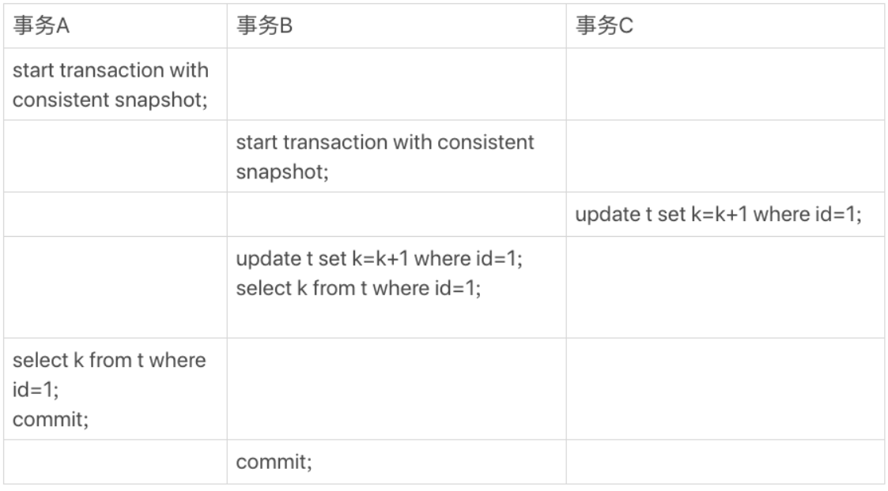

# 基础

## 基础架构

MySQL 可以分为 **Server 层**和**存储引擎层**两部分。


Server 层包括连接器、查询缓存、分析器、优化器、执行器等，涵盖 MySQL 的大多数核心服务功能，以及所有的内置函数（如日期、时间、数学和加密函数等），所有跨存储引擎的功能都在这一层实现，比如存储过程、触发器、视图等。

而存储引擎层负责数据的存储和提取。其架构模式是插件式的，支持 InnoDB、MyISAM、Memory 等多个存储引擎。现在最常用的存储引擎是 InnoDB，它从 MySQL 5.5.5 版本开始成为了默认存储引擎。

### 连接器

连接器负责跟客户端建立连接、获取权限、维持和管理连接。

```bash
mysql -h$ip -P$port -u$user -p
```

连接命令中的 mysql 是客户端工具，用来跟服务端建立连接。在完成经典的 TCP 握手后，连接器就要开始认证你的身份，这个时候用的就是你输入的用户名和密码。

如果用户名密码认证通过，连接器会到权限表里面查出你拥有的权限。之后，这个连接里面的权限判断逻辑，都将依赖于此时读到的权限。

这就意味着，一个用户成功建立连接后，即使你用管理员账号对这个用户的权限做了修改，也不会影响已经存在连接的权限。修改完成后，只有再新建的连接才会使用新的权限设置。

连接完成后，如果你没有后续的动作，这个连接就处于空闲状态，你可以在 show processlist 命令中看到它。

客户端如果太长时间没动静，连接器就会自动将它断开。这个时间是由参数 wait_timeout 控制的，默认值是 8 小时。

数据库里面，长连接是指连接成功后，如果客户端持续有请求，则一直使用同一个连接。短连接则是指每次执行完很少的几次查询就断开连接，下次查询再重新建立一个。(尽量使用长连接)

但是全部使用长连接后，你可能会发现，有些时候 MySQL 占用内存涨得特别快，这是因为 MySQL 在执行过程中临时使用的内存是管理在连接对象里面的。这些资源会在连接断开的时候才释放。所以如果长连接累积下来，可能导致内存占用太大，被系统强行杀掉（OOM），从现象看就是 MySQL 异常重启了。

解决方案:

* 定期断开长连接。使用一段时间，或者程序里面判断执行过一个占用内存的大查询后，断开连接，之后要查询再重连。
* MySQL 5.7 或更新版本，可以在每次执行一个比较大的操作后，通过执行 mysql_reset_connection 来重新初始化连接资源。这个过程不需要重连和重新做权限验证，但是会将连接恢复到刚刚创建完时的状态。

### 查询缓存

MySQL 拿到一个查询请求后，会先到查询缓存看看，之前是不是执行过这条语句。之前执行过的语句及其结果可能会以 key-value 对的形式，被直接缓存在内存中。key 是查询的语句，value 是查询的结果。如果你的查询能够直接在这个缓存中找到 key，那么这个 value 就会被直接返回给客户端。

如果查询命中缓存，MySQL 不需要执行后面的复杂操作，就可以直接返回结果，这个效率会很高。

查询缓存往往弊大于利。

查询缓存的失效非常频繁，只要有对一个表的更新，这个表上所有的查询缓存都会被清空。

MySQL 8.0 版本直接将查询缓存的整块功能删掉了

### 分析器

如果没有命中查询缓存，就要开始真正执行语句了.

分析器先会做“词法分析”。你输入的是由多个字符串和空格组成的一条 SQL 语句，MySQL 需要识别出里面的字符串分别是什么，代表什么。

### 优化器

经过了分析器，MySQL 就知道你要做什么了。在开始执行之前，还要先经过优化器的处理。

优化器是在表里面有多个索引的时候，决定使用哪个索引；或者在一个语句有多表关联（join）的时候，决定各个表的连接顺序。

### 执行器

MySQL 通过分析器知道了你要做什么，通过优化器知道了该怎么做，于是就进入了执行器阶段，开始执行语句。

首先判断是否有执行该表的权限，如果有权限，就打开表继续执行。打开表的时候，执行器就会根据表的引擎定义，去使用这个引擎提供的接口。

## 日志系统

与查询流程不一样的是，更新流程还涉及两个重要的日志模块，redo log（重做日志）和 binlog（归档日志）

### 重要的日志模块：redo log

有一条记录需要更新的时候，InnoDB 引擎就会先把记录写到 redo log（粉板）里面，并更新内存，这个时候更新就算完成了。同时，InnoDB 引擎会在适当的时候，将这个操作记录更新到磁盘里面，而这个更新往往是在系统比较空闲的时候做。


write pos 是当前记录的位置，一边写一边后移。checkpoint 是当前要擦除的位置，也是往后推移并且循环的，擦除记录前要把记录更新到数据文件。

write pos 和 checkpoint 之间的是空着的部分，可以用来记录新的操作。如果 write pos 追上 checkpoint，表示日志记录满了，这时候不能再执行新的更新，得停下来先擦掉一些记录，把 checkpoint 推进一下。

有了 redo log，InnoDB 就可以保证即使数据库发生异常重启，之前提交的记录都不会丢失，这个能力称为 crash-safe。

### 重要的日志模块：binlog

MySQL 整体来看，其实就有两块：一块是 Server 层，它主要做的是 MySQL 功能层面的事情；还有一块是引擎层，负责存储相关的具体事宜。

redo log 是 InnoDB 引擎特有的日志，而 Server 层也有自己的日志，称为 binlog（归档日志）。binlog 是没有 crash-safe 能力的。

```markdown
# 两个日志的区别
- redo log 是 InnoDB 引擎特有的；binlog 是 MySQL 的 Server 层实现的，所有引擎都可以使用。
- redo log 是物理日志，记录的是“在某个数据页上做了什么修改”；binlog 是逻辑日志，记录的是这个语句的原始逻辑，比如“给 ID=2 这一行的 c 字段加 1 ”。
- redo log 是循环写的，空间固定会用完；binlog 是可以追加写入的。“追加写”是指 binlog 文件写到一定大小后会切换到下一个，并不会覆盖以前的日志。
# 执行器和 InnoDB 引擎在执行这个简单的 update 语句时的内部流程
- 执行器先找引擎取 ID=2 这一行。ID 是主键，引擎直接用树搜索找到这一行。如果 ID=2 这一行所在的数据页本来就在内存中，就直接返回给执行器；否则，需要先从磁盘读入内存，然后再返回。
- 执行器拿到引擎给的行数据，把这个值加上 1，比如原来是 N，现在就是 N+1，得到新的一行数据，再调用引擎接口写入这行新数据。
- 引擎将这行新数据更新到内存中，同时将这个更新操作记录到 redo log 里面，此时 redo log 处于 prepare 状态。然后告知执行器执行完成了，随时可以提交事务。
- 执行器生成这个操作的 binlog，并把 binlog 写入磁盘。
- 执行器调用引擎的提交事务接口，引擎把刚刚写入的 redo log 改成提交（commit）状态，更新完成。
```

### 两阶段提交

将 redo log 的写入拆成了两个步骤：prepare 和 commit，这就是"两阶段提交"。

这是为了让两份日志之间的逻辑一致。

## 事务隔离

事务就是要保证一组数据库操作，要么全部成功，要么全部失败。

事务特性 ACID（Atomicity、Consistency、Isolation、Durability，即原子性、一致性、隔离性、持久性）

### 隔离性与隔离级别

当数据库上有多个事务同时执行的时候，就可能出现脏读（dirty read）、不可重复读（non-repeatable read）、幻读（phantom read）的问题，为了解决这些问题，就有了“隔离级别”的概念。

你隔离得越严实，效率就会越低。

SQL 标准的事务隔离级别包括：读未提交（read uncommitted）、读提交（read committed）、可重复读（repeatable read）和串行化（serializable ）

```markdown
- 读未提交是指，一个事务还没提交时，它做的变更就能被别的事务看到。

- 读提交是指，一个事务提交之后，它做的变更才会被其他事务看到。

- 可重复读是指，一个事务执行过程中看到的数据，总是跟这个事务在启动时看到的数据是一致的。当然在可重复读隔离级别下，未提交变更对其他事务也是不可见的。

- 串行化，顾名思义是对于同一行记录，“写”会加“写锁”，“读”会加“读锁”。当出现读写锁冲突的时候，后访问的事务必须等前一个事务执行完成，才能继续执行。
```

```bash
# 查看事务隔离
mysql> show variables like 'transaction_isolation';
```

### 事务隔离的实现

在 MySQL 中，实际上每条记录在更新的时候都会同时记录一条回滚操作。记录上的最新值，通过回滚操作，都可以得到前一个状态的值。

尽量不要使用长事务。长事务意味着系统里面会存在很老的事务视图。

### 事务的启动方式

```markdown
- 显式启动事务语句， begin 或 start transaction。配套的提交语句是 commit，回滚语句是 rollback。
- set autocommit=0，这个命令会将这个线程的自动提交关掉。意味着如果你只执行一个 select 语句，这个事务就启动了，而且并不会自动提交。这个事务持续存在直到你主动执行 commit 或 rollback 语句，或者断开连接。
```

```sql
-- 在 information_schema 库的 innodb_trx 这个表中查询长事务
-- 比如下面这个语句，用于查找持续时间超过 60s 的事务。
select * from information_schema.innodb_trx where TIME_TO_SEC(timediff(now(),trx_started))>60
```

## 深入浅出索引

索引的出现其实就是为了提高数据查询的效率，就像书的目录一样。

### 索引的常见模型

三种常见的索引模型：哈希表、有序数组、搜索树

哈希表这种结构适用于只有等值查询的场景

有序数组在等值查询和范围查询场景中的性能就都非常优秀，有序数组索引只适用于静态存储引擎

N 叉树由于在读写上的性能优点，以及适配磁盘的访问模式，已经被广泛应用在数据库引擎中了。

### InnoDB 的索引模型

在 InnoDB 中，表都是根据主键顺序以索引的形式存放的，这种存储方式的表称为索引组织表。又因为前面我们提到的，InnoDB 使用了 **B+ 树**索引模型，所以数据都是存储在 B+ 树中的。

每一个索引在 InnoDB 里面对应一棵 B+ 树。

索引类型分为主键索引和非主键索引。

```sql
mysql> create table T(
id int primary key, 
k int not null, 
name varchar(16),
index (k))engine=InnoDB;
-- id 为主键索引
-- k 为非主键索引
```

主键索引的叶子节点存的是整行数据。在 InnoDB 里，主键索引也被称为聚簇索引（clustered index）。

非主键索引的叶子节点内容是主键的值。在 InnoDB 里，非主键索引也被称为二级索引（secondary index）。

```markdown
# 基于主键索引和普通索引的查询有什么区别？
- 如果语句是 select * from T where ID=500，即主键查询方式，则只需要搜索 ID 这棵 B+ 树；
- 如果语句是 select * from T where k=5，即普通索引查询方式，则需要先搜索 k 索引树，得到 ID 的值为 500，再到 ID 索引树搜索一次。这个过程称为回表。
- **也就是说，基于非主键索引的查询需要多扫描一棵索引树**。因此，我们在应用中应该尽量使用主键查询。
```

### 索引维护

B+ 树为了维护索引有序性，在插入新值的时候需要做必要的维护。


以上面这个图为例，如果插入新的行 ID 值为 700，则只需要在 R5 的记录后面插入一个新记录。如果新插入的 ID 值为 400，就相对麻烦了，需要逻辑上挪动后面的数据，空出位置。

而更糟的情况是，如果 R5 所在的数据页已经满了，根据 B+ 树的算法，这时候需要申请一个新的数据页，然后挪动部分数据过去。这个过程称为**页分裂**。在这种情况下，性能自然会受影响。

除了性能外，页分裂操作还影响数据页的利用率。原本放在一个页的数据，现在分到两个页中，整体空间利用率降低大约 50%。

当然有分裂就有合并。当相邻两个页由于删除了数据，利用率很低之后，会将数据页做合并。合并的过程，可以认为是分裂过程的逆过程。

自增主键是指自增列上定义的主键，在建表语句中一般是这么定义的： `NOT NULL PRIMARY KEY AUTO_INCREMENT`。

自增主键的插入数据模式，正符合了我们前面提到的递增插入的场景。每次插入一条新记录，都是追加操作，都不涉及到挪动其他记录，也不会触发叶子节点的分裂。

而有业务逻辑的字段做主键，则往往不容易保证有序插入，这样写数据成本相对较高。

由于每个非主键索引的叶子节点上都是主键的值。如果用身份证号做主键，那么每个二级索引的叶子节点占用约 20 个字节，而如果用整型做主键，则只要 4 个字节，如果是长整型（bigint）则是 8 个字节。

显然，**主键长度越小，普通索引的叶子节点就越小，普通索引占用的空间也就越小**。

**从性能和存储空间方面考量，自增主键往往是更合理的选择。**

直接将这个索引设置为主键，可以避免每次查询需要搜索两棵树。

B+ 树能够很好地配合磁盘的读写特性，减少单次查询的磁盘访问次数。

```sql
-- 重建索引k
alter table T drop index k;
alter table T add index(k);
-- 重建主键索引（不合理）,不论是删除主键还是创建主键，都会将整个表重建
alter table T drop primary key;
alter table T add primary key(id);
-- 重建表语句
alter table T engine=InnoDB;
```

### 覆盖索引

通过非主键索引查询所有数据会先查询非主键的B+树得到主键ID，通过查询结果再查询主键的索引的B+树，称为回表。

如果执行的语句是` select ID from T where k between 3 and 5`，这时只需要查 ID 的值，而 ID 的值已经在 k 索引树上了，因此可以直接提供查询结果，不需要回表。也就是说，在这个查询里面，索引 k 已经“覆盖了”我们的查询需求，我们称为覆盖索引。

由于覆盖索引可以减少树的搜索次数，显著提升查询性能，所以使用覆盖索引是一个常用的性能优化手段。

### 最左前缀原则

B+ 树这种索引结构，可以利用索引的“最左前缀”，来定位记录。

```sql
CREATE TABLE `tuser` (
  `id` int(11) NOT NULL,
  `id_card` varchar(32) DEFAULT NULL,
  `name` varchar(32) DEFAULT NULL,
  `age` int(11) DEFAULT NULL,
  `ismale` tinyint(1) DEFAULT NULL,
  PRIMARY KEY (`id`),
  KEY `id_card` (`id_card`),
  KEY `name_age` (`name`,`age`)
) ENGINE=InnoDB
-- id_card 索引
-- name_age 联合索引，通过联合索引和最左前缀原则，可以快速查询关于姓名的查询
-- 也就是说，可以不用再维护一个姓名索引
```

```markdown
# 在建立联合索引的时候，如何安排索引内的字段顺序。
- 这里我们的评估标准是，索引的复用能力。因为可以支持最左前缀，所以当已经有了 (a,b) 这个联合索引后，一般就不需要单独在 a 上建立索引了。因此，第一原则是，如果通过调整顺序，可以少维护一个索引，那么这个顺序往往就是需要优先考虑采用的。
- 那么，如果既有联合查询，又有基于 a、b 各自的查询呢？查询条件里面只有 b 的语句，是无法使用 (a,b) 这个联合索引的，这时候你不得不维护另外一个索引，也就是说你需要同时维护 (a,b)、(b) 这两个索引。
- 这时候，我们要考虑的原则就是空间了。比如上面这个市民表的情况，name 字段是比 age 字段大的 ，那我就建议你创建一个（name,age) 的联合索引和一个 (age) 的单字段索引。
```

### 索引下推

```bash
# 检索出表中“名字第一个字是张，而且年龄是 10 岁的所有男孩”
mysql> select * from tuser where name like '张%' and age=10 and ismale=1;
# MySQL5.6之前，只能先查询 name_age 索引表，找到第一个符合“张%”的ID后进行回表查询，到主键索引上找出数据行，在对比字段值
# MySQL5.6之后引入了索引下推，索引遍历过程中，对索引中包含的字段先做判断，直接过滤掉不满足条件的记录，减少回表次数。
```

## 全局锁和表锁

根据加锁的范围，MySQL 里面的锁大致可以分成全局锁、表级锁和行锁三类。

### 全局锁

全局锁就是对整个数据库实例加锁。MySQL 提供了一个加全局读锁的方法，命令是 `Flush tables with read lock `(FTWRL)。当你需要让整个库处于只读状态的时候，可以使用这个命令，之后其他线程的以下语句会被阻塞：数据更新语句（数据的增删改）、数据定义语句（包括建表、修改表结构等）和更新类事务的提交语句。

全局锁的典型使用场景是，做全库逻辑备份。也就是把整库每个表都 select 出来存成文本。

```markdown
# 问题
- 如果你在主库上备份，那么在备份期间都不能执行更新，业务基本上就得停摆；
- 如果你在从库上备份，那么备份期间从库不能执行主库同步过来的 binlog，会导致主从延迟。
```

官方自带的逻辑备份工具是 mysqldump。当 mysqldump 使用参数–single-transaction 的时候，导数据之前就会启动一个事务，来确保拿到一致性视图。而由于 MVCC 的支持，这个过程中数据是可以正常更新的。一致性读是好，但前提是引擎要支持这个隔离级别。**single-transaction 方法只适用于所有的表使用事务引擎的库。**

```markdown
# 既然要全库只读，为什么不使用 set global readonly=true 的方式呢？
- 一是，在有些系统中，readonly 的值会被用来做其他逻辑，比如用来判断一个库是主库还是备库。因此，修改 global 变量的方式影响面更大，我不建议你使用。
- 二是，在异常处理机制上有差异。如果执行 FTWRL 命令之后由于客户端发生异常断开，那么 MySQL 会自动释放这个全局锁，整个库回到可以正常更新的状态。而将整个库设置为 readonly 之后，如果客户端发生异常，则数据库就会一直保持 readonly 状态，这样会导致整个库长时间处于不可写状态，风险较高。
```

### 表级锁

MySQL 里面表级别的锁有两种：一种是表锁，一种是元数据锁（meta data lock，MDL)。

表锁的语法是 `lock tables … read/write`。与 FTWRL 类似，可以用 `unlock tables` 主动释放锁，也可以在客户端断开的时候自动释放。需要注意，lock tables 语法除了会限制别的线程的读写外，也限定了本线程接下来的操作对象。

举个例子, 如果在某个线程 A 中执行 `lock tables t1 read, t2 write;` 这个语句，则其他线程写 t1、读写 t2 的语句都会被阻塞。同时，线程 A 在执行 `unlock tables` 之前，也只能执行读 t1、读写 t2 的操作。连写 t1 都不允许，自然也不能访问其他表。

在还没有出现更细粒度的锁的时候，表锁是最常用的处理并发的方式。而对于 InnoDB 这种支持行锁的引擎，一般不使用 lock tables 命令来控制并发，毕竟锁住整个表的影响面还是太大。

另一类表级的锁是 **MDL**（metadata lock)。MDL 不需要显式使用，在访问一个表的时候会被自动加上。MDL 的作用是，保证读写的正确性。

```markdown
- 在 MySQL 5.5 版本中引入了 MDL，当对一个表做增删改查操作的时候，加 MDL 读锁；当要对表做结构变更操作的时候，加 MDL 写锁。
- 读锁之间不互斥，因此你可以有多个线程同时对一张表增删改查。
- 读写锁之间、写锁之间是互斥的，用来保证变更表结构操作的安全性。因此，如果有两个线程要同时给一个表加字段，其中一个要等另一个执行完才能开始执行。
- 事务中的 MDL 锁，在语句执行开始时申请，但是语句结束后并不会马上释放，而会等到整个事务提交后再释放。
```

```markdown
# 如何安全地给小表加字段？
- 首先我们要解决长事务，事务不提交，就会一直占着 MDL 锁。在 MySQL 的 information_schema 库的 innodb_trx 表中，你可以查到当前执行中的事务。如果你要做 DDL 变更的表刚好有长事务在执行，要考虑先暂停 DDL，或者 kill 掉这个长事务。
## 如果你要变更的表是一个热点表，虽然数据量不大，但是上面的请求很频繁，而你不得不加个字段，你该怎么做呢？
- 这时候 kill 可能未必管用，因为新的请求马上就来了。比较理想的机制是，在 alter table 语句里面设定等待时间，如果在这个指定的等待时间里面能够拿到 MDL 写锁最好，拿不到也不要阻塞后面的业务语句，先放弃。之后开发人员或者 DBA 再通过重试命令重复这个过程。
- ALTER TABLE tbl_name NOWAIT add column ...
- ALTER TABLE tbl_name WAIT N add column ... 
```

## 行锁功过

MySQL 的行锁是在引擎层由各个引擎自己实现的。不支持行锁意味着并发控制只能使用表锁，对于这种引擎的表，同一张表上任何时刻只能有一个更新在执行，这就会影响到业务并发度。InnoDB 是支持行锁的，这也是 MyISAM 被 InnoDB 替代的重要原因之一。

顾名思义，行锁就是针对数据表中行记录的锁。这很好理解，比如事务 A 更新了一行，而这时候事务 B 也要更新同一行，则必须等事务 A 的操作完成后才能进行更新。

### 两阶段锁

在 InnoDB 事务中，行锁是在需要的时候才加上的，但并不是不需要了就立刻释放，而是要等到事务结束时才释放。这个就是两阶段锁协议。

如果你的事务中需要锁多个行，要把最可能造成锁冲突、最可能影响并发度的锁尽量往后放。这就最大程度地减少了事务之间的锁等待，提升了并发度。

```markdown
- 顾客 A 要在影院 B 购买电影票需要执行 update 两条记录，并 insert 一条记录
- 1.从顾客 A 账户余额中扣除电影票价；
- 2.给影院 B 的账户余额增加这张电影票价；
- 3.记录一条交易日志。

- 试想如果同时有另外一个顾客 C 要在影院 B 买票，那么这两个事务冲突的部分就是语句 2 了。
- 根据两阶段锁协议，不论你怎样安排语句顺序，所有的操作需要的行锁都是在事务提交的时候才释放的。所以，如果你把语句 2 安排在最后，比如按照 3、1、2 这样的顺序，那么影院账户余额这一行的锁时间就最少。这就最大程度地减少了事务之间的锁等待，提升了并发度。
```

### 死锁和死锁检测

当并发系统中不同线程出现循环资源依赖，涉及的线程都在等待别的线程释放资源时，就会导致这几个线程都进入无限等待的状态，称为死锁。

事务A拥有id=1的行锁，事务B拥有id=2的行锁，而此时事务 A 在等待事务 B 释放 id=2 的行锁，而事务 B 在等待事务 A 释放 id=1 的行锁。 事务 A 和事务 B 在互相等待对方的资源释放，就是进入了死锁状态。

```markdown
# 解决死锁的策略
- 一种策略是，直接进入等待，直到超时。这个超时时间可以通过参数 innodb_lock_wait_timeout 来设置。在 InnoDB 中，innodb_lock_wait_timeout 的默认值是 50s.
- 另一种策略是，发起死锁检测，发现死锁后，主动回滚死锁链条中的某一个事务，让其他事务得以继续执行。将参数 innodb_deadlock_detect 设置为 on，表示开启这个逻辑。
```

建议使用主动死锁检测，因为设置超时参数没有一个很好的标准。

正常情况下我们还是要采用第二种策略，即：主动死锁检测，而且 innodb_deadlock_detect 的默认值本身就是 on。主动死锁检测在发生死锁的时候，是能够快速发现并进行处理的，但是它也是有额外负担的。

每个新来的被堵住的线程，都要判断会不会由于自己的加入导致了死锁，这是一个时间复杂度是 O(n) 的操作。

```markdown
# 怎么解决由这种热点行更新导致的性能问题呢？问题的症结在于，死锁检测要耗费大量的 CPU 资源。
- 一种头痛医头的方法，就是如果你能确保这个业务一定不会出现死锁，可以临时把死锁检测关掉。但是这种操作本身带有一定的风险，因为业务设计的时候一般不会把死锁当做一个严重错误，毕竟出现死锁了，就回滚，然后通过业务重试一般就没问题了，这是业务无损的。而关掉死锁检测意味着可能会出现大量的超时，这是业务有损的。
- 另一个思路是控制并发度。
```

## 锁与隔离

```sql
CREATE TABLE `t` (
    `id` int(11) NOT NULL,
    `k` int(11) DEFAULT NULL,
    PRIMARY KEY (`id`)
) ENGINE=InnoDB;
insert into t(id, k) values(1,1),(2,2);
```



begin/start transaction 命令并不是一个事务的起点，在执行到它们之后的第一个操作 InnoDB 表的语句，事务才真正启动。如果你想要马上启动一个事务，可以使用 `start transaction with consistent snapshot` 这个命令。

```markdown
# 两个“视图”的概念：
- 一个是 view。它是一个用查询语句定义的虚拟表，在调用的时候执行查询语句并生成结果。创建视图的语法是 create view … ，而它的查询方法与表一样。
- 另一个是 InnoDB 在实现 MVCC 时用到的一致性读视图，即 consistent read view，用于支持 RC（Read Committed，读提交）和 RR（Repeatable Read，可重复读）隔离级别的实现。
```

### “快照”在 MVCC 里是怎么工作的？

在可重复读隔离级别下，事务在启动的时候就“拍了个快照”。注意，这个快照是基于整库的。

InnoDB 里面每个事务有一个唯一的事务 ID，叫作 transaction id。它是在事务开始的时候向 InnoDB 的事务系统申请的，是按申请顺序严格递增的。

而每行数据也都是有多个版本的。每次事务更新数据的时候，都会生成一个新的数据版本，并且把 transaction id 赋值给这个数据版本的事务 ID，记为 row trx_id。同时，旧的数据版本要保留，并且在新的数据版本中，能够有信息可以直接拿到它。

也就是说，数据表中的一行记录，其实可能有多个版本 (row)，每个版本有自己的 row trx_id。

按照可重复读的定义，开启事务时，能够看到所有已经提交的事务结果。但是之后，这个事务执行期间，其他事务的更新对它不可见。

在实现上， InnoDB 为每个事务构造了一个数组，用来保存这个事务启动瞬间，当前正在“活跃”的所有事务 ID。“活跃”指的就是，启动了但还没提交。

数组里面事务 ID 的最小值记为低水位，当前系统里面已经创建过的事务 ID 的最大值加 1 记为高水位。

这个**视图数组**和高水位，就组成了当前事务的一致性视图（read-view）。

而数据版本的可见性规则，就是基于数据的 row trx_id 和这个一致性视图的对比结果得到的。(数据版本ID和事务ID的比较)


```markdown
# 对于当前事务的启动瞬间来说，一个数据版本的 row trx_id，有以下几种可能：
- 1.如果落在绿色部分，表示这个版本是已提交的事务或者是当前事务自己生成的，这个数据是可见的；
- 2.如果落在红色部分，表示这个版本是由将来启动的事务生成的，是肯定不可见的；
- 3.如果落在黄色部分，那就包括两种情况
- - a.若 row trx_id 在数组中，表示这个版本是由还没提交的事务生成的，不可见；
- - b. 若 row trx_id 不在数组中，表示这个版本是已经提交了的事务生成的，可见。
```

InnoDB 利用了“所有数据都有多个版本”的这个特性，实现了“秒级创建快照”的能力。


```markdown
# 事务 A 查询语句的读数据流程是这样的：
- 找到 (1,3) 的时候，判断出 row trx_id=101，比高水位大，处于红色区域，不可见；
- 接着，找到上一个历史版本，一看 row trx_id=102，比高水位大，处于红色区域，不可见；
- 再往前找，终于找到了（1,1)，它的 row trx_id=90，比低水位小，处于绿色区域，可见。
```

虽然期间这一行数据被修改过，但是事务 A 不论在什么时候查询，看到这行数据的结果都是一致的，所以我们称之为一致性读。

```markdown
# 一个数据版本，对于一个事务视图来说，除了自己的更新总是可见以外，有三种情况：
- 版本未提交，不可见；
- 版本已提交，但是是在视图创建后提交的，不可见；
- 版本已提交，而且是在视图创建前提交的，可见。
```

### 更新逻辑

**更新数据都是先读后写的，而这个读，只能读当前的值，称为“当前读”（current read）。**因此，事务 B 此时的 set k=k+1 是在（1,2）的基础上进行的操作。所以，在执行事务 B 查询语句的时候，一看自己的版本号是 101，最新数据的版本号也是 101，是自己的更新，可以直接使用，所以查询得到的 k 的值是 3。

除了 update 语句外，select 语句如果加锁，也是当前读。

所以，如果把事务 A 的查询语句 select * from t where id=1 修改一下，加上 lock in share mode 或 for update，也都可以读到版本号是 101 的数据，返回的 k 的值是 3。下面这两个 select 语句，就是分别加了读锁（S 锁，共享锁）和写锁（X 锁，排他锁）。

```bash
mysql> select k from t where id=1 lock in share mode;
mysql> select k from t where id=1 for update;
```

```markdown
# 如果事务C没有马上提交
- 事务 C 没提交，也就是说 (1,2) 这个版本上的写锁还没释放。而事务 B 是当前读，必须要读最新版本，而且必须加锁，因此就被锁住了，必须等到事务 C 释放这个锁，才能继续它的当前读。
```

```markdown
# 事务的可重复读的能力是怎么实现的？
- 可重复读的核心就是一致性读（consistent read）；而事务更新数据的时候，只能用当前读。如果当前的记录的行锁被其他事务占用的话，就需要进入锁等待。

# 而读提交的逻辑和可重复读的逻辑类似，它们最主要的区别是：
- 在可重复读隔离级别下，只需要在事务开始的时候创建一致性视图，之后事务里的其他查询都共用这个一致性视图；查询只承认在事务启动前就已经提交完成的数据；
- 在读提交隔离级别下，每一个语句执行前都会重新算出一个新的视图。查询只承认在语句启动前就已经提交完成的数据；
```


