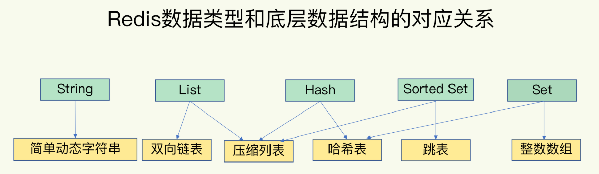

# 基础

## 基本架构

Redis 经常被用于缓存、秒杀、分布式锁等场景。

Redis基本数据模型，K（键）,V（值）。key 是 String 类型，而 value 是基本数据类型。

Redis 能够在实际业务场景中得到广泛的应用，就是得益于支持多样化类型的 value。

PUT/GET/DELETE/SCAN 是一个键值数据库的基本操作集合。

键值对保存在内存还是外存？看需要场景。作为缓存，能够接收数据丢失，则用内存；不能接受数据丢失，性能要求不要，用外存。

一个键值数据库包括了访问框架、索引模块、操作模块和存储模块四部分。


> 采用什么访问模式？

访问模式通常有两种：

* 一种是通过函数库调用的方式供外部应用使用，比如，上图中的 libsimplekv.so，就是以动态链接库的形式链接到我们自己的程序中，提供键值存储功能；

* 另一种是通过网络框架以 Socket 通信的形式对外提供键值对操作，这种形式可以提供广泛的键值存储服务。在上图中，我们可以看到，网络框架中包括 Socket Server 和协议解析。

实际的键值数据库也基本采用上述两种方式，例如，RocksDB 以动态链接库的形式使用，而 Memcached 和 **Redis 则是通过网络框架访问**。后面我还会给你介绍 Redis 现有的客户端和通信协议。

通过网络框架提供键值存储服务，一方面扩大了键值数据库的受用面，但另一方面，也给键值数据库的性能、运行模型提供了不同的设计选择，带来了一些潜在的问题。

> 如何定位键值对的位置？

这依赖于键值数据库的索引模块。**索引的作用是让键值数据库根据 key 找到相应 value 的存储位置，进而执行操作。**

索引的类型有很多，常见的有哈希表、B+ 树、字典树等。不同的索引结构在性能、空间消耗、并发控制等方面具有不同的特征。如果你看过其他键值数据库，就会发现，不同键值数据库采用的索引并不相同，例如，Memcached 和 **Redis 采用哈希表作为 key-value 索引**，而 RocksDB 则采用跳表作为内存中 key-value 的索引。

```markdown
# Redis 采用哈希表作为 key-value 索引的原因
- 内存键值数据库（例如 Redis）采用哈希表作为索引，很大一部分原因在于，其键值数据基本都是保存在内存中的，而内存的高性能随机访问特性可以很好地与哈希表 O(1) 的操作复杂度相匹配。
```

> 不同操作的具体逻辑是怎样的？

对于 GET/SCAN 操作而言，此时根据 value 的存储位置返回 value 值即可；

对于 PUT 一个新的键值对数据而言，需要为该键值对分配内存空间；

对于 DELETE 操作，需要删除键值对，并释放相应的内存空间，这个过程由分配器完成。

> 如何实现重启后快速提供服务？

分配器是键值数据库中的一个关键因素。对于以内存存储为主的 Redis 而言，这点尤为重要。Redis 的内存分配器提供了多种选择，分配效率也不一样。

Redis 为持久化提供了诸多的执行机制和优化改进

### 总结


* Redis 主要通过网络框架进行访问，而不再是动态库了，这也使得 Redis 可以作为一个基础性的网络服务进行访问，扩大了 Redis 的应用范围。
* Redis 数据模型中的 value 类型很丰富，因此也带来了更多的操作接口，例如面向列表的 LPUSH/LPOP，面向集合的 SADD/SREM 等。
* Redis 的持久化模块能支持两种方式：日志（AOF）和快照（RDB），这两种持久化方式具有不同的优劣势，影响到 Redis 的访问性能和可靠性。
* Redis 支持高可靠集群和高可扩展集群，因此，Redis 中包含了相应的集群功能支撑模块。

## 数据结构

为啥 Redis 能有这么突出的表现呢？一方面，这是因为它是**内存数据库**，所有操作都在内存上完成，内存的访问速度本身就很快。另一方面，这要归功于它的数据结构。这是因为，键值对是按一定的数据结构来组织的，操作键值对最终就是对数据结构进行增删改查操作，所以**高效的数据结构是 Redis 快速处理数据的基础**。

数据类型：String（字符串）、List（列表）、Hash（哈希）、Set（集合）和 Sorted Set（有序集合）

底层数据结构：一共有 6 种，分别是简单动态字符串、双向链表、压缩列表、哈希表、跳表和整数数组。



String 类型的底层实现只有一种数据结构，也就是简单动态字符串。而 List、Hash、Set 和 Sorted Set 这四种数据类型，都有两种底层实现结构。通常情况下，我们会把这四种类型称为集合类型，它们的特点是一个键对应了一个集合的数据。

### 键值对结构哈希表

Redis 使用了一个哈希表来保存所有键值对。

一个哈希表，其实就是一个数组，数组的每个元素称为一个哈希桶。一个哈希表是由多个哈希桶组成的，每个哈希桶中保存了键值对数据。

哈希桶中的元素保存的并不是值本身，而是指向具体值的指针。这也就是说，不管值是 String，还是集合类型，哈希桶中的元素都是指向它们的指针。


因为这个哈希表保存了所有的键值对，所以，我也把它称为**全局哈希表**。哈希表的最大好处很明显，就是让我们可以用 O(1) 的时间复杂度来快速查找到键值对——我们只需要计算键的哈希值，就可以知道它所对应的哈希桶位置，然后就可以访问相应的 entry 元素。

**哈希表的冲突问题和 rehash 可能带来的操作阻塞。**

### 哈希冲突和rehash

当你往哈希表中写入更多数据时，哈希冲突是不可避免的问题。这里的哈希冲突，也就是指，两个 key 的哈希值和哈希桶计算对应关系时，正好落在了同一个哈希桶中。

哈希桶的个数通常要少于 key 的数量，这也就是说，难免会有一些 key 的哈希值对应到了同一个哈希桶中。

Redis 解决哈希冲突的方式，就是**链式哈希**。链式哈希也很容易理解，就是指同一个哈希桶中的多个元素用一个链表来保存，它们之间依次用指针连接。


当哈希链过长时，Redis 性能就会降低，所以，Redis 会对哈希表做 **rehash 操作**。rehash 也就是增加现有的哈希桶数量，让逐渐增多的 entry 元素能在更多的桶之间分散保存，减少单个桶中的元素数量，从而减少单个桶中的冲突。

> 这里和java中hashMap非常类似，都存在hash冲突，只不过redis为了提高性能，会将所有数据重hash一遍，hashMap 为了提高效率会将链表转换成红黑树。

```markdown
# rehash 操作
- 为了使 rehash 操作更高效，Redis 默认使用了两个全局哈希表：哈希表 1 和哈希表 2。一开始，当你刚插入数据时，默认使用哈希表 1，此时的哈希表 2 并没有被分配空间。随着数据逐步增多，Redis 开始执行 rehash，这个过程分为三步：
- 1.给哈希表 2 分配更大的空间，例如是当前哈希表 1 大小的两倍；
- 2.把哈希表 1 中的数据重新映射并拷贝到哈希表 2 中；
- 3.释放哈希表 1 的空间。
- 到此，我们就可以从哈希表 1 切换到哈希表 2，用增大的哈希表 2 保存更多数据，而原来的哈希表 1 留作下一次 rehash 扩容备用。
- 这个过程看似简单，但是第二步涉及大量的数据拷贝，如果一次性把哈希表 1 中的数据都迁移完，会造成 Redis 线程阻塞，无法服务其他请求。此时，Redis 就无法快速访问数据了。为了避免这个问题，Redis 采用了渐进式 rehash。
# 渐进式 rehash
- 简单来说就是在第二步拷贝数据时，Redis 仍然正常处理客户端请求，每处理一个请求时，从哈希表 1 中的第一个索引位置开始，顺带着将这个索引位置上的所有 entries 拷贝到哈希表 2 中；等处理下一个请求时，再顺带拷贝哈希表 1 中的下一个索引位置的 entries。
- 这样就巧妙地把一次性大量拷贝的开销，分摊到了多次处理请求的过程中，避免了耗时操作，保证了数据的快速访问
```

找到哈希桶是所有redis操作的第一步，第二步是找到具体的值，string类型比较容易找，**集合类型还要进一步去查找**，复杂度也会增加

### 集合数据操作效率

集合的操作效率和哪些因素相关呢？

首先，与集合的底层数据结构有关。例如，使用哈希表实现的集合，要比使用链表实现的集合访问效率更高。其次，操作效率和这些操作本身的执行特点有关，比如读写一个元素的操作要比读写所有元素的效率高。

#### 底层数据结构

集合类型的底层数据结构主要有 5 种：整数数组、双向链表、哈希表、压缩列表和跳表。

**压缩列表**

压缩列表实际上类似于一个数组，数组中的每一个元素都对应保存一个数据。和数组不同的是，压缩列表在表头有三个字段 zlbytes、zltail 和 zllen，分别表示列表长度、列表尾的偏移量和列表中的 entry 个数；压缩列表在表尾还有一个 zlend，表示列表结束。


在压缩列表中，如果我们要查找定位第一个元素和最后一个元素，可以通过表头三个字段的长度直接定位，复杂度是 O(1)。而查找其他元素时，就没有这么高效了，只能逐个查找，此时的复杂度就是 O(N) 了。

**跳表**

有序链表只能逐一查找元素，导致操作起来非常缓慢，于是就出现了跳表。具体来说，跳表在链表的基础上，增加了**多级索引**，通过索引位置的几个跳转，实现数据的快速定位，如下图所示：


当数据量很大时，跳表的查找复杂度就是 O(logN)。


#### 不同操作的复杂度

**第一，单元素操作，是指每一种集合类型对单个数据实现的增删改查操作**。例如，Hash 类型的 HGET、HSET 和 HDEL，Set 类型的 SADD、SREM、SRANDMEMBER 等。这些操作的复杂度由集合采用的数据结构决定，例如，HGET、HSET 和 HDEL 是对哈希表做操作，所以它们的复杂度都是 O(1)；Set 类型用哈希表作为底层数据结构时，它的 SADD、SREM、SRANDMEMBER 复杂度也是 O(1)。

**第二，范围操作，是指集合类型中的遍历操作，可以返回集合中的所有数据**，比如 Hash 类型的 HGETALL 和 Set 类型的 SMEMBERS，或者返回一个范围内的部分数据，比如 List 类型的 LRANGE 和 ZSet 类型的 ZRANGE。**这类操作的复杂度一般是 O(N)，比较耗时，我们应该尽量避免。**

> 不过，Redis 从 2.8 版本开始提供了 SCAN 系列操作（包括 HSCAN，SSCAN 和 ZSCAN），这类操作实现了渐进式遍历，每次只返回有限数量的数据。这样一来，相比于 HGETALL、SMEMBERS 这类操作来说，就避免了一次性返回所有元素而导致的 Redis 阻塞。

**第三，统计操作，是指集合类型对集合中所有元素个数的记录**，例如 LLEN 和 SCARD。**这类操作复杂度只有 O(1)**，这是因为当集合类型采用压缩列表、双向链表、整数数组这些数据结构时，**这些结构中专门记录了元素的个数统计**，因此可以高效地完成相关操作。

**第四，例外情况，是指某些数据结构的特殊记录**，例如压缩列表和双向链表都会记录表头和表尾的偏移量。这样一来，对于 List 类型的 LPOP、RPOP、LPUSH、RPUSH 这四个操作来说，它们是在列表的头尾增删元素，这就可以通过偏移量直接定位，所以它们的复杂度也只有 O(1)，可以实现快速操作。

## 高性能IO模型

**Redis 是单线程，主要是指 Redis 的网络 IO 和键值对读写是由一个线程来完成的，这也是 Redis 对外提供键值存储服务的主要流程**。但 Redis 的其他功能，比如持久化、异步删除、集群数据同步等，其实是由额外的线程执行的。

### 单线程优势

> 多线程的开销

我们刚开始增加线程数时，系统吞吐率会增加，但是，再进一步增加线程时，系统吞吐率就增长迟缓了，有时甚至还会出现下降的情况。

为什么会出现这种情况呢？一个关键的瓶颈在于，系统中通常会存在被多线程同时访问的共享资源，比如一个共享的数据结构。当有多个线程要修改这个共享资源时，为了保证共享资源的正确性，就需要有额外的机制进行保证，而这个额外的机制，就会带来额外的开销。**多线程编程模式面临的共享资源的并发访问控制问题。**

只是简单地采用一个粗粒度互斥锁，就会出现不理想的结果：即使增加了线程，大部分线程也在等待获取访问共享资源的互斥锁，并行变串行，系统吞吐率并没有随着线程的增加而增加。

而且，采用多线程开发一般会引入同步原语来保护共享资源的并发访问，这也会降低系统代码的易调试性和可维护性。为了避免这些问题，Redis 直接采用了单线程模式。

> 单线程 Redis 为什么那么快？

一方面，**Redis 的大部分操作在内存上完成**，再加上它采用了高效的数据结构，例如哈希表和跳表，这是它实现高性能的一个重要原因。另一方面，**就是 Redis 采用了多路复用机制**，使其在网络 IO 操作中能并发处理大量的客户端请求，实现高吞吐率。

### 基于多路复用的高性能 I/O 模型

Linux 中的 IO 多路复用机制是指一个线程处理多个 IO 流，就是我们经常听到的 **select/epoll 机制**。简单来说，在 Redis 只运行单线程的情况下，**该机制允许内核中，同时存在多个监听套接字和已连接套接字**。内核会一直监听这些套接字上的连接请求或数据请求。一旦有请求到达，就会交给 Redis 线程处理，这就实现了一个 Redis 线程处理多个 IO 流的效果。


```markdown
- 为了在请求到达时能通知到 Redis 线程，select/epoll 提供了基于事件的回调机制，即针对不同事件的发生，调用相应的处理函数。
- select/epoll 一旦监测到 FD 上有请求到达时，就会触发相应的事件。
- 这些事件会被放进一个事件队列，Redis 单线程对该事件队列不断进行处理。这样一来，Redis 无需一直轮询是否有请求实际发生，这就可以避免造成 CPU 资源浪费。同时，Redis 在对事件队列中的事件进行处理时，会调用相应的处理函数，这就实现了基于事件的回调。因为 Redis 一直在对事件队列进行处理，所以能及时响应客户端请求，提升 Redis 的响应性能。
```

## AOF日志

Redis 的持久化主要有两大机制，即 AOF（Append Only File）日志和 RDB 快照。

### 实现 AOF

说到日志，我们比较熟悉的是数据库的**写前日志（Write Ahead Log, WAL）**，也就是说，在实际写数据前，先把修改的数据记到日志文件中，以便故障时进行恢复。不过，**AOF 日志正好相反，它是写后日志**，“写后”的意思是 Redis 是先执行命令，把数据写入内存，然后才记录日志，如下图所示：


传统数据库的日志，例如 redo log（重做日志），记录的是修改后的数据，而 AOF 里记录的是 Redis 收到的每一条命令，这些命令是以文本形式保存的。


> 我们以 Redis 收到“set testkey testvalue”命令后记录的日志为例，看看 AOF 日志的内容。其中，“*3”表示当前命令有三个部分，每部分都是由“$+数字”开头，后面紧跟着具体的命令、键或值。这里，“数字”表示这部分中的命令、键或值一共有多少字节。例如，“$3 set”表示这部分有 3 个字节，也就是“set”命令。

```markdown
# 为什么要后写日志
- 为了避免额外的检查开销，Redis 在向 AOF 里面记录日志的时候，并不会先去对这些命令进行语法检查。所以，如果先记日志再执行命令的话，日志中就有可能记录了错误的命令，Redis 在使用日志恢复数据时，就可能会出错。
- 而写后日志这种方式，就是先让系统执行命令，只有命令能执行成功，才会被记录到日志中，否则，系统就会直接向客户端报错。所以，Redis 使用写后日志这一方式的一大好处是，可以避免出现记录错误命令的情况。
- AOF 还有一个好处：它是在命令执行后才记录日志，所以不会阻塞当前的写操作。
# AOF 潜在风险
- 1.首先，如果刚执行完一个命令，还没有来得及记日志就宕机了，那么这个命令和相应的数据就有丢失的风险。
- 2.其次，AOF 虽然避免了对当前命令的阻塞，但可能会给下一个操作带来阻塞风险。这是因为，AOF 日志也是在主线程中执行的，如果在把日志文件写入磁盘时，磁盘写压力大，就会导致写盘很慢，进而导致后续的操作也无法执行了。
```

### 写回策略

对于 AOF 潜在风险这个问题，AOF 机制给我们提供了三个选择，也就是 AOF 配置项 appendfsync 的三个可选值。

```markdown
# 三种写回磁盘的策略
- 1.Always，同步写回：每个写命令执行完，立马同步地将日志写回磁盘；
- 2.Everysec，每秒写回：每个写命令执行完，只是先把日志写到 AOF 文件的内存缓冲区，每隔一秒把缓冲区中的内容写入磁盘；
- 3.No，操作系统控制的写回：每个写命令执行完，只是先把日志写到 AOF 文件的内存缓冲区，由操作系统决定何时将缓冲区内容写回磁盘。
# 这三种写回策略都无法做到两全其美
- 1.“同步写回”可以做到基本不丢数据，但是它在每一个写命令后都有一个慢速的落盘操作，不可避免地会影响主线程性能；
- 2.“每秒写回”采用一秒写回一次的频率，避免了“同步写回”的性能开销，虽然减少了对系统性能的影响，但是如果发生宕机，上一秒内未落盘的命令操作仍然会丢失。所以，这只能算是，在避免影响主线程性能和避免数据丢失两者间取了个折中。
- 3.虽然“操作系统控制的写回”在写完缓冲区后，就可以继续执行后续的命令，但是落盘的时机已经不在 Redis 手中了，只要 AOF 记录没有写回磁盘，一旦宕机对应的数据就丢失了.
```


```markdown
# AOF 文件过大带来的性能问题
- 一是，文件系统本身对文件大小有限制，无法保存过大的文件
- 二是，如果文件太大，之后再往里面追加命令记录的话，效率也会变低
- 三是，如果发生宕机，AOF 中记录的命令要一个个被重新执行，用于故障恢复，如果日志文件太大，整个恢复过程就会非常缓慢，这就会影响到 Redis 的正常使用
```

### 重写机制

AOF 重写机制就是在重写时，Redis 根据数据库的现状创建一个新的 AOF 文件，也就是说，读取数据库中的所有键值对，然后对每一个键值对用一条命令记录它的写入。比如说，当读取了键值对“testkey”: “testvalue”之后，重写机制会记录 set testkey testvalue 这条命令。这样，当需要恢复时，可以重新执行该命令，实现“testkey”: “testvalue”的写入。

为什么重写机制可以把日志文件变小呢? 实际上，**重写机制具有“多变一”功能**。所谓的“多变一”，也就是说，旧日志文件中的多条命令，在重写后的新日志中变成了一条命令。

在重写的时候，是根据这个键值对当前的最新状态，为它生成对应的写入命令。


```markdown
# AOF 重写会阻塞吗?
- 和 AOF 日志由主线程写回不同，重写过程是由后台子进程 bgrewriteaof 来完成的，这也是为了避免阻塞主线程，导致数据库性能下降。
# 重写的过程总结为“一个拷贝，两处日志”
## 一个拷贝
- “一个拷贝”就是指，每次执行重写时，主线程 fork 出后台的 bgrewriteaof 子进程。此时，fork 会把主线程的内存拷贝一份给 bgrewriteaof 子进程，这里面就包含了数据库的最新数据。然后，bgrewriteaof 子进程就可以在不影响主线程的情况下，逐一把拷贝的数据写成操作，记入重写日志。
## 两处日志
- 因为主线程未阻塞，仍然可以处理新来的操作。此时，如果有写操作，第一处日志就是指正在使用的 AOF 日志，Redis 会把这个操作写到它的缓冲区。这样一来，即使宕机了，这个 AOF 日志的操作仍然是齐全的，可以用于恢复。
- 而第二处日志，就是指新的 AOF 重写日志。这个操作也会被写到重写日志的缓冲区。这样，重写日志也不会丢失最新的操作。等到拷贝数据的所有操作记录重写完成后，重写日志记录的这些最新操作也会写入新的 AOF 文件，以保证数据库最新状态的记录。此时，我们就可以用新的 AOF 文件替代旧文件了。
```


> 每次 AOF 重写时，Redis 会先执行一个内存拷贝，用于重写；然后，使用两个日志保证在重写过程中，新写入的数据不会丢失。而且，因为 Redis 采用额外的线程进行数据重写，所以，这个过程并不会阻塞主线程。

## 内存快照

日志里记录的是操作命令，而不是实际数据，所以，用 AOF 方法进行故障恢复的时候，需要逐一把操作日志都执行一遍。如果操作日志非常多，Redis 就会恢复得很缓慢，影响到正常使用。

另一种持久化方法：内存快照。所谓内存快照，就是指内存中的数据在某一个时刻的状态记录。

和 AOF 相比，RDB( Redis DataBase ) 记录的是某一时刻的数据，并不是操作，所以，在做数据恢复时，我们可以直接把 RDB 文件读入内存，很快地完成恢复。听起来好像很不错，但内存快照也并不是最优选项。

```markdown
# 两个问题
- 对哪些数据做快照？这关系到快照的执行效率问题；
- 做快照时，数据还能被增删改吗？这关系到 Redis 是否被阻塞，能否同时正常处理请求。
```

### 执行效率问题

Redis 的数据都在内存中，为了提供所有数据的可靠性保证，它执行的是**全量快照**，也就是说，把内存中的所有数据都记录到磁盘。把它们全部写入磁盘也会花费很多时间。而且，全量数据越多，RDB 文件就越大，往磁盘上写数据的时间开销就越大。

```markdown
# Redis 提供了两个命令来生成 RDB 文件，分别是 save 和 bgsave。
- save：在主线程中执行，会导致阻塞；
- bgsave：创建一个子进程，专门用于写入 RDB 文件，避免了主线程的阻塞，这也是 Redis RDB 文件生成的默认配置。
```

### 数据修改问题

为了快照而暂停写操作，肯定是不能接受的。所以这个时候，Redis 就会借助操作系统提供的写**时复制技术（Copy-On-Write, COW）**，在执行快照的同时，正常处理写操作。

简单来说，bgsave 子进程是由主线程 fork 生成的，可以共享主线程的所有内存数据。bgsave 子进程运行后，开始读取主线程的内存数据，并把它们写入 RDB 文件。


> 此时，如果主线程对这些数据也都是读操作（例如图中的键值对 A），那么，主线程和 bgsave 子进程相互不影响。但是，如果主线程要修改一块数据（例如图中的键值对 C），那么，这块数据就会被复制一份，生成该数据的副本。然后，bgsave 子进程会把这个副本数据写入 RDB 文件，而在这个过程中，主线程仍然可以直接修改原来的数据。

### 频繁快照问题

虽然 bgsave 执行时不阻塞主线程，但是，如果频繁地执行全量快照，也会带来两方面的开销。

一方面，频繁将全量数据写入磁盘，会给磁盘带来很大压力，多个快照竞争有限的磁盘带宽，前一个快照还没有做完，后一个又开始做了，容易造成恶性循环。

此时，我们可以做**增量快照**，所谓增量快照，就是指，做了一次全量快照后，后续的快照只对修改的数据进行快照记录，这样可以避免每次全量快照的开销。但是，这么做的前提是，我们需要记住哪些数据被修改了。你可不要小瞧这个“记住”功能，它需要我们使用额外的元数据信息去记录哪些数据被修改了，这会带来额外的空间开销问题。

虽然跟 AOF 相比，快照的恢复速度快，但是，快照的频率不好把握，如果频率太低，两次快照间一旦宕机，就可能有比较多的数据丢失。如果频率太高，又会产生额外开销，

Redis 4.0 中提出了一个**混合使用 AOF 日志和内存快照的方法**。简单来说，内存快照以一定的频率执行，**在两次快照之间，使用 AOF 日志记录这期间的所有命令操作。**

这样一来，快照不用很频繁地执行，这就避免了频繁 fork 对主线程的影响。而且，AOF 日志也只用记录两次快照间的操作，也就是说，不需要记录所有操作了，因此，就不会出现文件过大的情况了，也可以避免重写开销。


> T1 和 T2 时刻的修改，用 AOF 日志记录，等到第二次做全量快照时，就可以清空 AOF 日志，因为此时的修改都已经记录到快照中了，恢复时就不再用日志了。

```markdown
# AOF 和 RDB 的选择问题
- 数据不能丢失时，内存快照和 AOF 的混合使用是一个很好的选择；
- 如果允许分钟级别的数据丢失，可以只使用 RDB；
- 如果只用 AOF，优先使用 everysec 的配置选项，因为它在可靠性和性能之间取了一个平衡。
```

