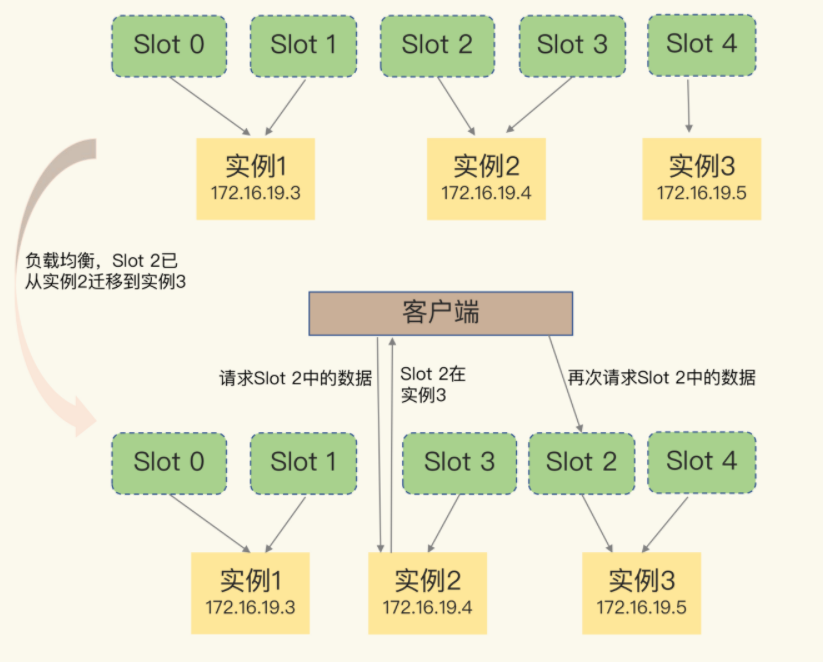

# 基础

## 基本架构

Redis 经常被用于缓存、秒杀、分布式锁等场景。

Redis基本数据模型，K（键）,V（值）。key 是 String 类型，而 value 是基本数据类型。

Redis 能够在实际业务场景中得到广泛的应用，就是得益于支持多样化类型的 value。

PUT/GET/DELETE/SCAN 是一个键值数据库的基本操作集合。

键值对保存在内存还是外存？看需要场景。作为缓存，能够接收数据丢失，则用内存；不能接受数据丢失，性能要求不要，用外存。

一个键值数据库包括了访问框架、索引模块、操作模块和存储模块四部分。


> 采用什么访问模式？

访问模式通常有两种：

* 一种是通过函数库调用的方式供外部应用使用，比如，上图中的 libsimplekv.so，就是以动态链接库的形式链接到我们自己的程序中，提供键值存储功能；

* 另一种是通过网络框架以 Socket 通信的形式对外提供键值对操作，这种形式可以提供广泛的键值存储服务。在上图中，我们可以看到，网络框架中包括 Socket Server 和协议解析。

实际的键值数据库也基本采用上述两种方式，例如，RocksDB 以动态链接库的形式使用，而 Memcached 和 **Redis 则是通过网络框架访问**。后面我还会给你介绍 Redis 现有的客户端和通信协议。

通过网络框架提供键值存储服务，一方面扩大了键值数据库的受用面，但另一方面，也给键值数据库的性能、运行模型提供了不同的设计选择，带来了一些潜在的问题。

> 如何定位键值对的位置？

这依赖于键值数据库的索引模块。**索引的作用是让键值数据库根据 key 找到相应 value 的存储位置，进而执行操作。**

索引的类型有很多，常见的有哈希表、B+ 树、字典树等。不同的索引结构在性能、空间消耗、并发控制等方面具有不同的特征。如果你看过其他键值数据库，就会发现，不同键值数据库采用的索引并不相同，例如，Memcached 和 **Redis 采用哈希表作为 key-value 索引**，而 RocksDB 则采用跳表作为内存中 key-value 的索引。

```markdown
# Redis 采用哈希表作为 key-value 索引的原因
- 内存键值数据库（例如 Redis）采用哈希表作为索引，很大一部分原因在于，其键值数据基本都是保存在内存中的，而内存的高性能随机访问特性可以很好地与哈希表 O(1) 的操作复杂度相匹配。
```

> 不同操作的具体逻辑是怎样的？

对于 GET/SCAN 操作而言，此时根据 value 的存储位置返回 value 值即可；

对于 PUT 一个新的键值对数据而言，需要为该键值对分配内存空间；

对于 DELETE 操作，需要删除键值对，并释放相应的内存空间，这个过程由分配器完成。

> 如何实现重启后快速提供服务？

分配器是键值数据库中的一个关键因素。对于以内存存储为主的 Redis 而言，这点尤为重要。Redis 的内存分配器提供了多种选择，分配效率也不一样。

Redis 为持久化提供了诸多的执行机制和优化改进

### 总结


* Redis 主要通过网络框架进行访问，而不再是动态库了，这也使得 Redis 可以作为一个基础性的网络服务进行访问，扩大了 Redis 的应用范围。
* Redis 数据模型中的 value 类型很丰富，因此也带来了更多的操作接口，例如面向列表的 LPUSH/LPOP，面向集合的 SADD/SREM 等。
* Redis 的持久化模块能支持两种方式：日志（AOF）和快照（RDB），这两种持久化方式具有不同的优劣势，影响到 Redis 的访问性能和可靠性。
* Redis 支持高可靠集群和高可扩展集群，因此，Redis 中包含了相应的集群功能支撑模块。

## 数据结构

为啥 Redis 能有这么突出的表现呢？一方面，这是因为它是**内存数据库**，所有操作都在内存上完成，内存的访问速度本身就很快。另一方面，这要归功于它的数据结构。这是因为，键值对是按一定的数据结构来组织的，操作键值对最终就是对数据结构进行增删改查操作，所以**高效的数据结构是 Redis 快速处理数据的基础**。

数据类型：String（字符串）、List（列表）、Hash（哈希）、Set（集合）和 Sorted Set（有序集合）

底层数据结构：一共有 6 种，分别是简单动态字符串、双向链表、压缩列表、哈希表、跳表和整数数组。


String 类型的底层实现只有一种数据结构，也就是简单动态字符串。而 List、Hash、Set 和 Sorted Set 这四种数据类型，都有两种底层实现结构。通常情况下，我们会把这四种类型称为集合类型，它们的特点是一个键对应了一个集合的数据。

### 键值对结构哈希表

Redis 使用了一个哈希表来保存所有键值对。

一个哈希表，其实就是一个数组，数组的每个元素称为一个哈希桶。一个哈希表是由多个哈希桶组成的，每个哈希桶中保存了键值对数据。

哈希桶中的元素保存的并不是值本身，而是指向具体值的指针。这也就是说，不管值是 String，还是集合类型，哈希桶中的元素都是指向它们的指针。


因为这个哈希表保存了所有的键值对，所以，我也把它称为**全局哈希表**。哈希表的最大好处很明显，就是让我们可以用 O(1) 的时间复杂度来快速查找到键值对——我们只需要计算键的哈希值，就可以知道它所对应的哈希桶位置，然后就可以访问相应的 entry 元素。

**哈希表的冲突问题和 rehash 可能带来的操作阻塞。**

### 哈希冲突和rehash

当你往哈希表中写入更多数据时，哈希冲突是不可避免的问题。这里的哈希冲突，也就是指，两个 key 的哈希值和哈希桶计算对应关系时，正好落在了同一个哈希桶中。

哈希桶的个数通常要少于 key 的数量，这也就是说，难免会有一些 key 的哈希值对应到了同一个哈希桶中。

Redis 解决哈希冲突的方式，就是**链式哈希**。链式哈希也很容易理解，就是指同一个哈希桶中的多个元素用一个链表来保存，它们之间依次用指针连接。


当哈希链过长时，Redis 性能就会降低，所以，Redis 会对哈希表做 **rehash 操作**。rehash 也就是增加现有的哈希桶数量，让逐渐增多的 entry 元素能在更多的桶之间分散保存，减少单个桶中的元素数量，从而减少单个桶中的冲突。

> 这里和java中hashMap非常类似，都存在hash冲突，只不过redis为了提高性能，会将所有数据重hash一遍，hashMap 为了提高效率会将链表转换成红黑树。

```markdown
# rehash 操作
- 为了使 rehash 操作更高效，Redis 默认使用了两个全局哈希表：哈希表 1 和哈希表 2。一开始，当你刚插入数据时，默认使用哈希表 1，此时的哈希表 2 并没有被分配空间。随着数据逐步增多，Redis 开始执行 rehash，这个过程分为三步：
- 1.给哈希表 2 分配更大的空间，例如是当前哈希表 1 大小的两倍；
- 2.把哈希表 1 中的数据重新映射并拷贝到哈希表 2 中；
- 3.释放哈希表 1 的空间。
- 到此，我们就可以从哈希表 1 切换到哈希表 2，用增大的哈希表 2 保存更多数据，而原来的哈希表 1 留作下一次 rehash 扩容备用。
- 这个过程看似简单，但是第二步涉及大量的数据拷贝，如果一次性把哈希表 1 中的数据都迁移完，会造成 Redis 线程阻塞，无法服务其他请求。此时，Redis 就无法快速访问数据了。为了避免这个问题，Redis 采用了渐进式 rehash。
# 渐进式 rehash
- 简单来说就是在第二步拷贝数据时，Redis 仍然正常处理客户端请求，每处理一个请求时，从哈希表 1 中的第一个索引位置开始，顺带着将这个索引位置上的所有 entries 拷贝到哈希表 2 中；等处理下一个请求时，再顺带拷贝哈希表 1 中的下一个索引位置的 entries。
- 这样就巧妙地把一次性大量拷贝的开销，分摊到了多次处理请求的过程中，避免了耗时操作，保证了数据的快速访问
```

找到哈希桶是所有redis操作的第一步，第二步是找到具体的值，string类型比较容易找，**集合类型还要进一步去查找**，复杂度也会增加

### 集合数据操作效率

集合的操作效率和哪些因素相关呢？

首先，与集合的底层数据结构有关。例如，使用哈希表实现的集合，要比使用链表实现的集合访问效率更高。其次，操作效率和这些操作本身的执行特点有关，比如读写一个元素的操作要比读写所有元素的效率高。

#### 底层数据结构

集合类型的底层数据结构主要有 5 种：整数数组、双向链表、哈希表、压缩列表和跳表。

**压缩列表**

压缩列表实际上类似于一个数组，数组中的每一个元素都对应保存一个数据。和数组不同的是，压缩列表在表头有三个字段 zlbytes、zltail 和 zllen，分别表示列表长度、列表尾的偏移量和列表中的 entry 个数；压缩列表在表尾还有一个 zlend，表示列表结束。


在压缩列表中，如果我们要查找定位第一个元素和最后一个元素，可以通过表头三个字段的长度直接定位，复杂度是 O(1)。而查找其他元素时，就没有这么高效了，只能逐个查找，此时的复杂度就是 O(N) 了。

**跳表**

有序链表只能逐一查找元素，导致操作起来非常缓慢，于是就出现了跳表。具体来说，跳表在链表的基础上，增加了**多级索引**，通过索引位置的几个跳转，实现数据的快速定位，如下图所示：


当数据量很大时，跳表的查找复杂度就是 O(logN)。


#### 不同操作的复杂度

**第一，单元素操作，是指每一种集合类型对单个数据实现的增删改查操作**。例如，Hash 类型的 HGET、HSET 和 HDEL，Set 类型的 SADD、SREM、SRANDMEMBER 等。这些操作的复杂度由集合采用的数据结构决定，例如，HGET、HSET 和 HDEL 是对哈希表做操作，所以它们的复杂度都是 O(1)；Set 类型用哈希表作为底层数据结构时，它的 SADD、SREM、SRANDMEMBER 复杂度也是 O(1)。

**第二，范围操作，是指集合类型中的遍历操作，可以返回集合中的所有数据**，比如 Hash 类型的 HGETALL 和 Set 类型的 SMEMBERS，或者返回一个范围内的部分数据，比如 List 类型的 LRANGE 和 ZSet 类型的 ZRANGE。**这类操作的复杂度一般是 O(N)，比较耗时，我们应该尽量避免。**

> 不过，Redis 从 2.8 版本开始提供了 SCAN 系列操作（包括 HSCAN，SSCAN 和 ZSCAN），这类操作实现了渐进式遍历，每次只返回有限数量的数据。这样一来，相比于 HGETALL、SMEMBERS 这类操作来说，就避免了一次性返回所有元素而导致的 Redis 阻塞。

**第三，统计操作，是指集合类型对集合中所有元素个数的记录**，例如 LLEN 和 SCARD。**这类操作复杂度只有 O(1)**，这是因为当集合类型采用压缩列表、双向链表、整数数组这些数据结构时，**这些结构中专门记录了元素的个数统计**，因此可以高效地完成相关操作。

**第四，例外情况，是指某些数据结构的特殊记录**，例如压缩列表和双向链表都会记录表头和表尾的偏移量。这样一来，对于 List 类型的 LPOP、RPOP、LPUSH、RPUSH 这四个操作来说，它们是在列表的头尾增删元素，这就可以通过偏移量直接定位，所以它们的复杂度也只有 O(1)，可以实现快速操作。

## 高性能IO模型

**Redis 是单线程，主要是指 Redis 的网络 IO 和键值对读写是由一个线程来完成的，这也是 Redis 对外提供键值存储服务的主要流程**。但 Redis 的其他功能，比如持久化、异步删除、集群数据同步等，其实是由额外的线程执行的。

### 单线程优势

> 多线程的开销

我们刚开始增加线程数时，系统吞吐率会增加，但是，再进一步增加线程时，系统吞吐率就增长迟缓了，有时甚至还会出现下降的情况。

为什么会出现这种情况呢？一个关键的瓶颈在于，系统中通常会存在被多线程同时访问的共享资源，比如一个共享的数据结构。当有多个线程要修改这个共享资源时，为了保证共享资源的正确性，就需要有额外的机制进行保证，而这个额外的机制，就会带来额外的开销。**多线程编程模式面临的共享资源的并发访问控制问题。**

只是简单地采用一个粗粒度互斥锁，就会出现不理想的结果：即使增加了线程，大部分线程也在等待获取访问共享资源的互斥锁，并行变串行，系统吞吐率并没有随着线程的增加而增加。

而且，采用多线程开发一般会引入同步原语来保护共享资源的并发访问，这也会降低系统代码的易调试性和可维护性。为了避免这些问题，Redis 直接采用了单线程模式。

> 单线程 Redis 为什么那么快？

一方面，**Redis 的大部分操作在内存上完成**，再加上它采用了高效的数据结构，例如哈希表和跳表，这是它实现高性能的一个重要原因。另一方面，**就是 Redis 采用了多路复用机制**，使其在网络 IO 操作中能并发处理大量的客户端请求，实现高吞吐率。

### 基于多路复用的高性能 I/O 模型

Linux 中的 IO 多路复用机制是指一个线程处理多个 IO 流，就是我们经常听到的 **select/epoll 机制**。简单来说，在 Redis 只运行单线程的情况下，**该机制允许内核中，同时存在多个监听套接字和已连接套接字**。内核会一直监听这些套接字上的连接请求或数据请求。一旦有请求到达，就会交给 Redis 线程处理，这就实现了一个 Redis 线程处理多个 IO 流的效果。


```markdown
- 为了在请求到达时能通知到 Redis 线程，select/epoll 提供了基于事件的回调机制，即针对不同事件的发生，调用相应的处理函数。
- select/epoll 一旦监测到 FD 上有请求到达时，就会触发相应的事件。
- 这些事件会被放进一个事件队列，Redis 单线程对该事件队列不断进行处理。这样一来，Redis 无需一直轮询是否有请求实际发生，这就可以避免造成 CPU 资源浪费。同时，Redis 在对事件队列中的事件进行处理时，会调用相应的处理函数，这就实现了基于事件的回调。因为 Redis 一直在对事件队列进行处理，所以能及时响应客户端请求，提升 Redis 的响应性能。
```

## AOF日志

Redis 的持久化主要有两大机制，即 AOF（Append Only File）日志和 RDB 快照。

### 实现 AOF

说到日志，我们比较熟悉的是数据库的**写前日志（Write Ahead Log, WAL）**，也就是说，在实际写数据前，先把修改的数据记到日志文件中，以便故障时进行恢复。不过，**AOF 日志正好相反，它是写后日志**，“写后”的意思是 Redis 是先执行命令，把数据写入内存，然后才记录日志，如下图所示：


传统数据库的日志，例如 redo log（重做日志），记录的是修改后的数据，而 AOF 里记录的是 Redis 收到的每一条命令，这些命令是以文本形式保存的。


> 我们以 Redis 收到“set testkey testvalue”命令后记录的日志为例，看看 AOF 日志的内容。其中，“*3”表示当前命令有三个部分，每部分都是由“$+数字”开头，后面紧跟着具体的命令、键或值。这里，“数字”表示这部分中的命令、键或值一共有多少字节。例如，“$3 set”表示这部分有 3 个字节，也就是“set”命令。

```markdown
# 为什么要后写日志
- 为了避免额外的检查开销，Redis 在向 AOF 里面记录日志的时候，并不会先去对这些命令进行语法检查。所以，如果先记日志再执行命令的话，日志中就有可能记录了错误的命令，Redis 在使用日志恢复数据时，就可能会出错。
- 而写后日志这种方式，就是先让系统执行命令，只有命令能执行成功，才会被记录到日志中，否则，系统就会直接向客户端报错。所以，Redis 使用写后日志这一方式的一大好处是，可以避免出现记录错误命令的情况。
- AOF 还有一个好处：它是在命令执行后才记录日志，所以不会阻塞当前的写操作。
# AOF 潜在风险
- 1.首先，如果刚执行完一个命令，还没有来得及记日志就宕机了，那么这个命令和相应的数据就有丢失的风险。
- 2.其次，AOF 虽然避免了对当前命令的阻塞，但可能会给下一个操作带来阻塞风险。这是因为，AOF 日志也是在主线程中执行的，如果在把日志文件写入磁盘时，磁盘写压力大，就会导致写盘很慢，进而导致后续的操作也无法执行了。
```

### 写回策略

对于 AOF 潜在风险这个问题，AOF 机制给我们提供了三个选择，也就是 AOF 配置项 appendfsync 的三个可选值。

```markdown
# 三种写回磁盘的策略
- 1.Always，同步写回：每个写命令执行完，立马同步地将日志写回磁盘；
- 2.Everysec，每秒写回：每个写命令执行完，只是先把日志写到 AOF 文件的内存缓冲区，每隔一秒把缓冲区中的内容写入磁盘；
- 3.No，操作系统控制的写回：每个写命令执行完，只是先把日志写到 AOF 文件的内存缓冲区，由操作系统决定何时将缓冲区内容写回磁盘。
# 这三种写回策略都无法做到两全其美
- 1.“同步写回”可以做到基本不丢数据，但是它在每一个写命令后都有一个慢速的落盘操作，不可避免地会影响主线程性能；
- 2.“每秒写回”采用一秒写回一次的频率，避免了“同步写回”的性能开销，虽然减少了对系统性能的影响，但是如果发生宕机，上一秒内未落盘的命令操作仍然会丢失。所以，这只能算是，在避免影响主线程性能和避免数据丢失两者间取了个折中。
- 3.虽然“操作系统控制的写回”在写完缓冲区后，就可以继续执行后续的命令，但是落盘的时机已经不在 Redis 手中了，只要 AOF 记录没有写回磁盘，一旦宕机对应的数据就丢失了.
```


```markdown
# AOF 文件过大带来的性能问题
- 一是，文件系统本身对文件大小有限制，无法保存过大的文件
- 二是，如果文件太大，之后再往里面追加命令记录的话，效率也会变低
- 三是，如果发生宕机，AOF 中记录的命令要一个个被重新执行，用于故障恢复，如果日志文件太大，整个恢复过程就会非常缓慢，这就会影响到 Redis 的正常使用
```

### 重写机制

AOF 重写机制就是在重写时，Redis 根据数据库的现状创建一个新的 AOF 文件，也就是说，读取数据库中的所有键值对，然后对每一个键值对用一条命令记录它的写入。比如说，当读取了键值对“testkey”: “testvalue”之后，重写机制会记录 set testkey testvalue 这条命令。这样，当需要恢复时，可以重新执行该命令，实现“testkey”: “testvalue”的写入。

为什么重写机制可以把日志文件变小呢? 实际上，**重写机制具有“多变一”功能**。所谓的“多变一”，也就是说，旧日志文件中的多条命令，在重写后的新日志中变成了一条命令。

在重写的时候，是根据这个键值对当前的最新状态，为它生成对应的写入命令。


```markdown
# AOF 重写会阻塞吗?
- 和 AOF 日志由主线程写回不同，重写过程是由后台子进程 bgrewriteaof 来完成的，这也是为了避免阻塞主线程，导致数据库性能下降。
# 重写的过程总结为“一个拷贝，两处日志”
## 一个拷贝
- “一个拷贝”就是指，每次执行重写时，主线程 fork 出后台的 bgrewriteaof 子进程。此时，fork 会把主线程的内存拷贝一份给 bgrewriteaof 子进程，这里面就包含了数据库的最新数据。然后，bgrewriteaof 子进程就可以在不影响主线程的情况下，逐一把拷贝的数据写成操作，记入重写日志。
## 两处日志
- 因为主线程未阻塞，仍然可以处理新来的操作。此时，如果有写操作，第一处日志就是指正在使用的 AOF 日志，Redis 会把这个操作写到它的缓冲区。这样一来，即使宕机了，这个 AOF 日志的操作仍然是齐全的，可以用于恢复。
- 而第二处日志，就是指新的 AOF 重写日志。这个操作也会被写到重写日志的缓冲区。这样，重写日志也不会丢失最新的操作。等到拷贝数据的所有操作记录重写完成后，重写日志记录的这些最新操作也会写入新的 AOF 文件，以保证数据库最新状态的记录。此时，我们就可以用新的 AOF 文件替代旧文件了。
```


> 每次 AOF 重写时，Redis 会先执行一个内存拷贝，用于重写；然后，使用两个日志保证在重写过程中，新写入的数据不会丢失。而且，因为 Redis 采用额外的线程进行数据重写，所以，这个过程并不会阻塞主线程。

## 内存快照

日志里记录的是操作命令，而不是实际数据，所以，用 AOF 方法进行故障恢复的时候，需要逐一把操作日志都执行一遍。如果操作日志非常多，Redis 就会恢复得很缓慢，影响到正常使用。

另一种持久化方法：内存快照。所谓内存快照，就是指内存中的数据在某一个时刻的状态记录。

和 AOF 相比，RDB( Redis DataBase ) 记录的是某一时刻的数据，并不是操作，所以，在做数据恢复时，我们可以直接把 RDB 文件读入内存，很快地完成恢复。听起来好像很不错，但内存快照也并不是最优选项。

```markdown
# 两个问题
- 对哪些数据做快照？这关系到快照的执行效率问题；
- 做快照时，数据还能被增删改吗？这关系到 Redis 是否被阻塞，能否同时正常处理请求。
```

### 执行效率问题

Redis 的数据都在内存中，为了提供所有数据的可靠性保证，它执行的是**全量快照**，也就是说，把内存中的所有数据都记录到磁盘。把它们全部写入磁盘也会花费很多时间。而且，全量数据越多，RDB 文件就越大，往磁盘上写数据的时间开销就越大。

```markdown
# Redis 提供了两个命令来生成 RDB 文件，分别是 save 和 bgsave。
- save：在主线程中执行，会导致阻塞；
- bgsave：创建一个子进程，专门用于写入 RDB 文件，避免了主线程的阻塞，这也是 Redis RDB 文件生成的默认配置。
```

### 数据修改问题

为了快照而暂停写操作，肯定是不能接受的。所以这个时候，Redis 就会借助操作系统提供的**写时复制技术（Copy-On-Write, COW）**，在执行快照的同时，正常处理写操作。

简单来说，bgsave 子进程是由主线程 fork 生成的，可以共享主线程的所有内存数据。bgsave 子进程运行后，开始读取主线程的内存数据，并把它们写入 RDB 文件。


> 此时，如果主线程对这些数据也都是读操作（例如图中的键值对 A），那么，主线程和 bgsave 子进程相互不影响。但是，如果主线程要修改一块数据（例如图中的键值对 C），那么，这块数据就会被复制一份，生成该数据的副本。然后，bgsave 子进程会把这个副本数据写入 RDB 文件，而在这个过程中，主线程仍然可以直接修改原来的数据。

### 频繁快照问题

虽然 bgsave 执行时不阻塞主线程，但是，如果频繁地执行全量快照，也会带来两方面的开销。

一方面，频繁将全量数据写入磁盘，会给磁盘带来很大压力，多个快照竞争有限的磁盘带宽，前一个快照还没有做完，后一个又开始做了，容易造成恶性循环。

此时，我们可以做**增量快照**，所谓增量快照，就是指，做了一次全量快照后，后续的快照只对修改的数据进行快照记录，这样可以避免每次全量快照的开销。但是，这么做的前提是，我们需要记住哪些数据被修改了。你可不要小瞧这个“记住”功能，它需要我们使用额外的元数据信息去记录哪些数据被修改了，这会带来额外的空间开销问题。

虽然跟 AOF 相比，快照的恢复速度快，但是，快照的频率不好把握，如果频率太低，两次快照间一旦宕机，就可能有比较多的数据丢失。如果频率太高，又会产生额外开销，

Redis 4.0 中提出了一个**混合使用 AOF 日志和内存快照的方法**。简单来说，内存快照以一定的频率执行，**在两次快照之间，使用 AOF 日志记录这期间的所有命令操作。**

这样一来，快照不用很频繁地执行，这就避免了频繁 fork 对主线程的影响。而且，AOF 日志也只用记录两次快照间的操作，也就是说，不需要记录所有操作了，因此，就不会出现文件过大的情况了，也可以避免重写开销。


> T1 和 T2 时刻的修改，用 AOF 日志记录，等到第二次做全量快照时，就可以清空 AOF 日志，因为此时的修改都已经记录到快照中了，恢复时就不再用日志了。

```markdown
# AOF 和 RDB 的选择问题
- 数据不能丢失时，内存快照和 AOF 的混合使用是一个很好的选择；
- 如果允许分钟级别的数据丢失，可以只使用 RDB；
- 如果只用 AOF，优先使用 everysec 的配置选项，因为它在可靠性和性能之间取了一个平衡。
```

## 数据同步

我们学习了 AOF 和 RDB，如果 Redis 发生了宕机，它们可以分别通过回放日志和重新读入 RDB 文件的方式恢复数据，从而保证尽量少丢失数据，提升可靠性。

Redis 具有高可靠性：**一是数据尽量少丢失，二是服务尽量少中断**。AOF 和 RDB 保证了前者，而对于后者，Redis 的做法就是**增加副本冗余量**，将一份数据同时保存在多个实例上。即使有一个实例出现了故障，需要过一段时间才能恢复，其他实例也可以对外提供服务，不会影响业务使用。

**Redis 提供了主从库模式，以保证数据副本的一致，主从库之间采用的是读写分离的方式。**

* 读操作：主库、从库都可以接收；
* 写操作：首先到主库执行，然后，主库将写操作同步给从库。


> 如果我们非要保持这个数据在三个实例上一致，就要涉及到加锁、实例间协商是否完成修改等一系列操作，但这会带来巨额的开销，当然是不太能接受的。
>
> 而主从库模式一旦采用了读写分离，所有数据的修改只会在主库上进行，不用协调三个实例。主库有了最新的数据后，会同步给从库，这样，主从库的数据就是一致的。

### 主从库同步

当我们启动多个 Redis 实例的时候，它们相互之间就可以通过 replicaof（Redis 5.0 之前使用 slaveof）命令形成主库和从库的关系，之后会按照三个阶段完成数据的第一次同步。

```bash
# 例如，现在有实例 1（ip：172.16.19.3）和实例 2（ip：172.16.19.5），我们在实例 2 上执行以下这个命令后，实例 2 就变成了实例 1 的从库，并从实例 1 上复制数据：
replicaof  172.16.19.3  6379
```


```markdown
# 第一阶段
- 第一阶段是主从库间建立连接、协商同步的过程，主要是为全量复制做准备。在这一步，从库和主库建立起连接，并告诉主库即将进行同步，主库确认回复后，主从库间就可以开始同步了。
- 具体来说，从库给主库发送 psync 命令，表示要进行数据同步，主库根据这个命令的参数来启动复制。psync 命令包含了主库的 runID 和复制进度 offset 两个参数。
- -		runID，是每个 Redis 实例启动时都会自动生成的一个随机 ID，用来唯一标记这个实例。当从库和主库第一次复制时，因为不知道主库的 runID，所以将 runID 设为“？”。
- -		offset，此时设为 -1，表示第一次复制。
- 主库收到 psync 命令后，会用 FULLRESYNC 响应命令带上两个参数：主库 runID 和主库目前的复制进度 offset，返回给从库。从库收到响应后，会记录下这两个参数。
- - 	这里有个地方需要注意，FULLRESYNC 响应表示第一次复制采用的全量复制，也就是说，主库会把当前所有的数据都复制给从库。
# 第二阶段
- 在第二阶段，主库将所有数据同步给从库。从库收到数据后，在本地完成数据加载。这个过程依赖于内存快照生成的 RDB 文件。
- 具体来说，主库执行 bgsave 命令，生成 RDB 文件，接着将文件发给从库。从库接收到 RDB 文件后，会先清空当前数据库，然后加载 RDB 文件。这是因为从库在通过 replicaof 命令开始和主库同步前，可能保存了其他数据。为了避免之前数据的影响，从库需要先把当前数据库清空。
- 为了保证主从库的数据一致性，主库会在内存中用专门的 replication buffer，记录 RDB 文件生成后收到的所有写操作。
# 第三阶段
- 最后，也就是第三个阶段，主库会把第二阶段执行过程中新收到的写命令，再发送给从库。具体的操作是，当主库完成 RDB 文件发送后，就会把此时 replication buffer 中的修改操作发给从库，从库再重新执行这些操作。这样一来，主从库就实现同步了。
```

### 主从级联

通过“主 - 从 - 从”模式将主库生成 RDB 和传输 RDB 的压力，以级联的方式分散到从库上。

```bash
# 简单来说，我们在部署主从集群的时候，可以手动选择一个从库（比如选择内存资源配置较高的从库），用于级联其他的从库。然后，我们可以再选择一些从库（例如三分之一的从库），在这些从库上执行如下命令，让它们和刚才所选的从库，建立起主从关系。
replicaof  所选从库的IP 6379
# 这样一来，这些从库就会知道，在进行同步时，不用再和主库进行交互了，只要和级联的从库进行写操作同步就行了，这就可以减轻主库上的压力
```


一旦主从库完成了全量复制，它们之间就会一直维护一个网络连接，主库会通过这个连接将后续陆续收到的命令操作再同步给从库，这个过程也称为**基于长连接的命令传播**，可以避免频繁建立连接的开销。

### 主从库间网络断了怎么办？

Redis 2.8 以前，主从库在命令传播时出现网络闪断，从库就会和主库重新进行一次**全量复制**，开销非常大。从 Redis 2.8 开始，网络断了之后，主从库会采用**增量复制**的方式继续同步。全量复制是同步所有数据，而增量复制只会把主从库网络断连期间主库收到的命令，同步给从库。

那么，增量复制时，主从库之间具体是怎么保持同步的呢？这里的奥妙就在于 **repl_backlog_buffer** 这个缓冲区。

```markdown
# repl_backlog_buffer 是一个环形缓冲区，主库会记录自己写到的位置，从库则会记录自己已经读到的位置。
- 刚开始的时候，主库和从库的写读位置在一起，这算是它们的起始位置。随着主库不断接收新的写操作，它在缓冲区中的写位置会逐步偏离起始位置，我们通常用偏移量来衡量这个偏移距离的大小，对主库来说，对应的偏移量就是 master_repl_offset。主库接收的新写操作越多，这个值就会越大。
- 同样，从库在复制完写操作命令后，它在缓冲区中的读位置也开始逐步偏移刚才的起始位置，此时，从库已复制的偏移量 slave_repl_offset 也在不断增加。正常情况下，这两个偏移量基本相等。
```


```markdown
- 主从库的连接恢复之后，从库首先会给主库发送 psync 命令，并把自己当前的 slave_repl_offset 发给主库，主库会判断自己的 master_repl_offset 和 slave_repl_offset 之间的差距。
- 在网络断连阶段，主库可能会收到新的写操作命令，所以，一般来说，master_repl_offset 会大于 slave_repl_offset。此时，主库只用把 master_repl_offset 和 slave_repl_offset 之间的命令操作同步给从库就行。
- 同步的方式就是通过主库与每个从库建立连接之后的这个所谓的 replication buffer

- repl_backlog_buffer 是一个环形缓冲区，所以在缓冲区写满后，主库会继续写入，此时，就会覆盖掉之前写入的操作。如果从库的读取速度比较慢，就有可能导致从库还未读取的操作被主库新写的操作覆盖了，这会导致主从库间的数据不一致。
- 一般而言，我们可以调整 repl_backlog_size 这个参数。这个参数和所需的缓冲空间大小有关。缓冲空间的计算公式是：`缓冲空间大小 = 主库写入命令速度 * 操作大小 - 主从库间网络传输命令速度 * 操作大小`。在实际应用中，考虑到可能存在一些突发的请求压力，我们通常需要把这个缓冲空间扩大一倍，即 `repl_backlog_size = 缓冲空间大小 * 2`，这也就是 repl_backlog_size 的最终值。
```

## 哨兵机制

在 Redis 主从集群中，**哨兵机制是实现主从库自动切换的关键机制**，它有效地解决了主从复制模式下故障转移的问题。

### 哨兵机制的基本流程

哨兵其实就是一个运行在特殊模式下的 Redis 进程，主从库实例运行的同时，它也在运行。**哨兵主要负责的就是三个任务：监控、选主（选择主库）和通知。**

```markdown
# 监控
- 监控是指哨兵进程在运行时，周期性地给所有的主从库发送 PING 命令，检测它们是否仍然在线运行。如果从库没有在规定时间内响应哨兵的 PING 命令，哨兵就会把它标记为“下线状态”；同样，如果主库也没有在规定时间内响应哨兵的 PING 命令，哨兵就会判定主库下线，然后开始自动切换主库的流程。
# 选主
- 主库挂了以后，哨兵就需要从很多个从库里，按照一定的规则选择一个从库实例，把它作为新的主库。这一步完成后，现在的集群里就有了新主库。
# 通知
- 在执行通知任务时，哨兵会把新主库的连接信息发给其他从库，让它们执行 replicaof 命令，和新主库建立连接，并进行数据复制。同时，哨兵会把新主库的连接信息通知给客户端，让它们把请求操作发到新主库上。
```


### 主观下线和客观下线

**哨兵进程会使用 PING 命令检测它自己和主、从库的网络连接情况，用来判断实例的状态。**如果哨兵发现主库或从库对 PING 命令的响应超时了，那么，哨兵就会先把它标记为“主观下线”。

```markdown
- 如果检测的是从库，那么，哨兵简单地把它标记为“主观下线”就行了，因为从库的下线影响一般不太大，集群的对外服务不会间断。
- 如果检测的是主库，那么，哨兵还不能简单地把它标记为“主观下线”，开启主从切换。因为很有可能存在这么一个情况：那就是哨兵误判了，其实主库并没有故障。可是，一旦启动了主从切换，后续的选主和通知操作都会带来额外的计算和通信开销。(误判一般会发生在集群网络压力较大、网络拥塞，或者是主库本身压力较大的情况下。)
# 通过哨兵集群来减少误判
- 通常会采用多实例组成的集群模式进行部署，这也被称为哨兵集群。引入多个哨兵实例一起来判断，就可以避免单个哨兵因为自身网络状况不好，而误判主库下线的情况。同时，多个哨兵的网络同时不稳定的概率较小，由它们一起做决策，误判率也能降低。
```


> 简单来说，“客观下线”的标准就是，当有 N 个哨兵实例时，最好要有 N/2 + 1 个实例判断主库为“主观下线”，才能最终判定主库为“客观下线”。

### 如何选定新主库？

哨兵选择新从库的过程：筛选+打分


```markdown
# 筛选
- 除了要检查从库的当前在线状态，还要判断它之前的网络连接状态。
- 使用配置项 down-after-milliseconds * 10。其中，down-after-milliseconds 是我们认定主从库断连的最大连接超时时间。如果在 down-after-milliseconds 毫秒内，主从节点都没有通过网络联系上，我们就可以认为主从节点断连了。如果发生断连的次数超过了 10 次，就说明这个从库的网络状况不好，不适合作为新主库。
# 打分
- 按照三个规则依次进行三轮打分，这三个规则分别是从库优先级、从库复制进度以及从库 ID 号。只要在某一轮中，有从库得分最高，那么它就是主库了，选主过程到此结束。如果没有出现得分最高的从库，那么就继续进行下一轮。
## 第一轮：优先级最高的从库得分高。
- 用户可以通过 slave-priority 配置项，给不同的从库设置不同优先级。
## 第二轮：和旧主库同步程度最接近的从库得分高。
- 我们想要找的从库，它的 slave_repl_offset 需要最接近 master_repl_offset。如果在所有从库中，有从库的 slave_repl_offset 最接近 master_repl_offset，那么它的得分就最高，可以作为新主库。
## ID 号小的从库得分高。
- 在优先级和复制进度都相同的情况下，ID 号最小的从库得分最高，会被选为新主库。
```

## 哨兵集群

哨兵集群中的多个实例共同判断，可以降低对主库下线的误判率。即使有哨兵实例出现故障挂掉了，其他哨兵还能继续协作完成主从库切换的工作。

```bash
# 在配置哨兵的信息时，我们只需要用到下面的这个配置项，设置主库的 IP 和端口，并没有配置其他哨兵的连接信息。
sentinel monitor <master-name> <ip> <redis-port> <quorum> 
```

### 基于 pub/sub 机制的哨兵集群组成

哨兵实例之间可以相互发现，要归功于 Redis 提供的 pub/sub 机制，也就是**发布 / 订阅机制**。

哨兵只要和主库建立起了连接，就可以在主库上发布消息了，比如说发布它自己的连接信息（IP 和端口）。同时，它也可以从主库上订阅消息，获得其他哨兵发布的连接信息。当多个哨兵实例都在主库上做了发布和订阅操作后，它们之间就能知道彼此的 IP 地址和端口。

**只有订阅了同一个频道的应用，才能通过发布的消息进行信息交换。**

在主从集群中，主库上有一个名为`“__sentinel__:hello”`的频道，不同哨兵就是通过它来相互发现，实现互相通信的。


```markdown
# 哨兵是如何知道从库的 IP 地址和端口的呢？
- 这是由哨兵向主库发送 INFO 命令来完成的。就像下图所示，哨兵 2 给主库发送 INFO 命令，主库接受到这个命令后，就会把从库列表返回给哨兵。接着，哨兵就可以根据从库列表中的连接信息，和每个从库建立连接，并在这个连接上持续地对从库进行监控。哨兵 1 和 3 可以通过相同的方法和从库建立连接。
```


### 基于 pub/sub 机制的客户端事件通知

哨兵就是一个运行在特定模式下的 Redis 实例，只不过它并不服务请求操作，只是完成监控、选主和通知的任务。所以，每个哨兵实例也提供 pub/sub 机制，**客户端可以从哨兵订阅消息**。哨兵提供的消息订阅频道有很多，不同频道包含了主从库切换过程中的不同关键事件。


客户端读取哨兵的配置文件后，可以获得哨兵的地址和端口，和哨兵建立网络连接。

```bash
# 订阅“所有实例进入客观下线状态的事件”：
SUBSCRIBE +odown
# 订阅所有的事件：
PSUBSCRIBE  *
```

### 由哪个哨兵执行主从切换？

任何一个实例只要自身判断主库“主观下线”后，就会给其他实例发送 is-master-down-by-addr 命令。接着，其他实例会根据自己和主库的连接情况，做出 Y 或 N 的响应，Y 相当于赞成票，N 相当于反对票。


> 一个哨兵获得了仲裁所需的赞成票数后，就可以标记主库为“客观下线”。这个所需的赞成票数是通过哨兵配置文件中的 quorum 配置项设定的。

```markdown
# Leader 选举
- 一个哨兵获得了仲裁所需的赞成票数后，就可以标记主库为“客观下线”。这个哨兵就可以再给其他哨兵发送命令，表明希望由自己来执行主从切换，并让所有其他哨兵进行投票。这个投票过程称为“Leader 选举”。因为最终执行主从切换的哨兵称为 Leader，投票过程就是确定 Leader。
- 在投票过程中，任何一个想成为 Leader 的哨兵，要满足两个条件：第一，拿到半数以上的赞成票；第二，拿到的票数同时还需要大于等于哨兵配置文件中的 quorum 值。
- 若选举失败，哨兵集群会等待一段时间（也就是哨兵故障转移超时时间的 2 倍），再重新选举。这是因为，哨兵集群能够进行成功投票，很大程度上依赖于选举命令的正常网络传播。
```

**要保证所有哨兵实例的配置是一致的，尤其是主观下线的判断值 down-after-milliseconds。**

## 切片集群

切片集群，也叫分片集群，就是指启动多个 Redis 实例组成一个集群，然后按照一定的规则，把收到的数据划分成多份，每一份用一个实例来保存。


在实际应用 Redis 时，随着用户或业务规模的扩展，保存大量数据的情况通常是无法避免的。而切片集群，就是一个非常好的解决方案。

### 如何保存更多数据？

Redis 应对数据量增多的两种方案：纵向扩展（scale up）和横向扩展（scale out）。

纵向扩展：扩展硬件配置的深度，能容纳更多数据 

横向扩展：扩展redis的广度，能分摊更多数据

```markdown
# 纵向扩展：升级单个 Redis 实例的资源配置，包括增加内存容量、增加磁盘容量、使用更高配置的 CPU。
- 实施起来简单、直接
- 纵向扩展会受到硬件和成本的限制
# 横向扩展：横向增加当前 Redis 实例的个数。
- 不用担心单个实例的硬件和成本限制。在面向百万、千万级别的用户规模时，横向扩展的 Redis 切片集群会是一个非常好的选择。
```

### 数据切片和实例的对应分布关系

```markdown
# 切片集群和 Redis Cluster 的联系与区别。
- 切片集群是一种保存大量数据的通用机制，这个机制可以有不同的实现方案。在 Redis 3.0 之前，官方并没有针对切片集群提供具体的方案。从 3.0 开始，官方提供了一个名为 Redis Cluster 的方案，用于实现切片集群。Redis Cluster 方案中就规定了数据和实例的对应规则。
- 具体来说，Redis Cluster 方案采用哈希槽（Hash Slot），来处理数据和实例之间的映射关系。在 Redis Cluster 方案中，一个切片集群共有 16384 个哈希槽，这些哈希槽类似于数据分区，每个键值对都会根据它的 key，被映射到一个哈希槽中。
- 具体的映射过程分为两大步：首先根据键值对的 key，按照CRC16 算法计算一个 16 bit 的值；然后，再用这个 16bit 值对 16384 取模，得到 0~16383 范围内的模数，每个模数代表一个相应编号的哈希槽。
# 哈希槽又是如何被映射到具体的 Redis 实例上的呢？
- 我们在部署 Redis Cluster 方案时，可以使用 cluster create 命令创建集群，此时，Redis 会自动把这些槽平均分布在集群实例上。例如，如果集群中有 N 个实例，那么，每个实例上的槽个数为 16384/N 个。
- 当然， 我们也可以使用 cluster meet 命令手动建立实例间的连接，形成集群，再使用 cluster addslots 命令，指定每个实例上的哈希槽个数。
```


```bash
# 示意图中的切片集群一共有 3 个实例，同时假设有 5 个哈希槽，我们首先可以通过下面的命令手动分配哈希槽：实例 1 保存哈希槽 0 和 1，实例 2 保存哈希槽 2 和 3，实例 3 保存哈希槽 4。
redis-cli -h 172.16.19.3 –p 6379 cluster addslots 0,1
redis-cli -h 172.16.19.4 –p 6379 cluster addslots 2,3
redis-cli -h 172.16.19.5 –p 6379 cluster addslots 4
# 在手动分配哈希槽时，需要把 16384 个槽都分配完，否则 Redis 集群无法正常工作。
```

### 客户端如何定位数据？

在定位键值对数据时，它所处的哈希槽是可以通过计算得到的，这个计算可以在客户端发送请求时来执行。

一般来说，客户端和集群实例建立连接后，**实例就会把哈希槽的分配信息发给客户端。**

Redis 实例会把自己的哈希槽信息发给和它相连接的其它实例，来完成哈希槽分配信息的扩散。当实例之间相互连接后，每个实例就有所有哈希槽的映射关系了。

客户端收到哈希槽信息后，会把哈希槽信息缓存在本地。当客户端请求键值对时，会先计算键所对应的哈希槽，然后就可以给相应的实例发送请求了。

```markdown
# 在集群中，实例和哈希槽的对应关系并不是一成不变的，最常见的变化有两个：
- 在集群中，实例有新增或删除，Redis 需要重新分配哈希槽；
- 为了负载均衡，Redis 需要把哈希槽在所有实例上重新分布一遍。

- 此时，实例之间还可以通过相互传递消息，获得最新的哈希槽分配信息，但是，客户端是无法主动感知这些变化的。这就会导致，它缓存的分配信息和最新的分配信息就不一致了，那该怎么办呢？
```

Redis Cluster 方案提供了一种**重定向机制**，所谓的“重定向”，就是指，客户端给一个实例发送数据读写操作时，这个实例上并没有相应的数据，客户端要再给一个新实例发送操作命令。

```bash
# 当客户端把一个键值对的操作请求发给一个实例时，如果这个实例上并没有这个键值对映射的哈希槽，那么，这个实例就会给客户端返回下面的 MOVED 命令响应结果，这个结果中就包含了新实例的访问地址。
GET hello:key
(error) MOVED 13320 172.16.19.5:6379
# 其中，MOVED 命令表示，客户端请求的键值对所在的哈希槽 13320，实际是在 172.16.19.5 这个实例上。通过返回的 MOVED 命令，就相当于把哈希槽所在的新实例的信息告诉给客户端了。这样一来，客户端就可以直接和 172.16.19.5 连接，并发送操作请求了。
```



> 可以看到，由于负载均衡，Slot 2 中的数据已经从实例 2 迁移到了实例 3，但是，客户端缓存仍然记录着“Slot 2 在实例 2”的信息，所以会给实例 2 发送命令。实例 2 给客户端返回一条 MOVED 命令，把 Slot 2 的最新位置（也就是在实例 3 上），返回给客户端，客户端就会再次向实例 3 发送请求，同时还会更新本地缓存，把 Slot 2 与实例的对应关系更新过来。

```bash
# 当客户端给实例 2 发送命令时，Slot 2 中的数据已经全部迁移到了实例 3。在实际应用时，如果 Slot 2 中的数据比较多，就可能会出现一种情况：客户端向实例 2 发送请求，但此时，Slot 2 中的数据只有一部分迁移到了实例 3，还有部分数据没有迁移。在这种迁移部分完成的情况下，客户端就会收到一条 ASK 报错信息
GET hello:key
(error) ASK 13320 172.16.19.5:6379
# 这个结果中的 ASK 命令就表示，客户端请求的键值对所在的哈希槽 13320，在 172.16.19.5 这个实例上，但是这个哈希槽正在迁移。此时，客户端需要先给 172.16.19.5 这个实例发送一个 ASKING 命令。这个命令的意思是，让这个实例允许执行客户端接下来发送的命令。然后，客户端再向这个实例发送 GET 命令，以读取数据。
```

ASK 命令的作用只是让客户端能给新实例发送一次请求，而不像 MOVED 命令那样，会更改本地缓存，让后续所有命令都发往新实例。

## 思考题

**和跟 Redis 相比，SimpleKV 还缺少什么？**


**整数数组和压缩列表作为底层数据结构的优势是什么？**

```
	整数数组和压缩列表的设计，充分体现了 Redis“又快又省”特点中的“省”，也就是节省内存空间。整数数组和压缩列表都是在内存中分配一块地址连续的空间，然后把集合中的元素一个接一个地放在这块空间内，非常紧凑。因为元素是挨个连续放置的，我们不用再通过额外的指针把元素串接起来，这就避免了额外指针带来的空间开销。
	Redis 之所以采用不同的数据结构，其实是在性能和内存使用效率之间进行的平衡。
```


**Redis 基本 IO 模型中还有哪些潜在的性能瓶颈？**

```
	这个问题是希望你能进一步理解阻塞操作对 Redis 单线程性能的影响。在 Redis 基本 IO 模型中，主要是主线程在执行操作，任何耗时的操作，例如 bigkey、全量返回等操作，都是潜在的性能瓶颈。
```

**AOF 重写过程中有没有其他潜在的阻塞风险？**

```
	这里有两个风险。
	风险一：Redis 主线程 fork 创建 bgrewriteaof 子进程时，内核需要创建用于管理子进程的相关数据结构，这些数据结构在操作系统中通常叫作进程控制块（Process Control Block，简称为 PCB）。内核要把主线程的 PCB 内容拷贝给子进程。这个创建和拷贝过程由内核执行，是会阻塞主线程的。而且，在拷贝过程中，子进程要拷贝父进程的页表，这个过程的耗时和 Redis 实例的内存大小有关。如果 Redis 实例内存大，页表就会大，fork 执行时间就会长，这就会给主线程带来阻塞风险。
	风险二：bgrewriteaof 子进程会和主线程共享内存。当主线程收到新写或修改的操作时，主线程会申请新的内存空间，用来保存新写或修改的数据，如果操作的是 bigkey，也就是数据量大的集合类型数据，那么，主线程会因为申请大空间而面临阻塞风险。因为操作系统在分配内存空间时，有查找和锁的开销，这就会导致阻塞。
```

**AOF 重写为什么不共享使用 AOF 本身的日志？**

```
	如果都用 AOF 日志的话，主线程要写，bgrewriteaof 子进程也要写，这两者会竞争文件系统的锁，这就会对 Redis 主线程的性能造成影响。
```

**用 RDB 做持久化有什么风险吗？**

```
	问题：使用一个 2 核 CPU、4GB 内存、500GB 磁盘的云主机运行 Redis，Redis 数据库的数据量大小差不多是 2GB。当时 Redis 主要以修改操作为主，写读比例差不多在 8:2 左右，也就是说，如果有 100 个请求，80 个请求执行的是修改操作。在这个场景下，用 RDB 做持久化有什么风险吗？
	内存不足的风险：Redis fork 一个 bgsave 子进程进行 RDB 写入，如果主线程再接收到写操作，就会采用写时复制。写时复制需要给写操作的数据分配新的内存空间。本问题中写的比例为 80%，那么，在持久化过程中，为了保存 80% 写操作涉及的数据，写时复制机制会在实例内存中，为这些数据再分配新内存空间，分配的内存量相当于整个实例数据量的 80%，大约是 1.6GB，这样一来，整个系统内存的使用量就接近饱和了。此时，如果实例还有大量的新 key 写入或 key 修改，云主机内存很快就会被吃光。如果云主机开启了 Swap 机制，就会有一部分数据被换到磁盘上，当访问磁盘上的这部分数据时，性能会急剧下降。如果云主机没有开启 Swap，会直接触发 OOM，整个 Redis 实例会面临被系统 kill 掉的风险
	主线程和子进程竞争使用 CPU 的风险：生成 RDB 的子进程需要 CPU 核运行，主线程本身也需要 CPU 核运行，而且，如果 Redis 还启用了后台线程，此时，主线程、子进程和后台线程都会竞争 CPU 资源。由于云主机只有 2 核 CPU，这就会影响到主线程处理请求的速度。
```

**为什么主从库间的复制不使用 AOF？**

```
RDB 文件是二进制文件，无论是要把 RDB 写入磁盘，还是要通过网络传输 RDB，IO 效率都比记录和传输 AOF 的高。
在从库端进行恢复时，用 RDB 的恢复效率要高于用 AOF。
```

**在主从切换过程中，客户端能否正常地进行请求操作呢？**

```
	主从集群一般是采用读写分离模式，当主库故障后，客户端仍然可以把读请求发送给从库，让从库服务。但是，对于写请求操作，客户端就无法执行了。
```

**如果想要应用程序不感知服务的中断，还需要哨兵或客户端再做些什么吗？**

```
	一方面，客户端需要能缓存应用发送的写请求。只要不是同步写操作（Redis 应用场景一般也没有同步写），写请求通常不会在应用程序的关键路径上，所以，客户端缓存写请求后，给应用程序返回一个确认就行。
	另一方面，主从切换完成后，客户端要能和新主库重新建立连接，哨兵需要提供订阅频道，让客户端能够订阅到新主库的信息。同时，客户端也需要能主动和哨兵通信，询问新主库的信息。
```

**5 个哨兵实例的集群，quorum 值设为 2。在运行过程中，如果有 3 个哨兵实例都发生故障了，此时，Redis 主库如果有故障，还能正确地判断主库“客观下线”吗？如果可以的话，还能进行主从库自动切换吗？**

```
	因为判定主库“客观下线”的依据是，认为主库“主观下线”的哨兵个数要大于等于 quorum 值，现在还剩 2 个哨兵实例，个数正好等于 quorum 值，所以还能正常判断主库是否处于“客观下线”状态。如果一个哨兵想要执行主从切换，就要获到半数以上的哨兵投票赞成，也就是至少需要 3 个哨兵投票赞成。但是，现在只有 2 个哨兵了，所以就无法进行主从切换了。
```

**哨兵实例是不是越多越好呢？如果同时调大 down-after-milliseconds 值，对减少误判是不是也有好处？**

```
	哨兵实例越多，误判率会越低，但是在判定主库下线和选举 Leader 时，实例需要拿到的赞成票数也越多，等待所有哨兵投完票的时间可能也会相应增加，主从库切换的时间也会变长，客户端容易堆积较多的请求操作，可能会导致客户端请求溢出，从而造成请求丢失。如果业务层对 Redis 的操作有响应时间要求，就可能会因为新主库一直没有选定，新操作无法执行而发生超时报警。
	调大 down-after-milliseconds 后，可能会导致这样的情况：主库实际已经发生故障了，但是哨兵过了很长时间才判断出来，这就会影响到 Redis 对业务的可用性。
```

**为什么 Redis 不直接用一个表，把键值对和实例的对应关系记录下来？**

```
	如果使用表记录键值对和实例的对应关系，一旦键值对和实例的对应关系发生了变化（例如实例有增减或者数据重新分布），就要修改表。如果是单线程操作表，那么所有操作都要串行执行，性能慢；如果是多线程操作表，就涉及到加锁开销。此外，如果数据量非常大，使用表记录键值对和实例的对应关系，需要的额外存储空间也会增加。
	基于哈希槽计算时，虽然也要记录哈希槽和实例的对应关系，但是哈希槽的个数要比键值对的个数少很多，无论是修改哈希槽和实例的对应关系，还是使用额外空间存储哈希槽和实例的对应关系，都比直接记录键值对和实例的关系的开销小得多。
```

**rehash 的触发时机和渐进式执行机制**

```
Redis 什么时候做 rehash？
	Redis 会使用装载因子（load factor）来判断是否需要做 rehash。装载因子的计算方式是，哈希表中所有 entry 的个数除以哈希表的哈希桶个数。Redis 会根据装载因子的两种情况，来触发 rehash 操作：
	装载因子≥1，同时，哈希表被允许进行 rehash；
	装载因子≥5。
	在第一种情况下，如果装载因子等于 1，同时我们假设，所有键值对是平均分布在哈希表的各个桶中的，那么，此时，哈希表可以不用链式哈希，因为一个哈希桶正好保存了一个键值对。
	但是，如果此时再有新的数据写入，哈希表就要使用链式哈希了，这会对查询性能产生影响。在进行 RDB 生成和 AOF 重写时，哈希表的 rehash 是被禁止的，这是为了避免对 RDB 和 AOF 重写造成影响。如果此时，Redis 没有在生成 RDB 和重写 AOF，那么，就可以进行 rehash。否则的话，再有数据写入时，哈希表就要开始使用查询较慢的链式哈希了。
	在第二种情况下，也就是装载因子大于等于 5 时，就表明当前保存的数据量已经远远大于哈希桶的个数，哈希桶里会有大量的链式哈希存在，性能会受到严重影响，此时，就立马开始做 rehash。

采用渐进式 hash 时，如果实例暂时没有收到新请求，是不是就不做 rehash 了？
	其实不是的。Redis 会执行定时任务，定时任务中就包含了 rehash 操作。所谓的定时任务，就是按照一定频率（例如每 100ms/ 次）执行的任务。
	在 rehash 被触发后，即使没有收到新请求，Redis 也会定时执行一次 rehash 操作，而且，每次执行时长不会超过 1ms，以免对其他任务造成影响
```

**主线程、子进程和后台线程的联系与区别**

```
	Redis 启动以后，本身就是一个进程，它会接收客户端发送的请求，并处理读写操作请求。而且，接收请求和处理请求操作是 Redis 的主要工作，Redis 没有再依赖于其他线程，所以，我一般把完成这个主要工作的 Redis 进程，称为主进程或主线程。
	在主线程中，我们还可以使用 fork 创建子进程，或是使用 pthread_create 创建线程。下面我先介绍下 Redis 中用 fork 创建的子进程有哪些。
	创建 RDB 的后台子进程，同时由它负责在主从同步时传输 RDB 给从库；
	通过无盘复制方式传输 RDB 的子进程；
	bgrewriteaof 子进程。
	然后，我们再看下 Redis 使用的线程。从 4.0 版本开始，Redis 也开始使用 pthread_create 创建线程，这些线程在创建后，一般会自行执行一些任务，例如执行异步删除任务。相对于完成主要工作的主线程来说，我们一般可以称这些线程为后台线程。
```


**写时复制的底层实现机制**

```
	对 Redis 来说，主线程 fork 出 bgsave 子进程后，bgsave 子进程实际是复制了主线程的页表。这些页表中，就保存了在执行 bgsave 命令时，主线程的所有数据块在内存中的物理地址。这样一来，bgsave 子进程生成 RDB 时，就可以根据页表读取这些数据，再写入磁盘中。如果此时，主线程接收到了新写或修改操作，那么，主线程会使用写时复制机制。具体来说，写时复制就是指，主线程在有写操作时，才会把这个新写或修改后的数据写入到一个新的物理地址中，并修改自己的页表映射。
```

**replication buffer 和 repl_backlog_buffer 的区别**

```
	总的来说，replication buffer 是主从库在进行全量复制时，主库上用于和从库连接的客户端的 buffer，而 repl_backlog_buffer 是为了支持从库增量复制，主库上用于持续保存写操作的一块专用 buffer。
	Redis 主从库在进行复制时，当主库要把全量复制期间的写操作命令发给从库时，主库会先创建一个客户端，用来连接从库，然后通过这个客户端，把写操作命令发给从库。在内存中，主库上的客户端就会对应一个 buffer，这个 buffer 就被称为 replication buffer。Redis 通过 client_buffer 配置项来控制这个 buffer 的大小。主库会给每个从库建立一个客户端，所以 replication buffer 不是共享的，而是每个从库都有一个对应的客户端。
	repl_backlog_buffer 是一块专用 buffer，在 Redis 服务器启动后，开始一直接收写操作命令，这是所有从库共享的。主库和从库会各自记录自己的复制进度，所以，不同的从库在进行恢复时，会把自己的复制进度（slave_repl_offset）发给主库，主库就可以和它独立同步。
```


